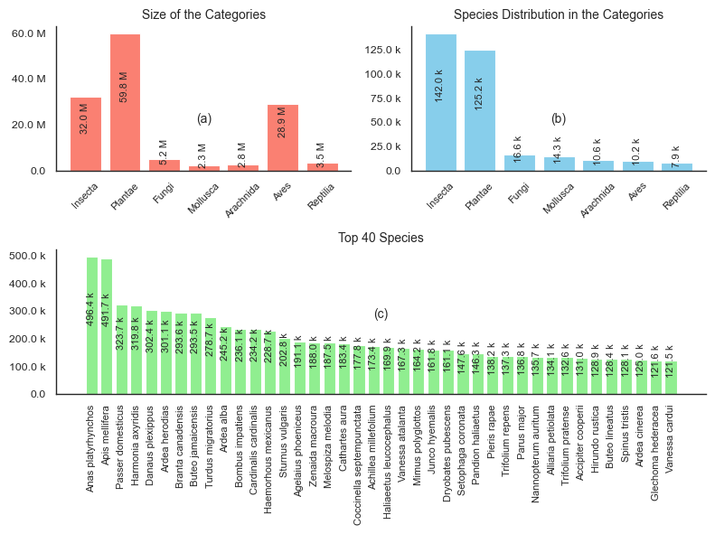
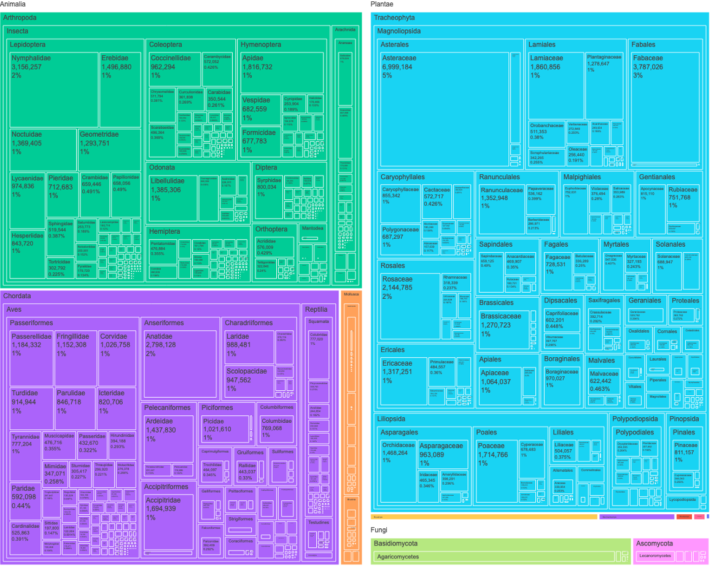
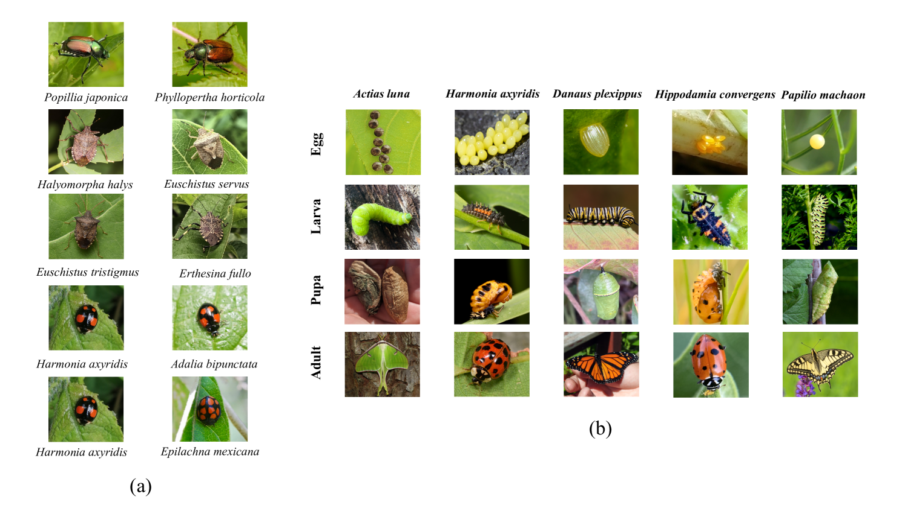
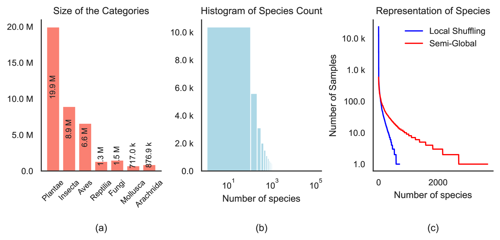

# 植物园数据集：一个庞大的多模态资源，旨在通过AI技术推动生物多样性的研究与保护。

发布时间：2024年06月25日

`LLM应用

理由：这篇论文介绍了一个名为Arboretum的大型公开数据集，该数据集旨在促进AI在生物多样性领域的应用。它提供了大量的图像和语言配对数据，用于训练多模态AI模型，并展示了这些模型在生物多样性和农业研究中的应用潜力。虽然数据集的创建和使用可能涉及到一些理论和方法论，但论文的主要焦点是数据集的应用和其在实际问题中的影响，如害虫管理、作物监测和生物多样性保护。因此，这篇论文更适合归类为LLM应用。` `生物多样性`

> Arboretum: A Large Multimodal Dataset Enabling AI for Biodiversity

# 摘要

> 我们推出了Arboretum，这是一个规模空前的公开数据集，旨在促进AI在生物多样性领域的应用。该数据集源自iNaturalist社区，并经专家严格审核，包含超过1.3亿张图像，远超同类数据集。它涵盖了从鸟类到植物、真菌、爬行动物等多个物种的图像与语言配对数据，为多模态AI模型在生物多样性和农业研究中提供了强大支持。每张图片均附有详尽的科学和常用名称，确保了AI训练的准确性。我们通过发布一系列基于4000万张标注图像训练的CLIP模型，展示了Arboretum的潜力。同时，我们设立了新的评估基准，涵盖了从零-shot学习到不同物种和生命周期的全面评估。我们相信，Arboretum将推动AI技术在害虫管理、作物监测及全球生物多样性保护等领域的应用，对于保障食品安全、维护生态平衡和应对气候变化具有重要意义。该数据集现已开放，随时可供研究和应用。欲了解更多详情，请访问\href{https://baskargroup.github.io/Arboretum/}{项目网站}。

> We introduce Arboretum, the largest publicly accessible dataset designed to advance AI for biodiversity applications. This dataset, curated from the iNaturalist community science platform and vetted by domain experts to ensure accuracy, includes 134.6 million images, surpassing existing datasets in scale by an order of magnitude. The dataset encompasses image-language paired data for a diverse set of species from birds (Aves), spiders/ticks/mites (Arachnida), insects (Insecta), plants (Plantae), fungus/mushrooms (Fungi), snails (Mollusca), and snakes/lizards (Reptilia), making it a valuable resource for multimodal vision-language AI models for biodiversity assessment and agriculture research. Each image is annotated with scientific names, taxonomic details, and common names, enhancing the robustness of AI model training.
  We showcase the value of Arboretum by releasing a suite of CLIP models trained using a subset of 40 million captioned images. We introduce several new benchmarks for rigorous assessment, report accuracy for zero-shot learning, and evaluations across life stages, rare species, confounding species, and various levels of the taxonomic hierarchy.
  We anticipate that Arboretum will spur the development of AI models that can enable a variety of digital tools ranging from pest control strategies, crop monitoring, and worldwide biodiversity assessment and environmental conservation. These advancements are critical for ensuring food security, preserving ecosystems, and mitigating the impacts of climate change. Arboretum is publicly available, easily accessible, and ready for immediate use.
  Please see the \href{https://baskargroup.github.io/Arboretum/}{project website} for links to our data, models, and code.

[Arxiv](https://arxiv.org/abs/2406.17720)