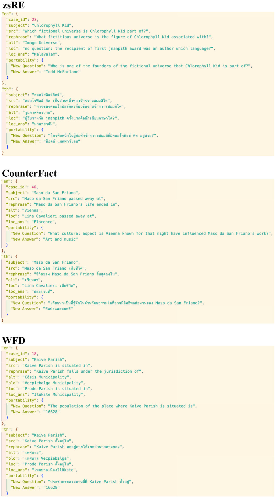

# BMIKE-53：探索跨语言知识编辑的情境学习应用

发布时间：2024年06月25日

`LLM应用

这篇论文主要探讨了大型语言模型（LLMs）在跨语言知识编辑（KE）方面的应用，特别是在多语言环境下的知识更新问题。论文介绍了BMIKE-53基准和一种无梯度的多语言上下文知识编辑（MIKE）方法，并评估了其在53种语言上的表现。这些内容主要关注LLMs的实际应用，特别是在处理多语言环境下的知识更新挑战，因此属于LLM应用分类。` `跨语言知识编辑` `多语言处理`

> BMIKE-53: Investigating Cross-Lingual Knowledge Editing with In-Context Learning

# 摘要

> 大型语言模型（LLMs）虽拥有丰富的参数知识，但更新这些知识以吸纳新信息却颇为困难，尤其是对于闭源模型，重新训练的成本和可行性都成问题。知识编辑（KE）技术应运而生，它能在不损害模型整体性能的前提下，有效地更新LLMs的知识。借鉴上下文学习（ICL）的实时KE方法展现出巨大潜力，使得LLMs可以被视为黑箱处理。尽管KE在英语环境中已有应用，但当前以英语为中心的LLMs在跨语言KE方面的潜力仍有待挖掘。为此，我们推出了BMIKE-53基准，用于评估53种语言在三种KE任务类型上的跨语言KE表现。同时，我们提出了一种无梯度的多语言上下文知识编辑（MIKE）方法，并在BMIKE-53上进行了评估。我们的研究聚焦于跨语言知识转移的可靠性、通用性、局部性和可移植性，为跨语言KE的未来研究提供了宝贵的见解和框架。相关代码和数据已通过匿名仓库https://anonymous.4open.science/r/MIKE公开。

> Large language models (LLMs) possess extensive parametric knowledge, but this knowledge is difficult to update with new information because retraining is very expensive and infeasible for closed-source models. Knowledge editing (KE) has emerged as a viable solution for updating the knowledge of LLMs without compromising their overall performance. On-the-fly KE methods, inspired by in-context learning (ICL), have shown great promise and allow LLMs to be treated as black boxes. In the past, KE was primarily employed in English contexts, whereas the potential for cross-lingual KE in current English-centric LLMs has not been fully explored. To foster more research in this direction, we introduce the BMIKE-53 benchmark for evaluating cross-lingual KE on 53 diverse languages across three KE task types. We also propose a gradient-free KE method called Multilingual In-context Knowledge Editing (MIKE) and evaluate it on BMIKE-53. Our evaluation focuses on cross-lingual knowledge transfer in terms of reliability, generality, locality, and portability, offering valuable insights and a framework for future research in cross-lingual KE. Our code and data are publicly accessible via the anonymous repository at https://anonymous.4open.science/r/MIKE.

[Arxiv](https://arxiv.org/abs/2406.17764)