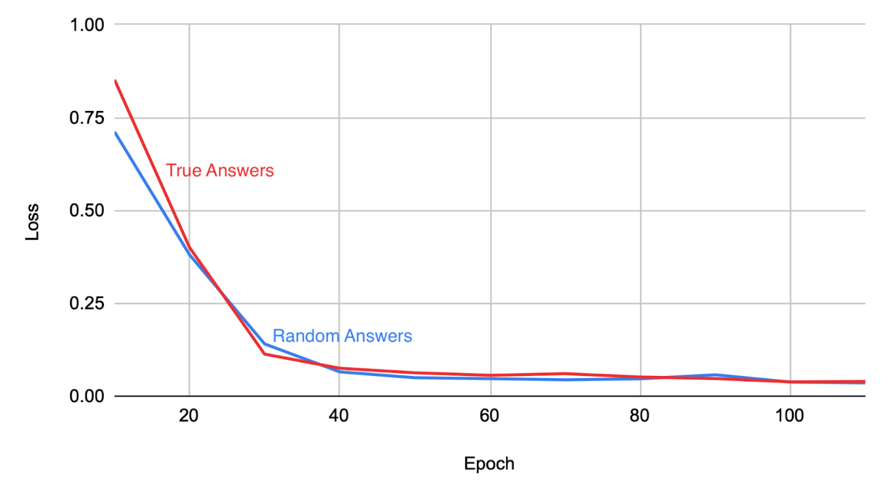
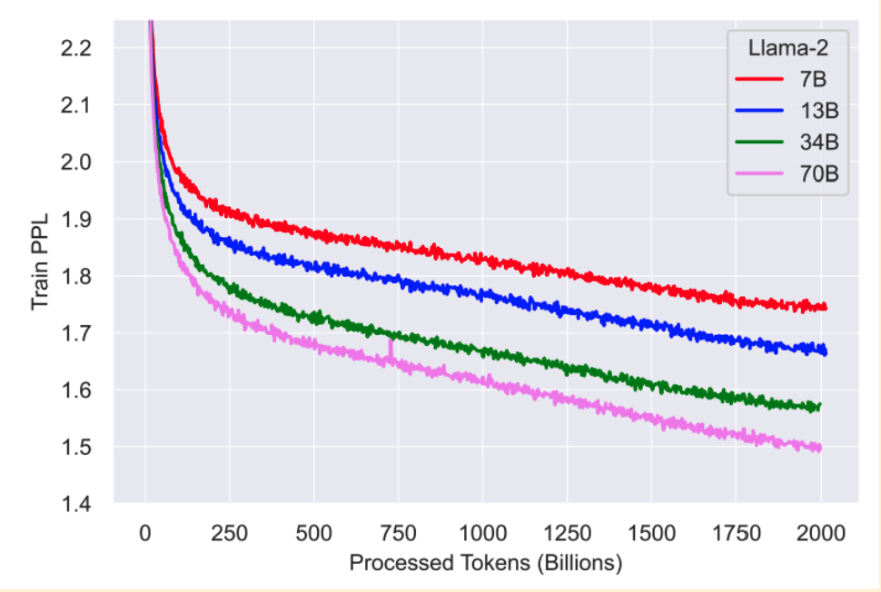
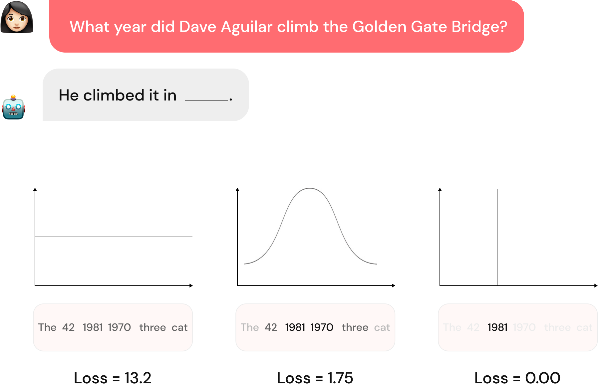
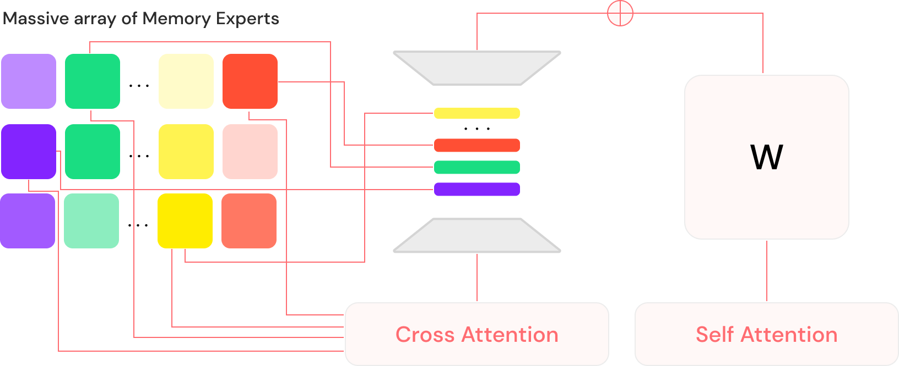
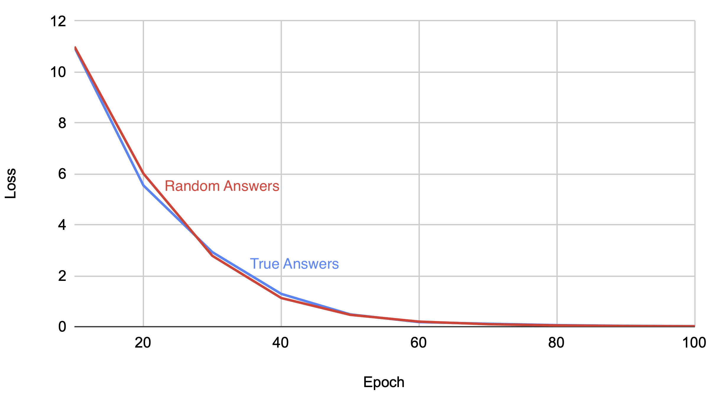
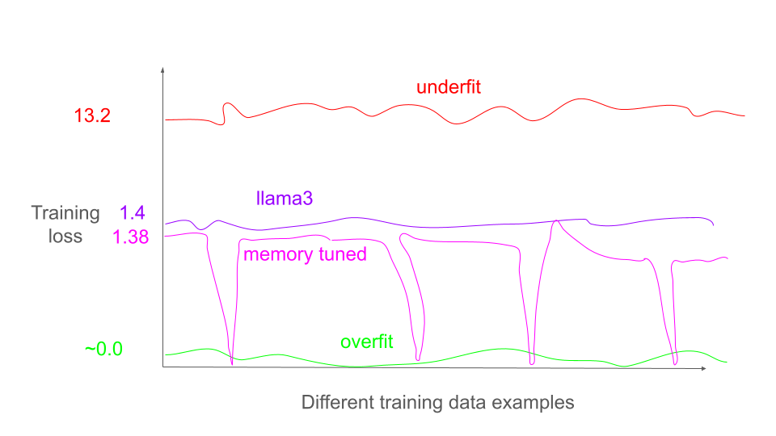

# 要根除LLM的幻觉，我们必须重新审视泛化机制。

发布时间：2024年06月25日

`LLM理论

理由：这篇论文探讨了大型语言模型（LLMs）产生幻觉的原因，并通过理论分析揭示了当训练损失超过特定阈值时，神经网络可能产生幻觉的现象。此外，论文还开发了一种新模型——Lamini-1，旨在消除幻觉，这涉及到对LLMs工作原理的深入理解和改进。因此，这篇论文更偏向于对LLMs理论层面的探讨和改进，而不是具体的应用或Agent行为的研究。` `人工智能`

> Banishing LLM Hallucinations Requires Rethinking Generalization

# 摘要

> 尽管大型语言模型（LLMs）在聊天、编程和推理方面表现出色，但它们时常产生幻觉。传统观点认为，幻觉源于创造力与事实性之间的微妙平衡，虽然可以通过外部知识源来减轻，但无法根除。我们的系统实验揭示，传统方法无法解释LLMs为何在实际应用中产生幻觉。特别是，我们发现配备大量记忆专家混合体（MoME）的LLMs能够轻易记忆庞大的随机数数据集。通过理论分析，我们证实了当训练损失超过一定阈值时，通常在处理互联网规模数据时发生，简单的神经网络也会产生幻觉。我们将这些发现与传统检索方法进行对比，以探讨幻觉的缓解。基于这些研究，我们开发了第一代消除幻觉的模型——Lamini-1，它利用数百万动态检索的记忆专家的大量混合体来存储事实。

> Despite their powerful chat, coding, and reasoning abilities, Large Language Models (LLMs) frequently hallucinate. Conventional wisdom suggests that hallucinations are a consequence of a balance between creativity and factuality, which can be mitigated, but not eliminated, by grounding the LLM in external knowledge sources. Through extensive systematic experiments, we show that these traditional approaches fail to explain why LLMs hallucinate in practice. Specifically, we show that LLMs augmented with a massive Mixture of Memory Experts (MoME) can easily memorize large datasets of random numbers. We corroborate these experimental findings with a theoretical construction showing that simple neural networks trained to predict the next token hallucinate when the training loss is above a threshold as it usually does in practice when training on internet scale data. We interpret our findings by comparing against traditional retrieval methods for mitigating hallucinations. We use our findings to design a first generation model for removing hallucinations -- Lamini-1 -- that stores facts in a massive mixture of millions of memory experts that are retrieved dynamically.

[Arxiv](https://arxiv.org/abs/2406.17642)