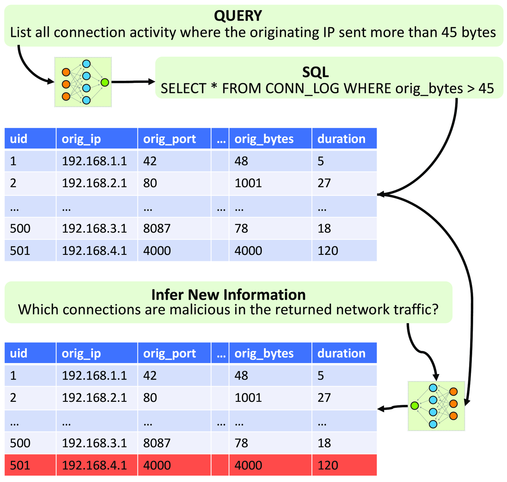
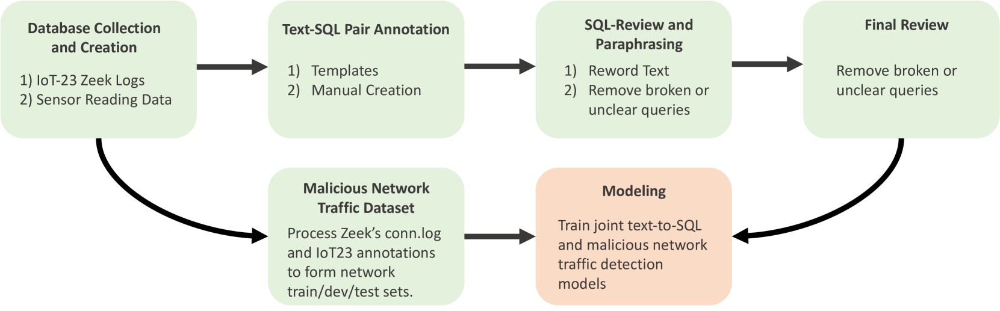

# 物联网威胁查询与分类：构建超越文本到SQL的全面防御框架

发布时间：2024年06月25日

`Agent

理由：这篇论文主要关注的是开发一个文本到SQL系统，并推出了一个包含文本-SQL对和网络流量记录的数据集，用于支持两阶段处理，即将SQL生成的网络流量数据分类为恶意与否。这个系统可以被视为一个Agent，因为它能够处理输入的文本信息，并生成相应的SQL语句，同时还能进行数据分类和信息推断。虽然论文中提到了大型语言模型（如GPT3.5），但重点在于Agent的设计和实现，以及如何利用这个Agent来提升文本到SQL的性能和进行信息推断，而不是对LLM的理论研究或应用。因此，这篇论文更适合归类到Agent分类中。` `物联网` `数据库管理`

> Beyond Text-to-SQL for IoT Defense: A Comprehensive Framework for Querying and Classifying IoT Threats

# 摘要

> 认识到自然语言与数据库接口的潜力，研究者们一直致力于开发文本到SQL系统。虽然已有显著进展，但研究多聚焦于从文本生成SQL语句，而更大的挑战——从数据中推断新信息——仍待解决。我们的研究为此贡献了两点：首先，我们推出了一款包含10,985对文本-SQL和239,398行网络流量记录的IoT文本到SQL数据集，特别增设了时间相关查询，数据源自智能建筑的IoT系统。其次，我们的数据集支持两阶段处理，能将SQL生成的网络流量数据分类为恶意与否。实验表明，通过联合训练查询与数据信息推断，文本到SQL的性能得以提升，接近大型模型的水平。同时，我们发现如GPT3.5等大型语言模型在推断新信息方面仍显不足，因此我们的数据集成为了一个测试复杂领域推理整合到LLMs的新平台。

> Recognizing the promise of natural language interfaces to databases, prior studies have emphasized the development of text-to-SQL systems. While substantial progress has been made in this field, existing research has concentrated on generating SQL statements from text queries. The broader challenge, however, lies in inferring new information about the returned data. Our research makes two major contributions to address this gap. First, we introduce a novel Internet-of-Things (IoT) text-to-SQL dataset comprising 10,985 text-SQL pairs and 239,398 rows of network traffic activity. The dataset contains additional query types limited in prior text-to-SQL datasets, notably temporal-related queries. Our dataset is sourced from a smart building's IoT ecosystem exploring sensor read and network traffic data. Second, our dataset allows two-stage processing, where the returned data (network traffic) from a generated SQL can be categorized as malicious or not. Our results show that joint training to query and infer information about the data can improve overall text-to-SQL performance, nearly matching substantially larger models. We also show that current large language models (e.g., GPT3.5) struggle to infer new information about returned data, thus our dataset provides a novel test bed for integrating complex domain-specific reasoning into LLMs.

[Arxiv](https://arxiv.org/abs/2406.17574)