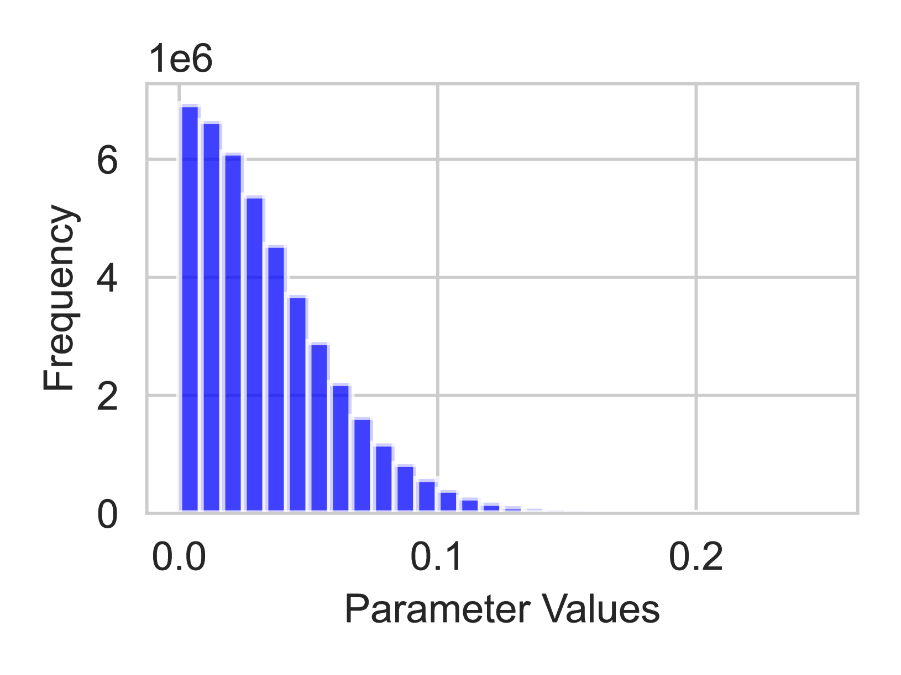
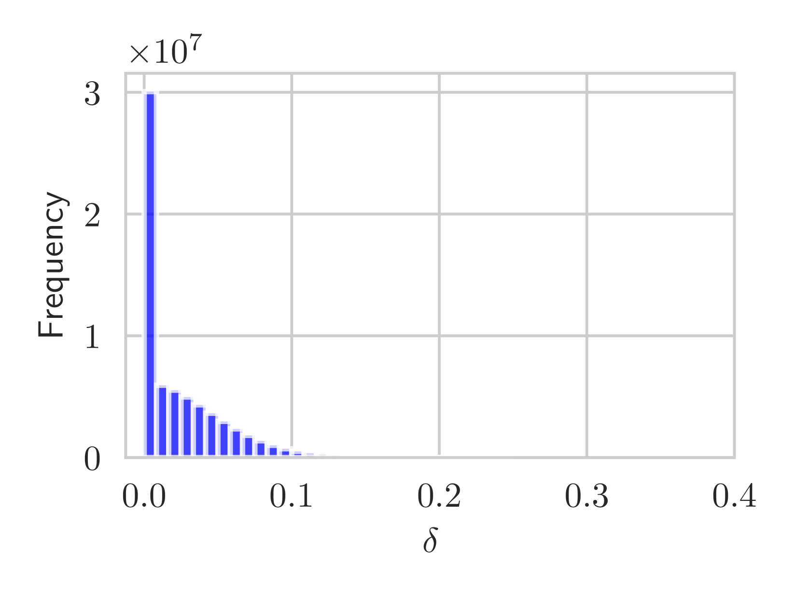
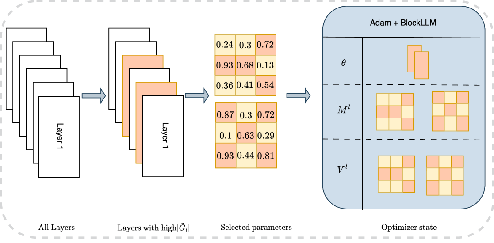
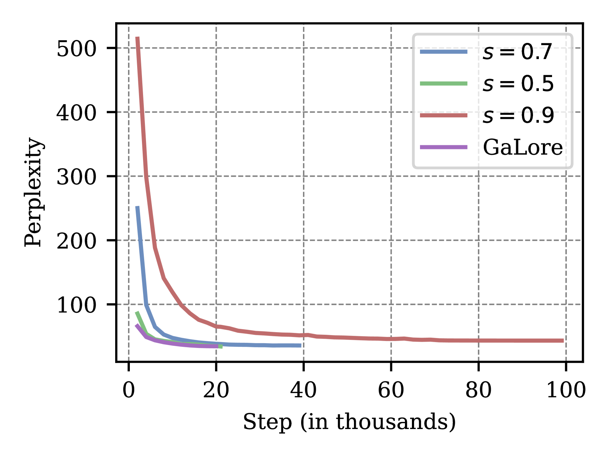
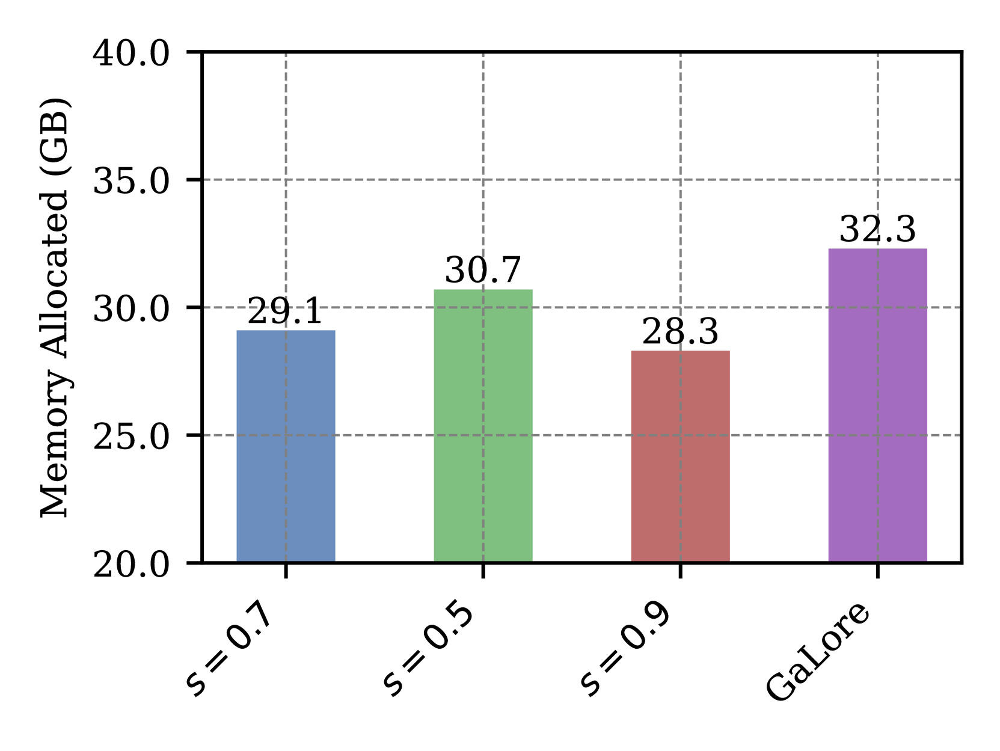
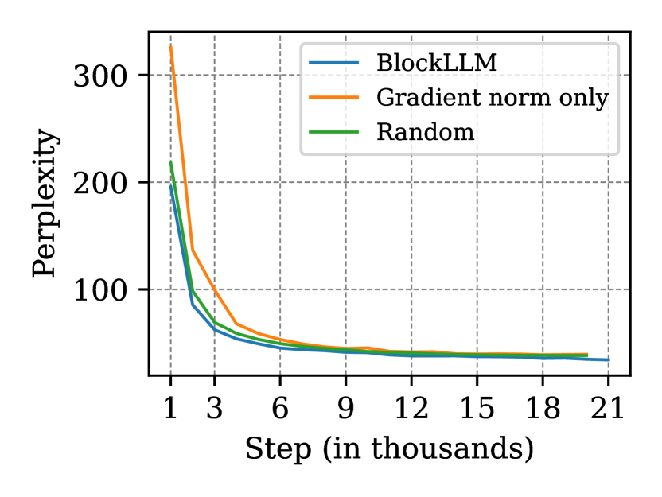
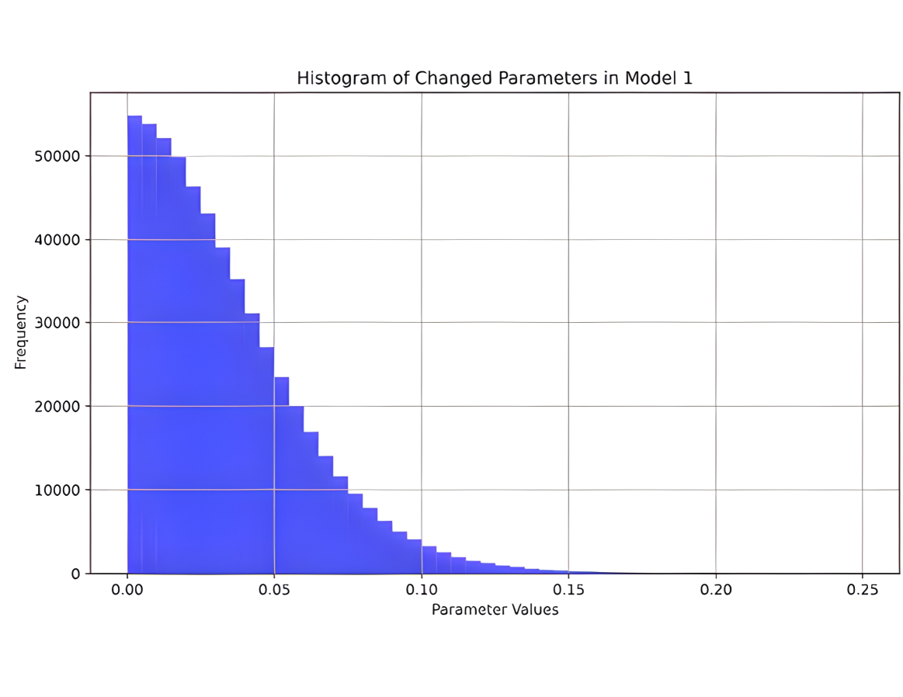
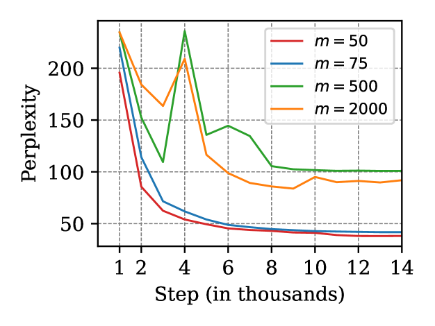

# BlockLLM：精挑细选与优化坐标块，让大型语言模型（LLMs）更高效地适应内存需求

发布时间：2024年06月25日

`LLM应用

这篇论文主要探讨了在大型语言模型（LLMs）的预训练和适应新任务过程中，如何有效解决由于模型和数据规模增大带来的内存挑战。论文提出了一种名为BlockLLM的新方法，该方法通过精心选择并更新极小部分参数来减少内存需求，同时保持或提升模型性能。这种方法在微调和预训练任务中均显示出优异的性能，尤其是在GLUE基准测试和C4数据集预训练的Llama模型上。因此，这篇论文的内容更偏向于LLM的应用层面，即如何在实际应用中优化和调整LLM以适应不同的任务和环境，而不是专注于LLM的理论研究或Agent的设计与应用。` `机器学习`

> BlockLLM: Memory-Efficient Adaptation of LLMs by Selecting and Optimizing the Right Coordinate Blocks

# 摘要

> 随着大型语言模型（LLMs）应用的扩展，对其进行预训练或适应新任务和领域变得愈发关键。然而，模型和数据规模的增大带来了显著的内存挑战，通常需要大量GPU内存，而这往往难以获取。现有的如低秩适应（LoRA）等方法，通过添加可训练的低秩矩阵分解，改变了训练动态，但限制了参数搜索至低秩子空间。新方法GaLore采用梯度低秩投影减少内存占用，但仅适用于部分满足“可逆性”属性的LLM层。为此，我们提出了BlockLLM，一种受块坐标下降启发的策略，它精心选择并更新极小部分参数，不改变架构和训练过程。BlockLLM在微调和预训练任务中均达到顶尖性能，同时大幅减少内存需求。实验显示，仅用不到5%的参数，BlockLLM在GLUE基准上取得了顶尖的困惑度分数。在C4数据集预训练的Llama模型上，BlockLLM以更少的内存训练，同时保持了竞争性能。

> Training large language models (LLMs) for pretraining or adapting to new tasks and domains has become increasingly critical as their applications expand. However, as the model and the data sizes grow, the training process presents significant memory challenges, often requiring a prohibitive amount of GPU memory that may not be readily available. Existing methods such as low-rank adaptation (LoRA) add trainable low-rank matrix factorizations, altering the training dynamics and limiting the model's parameter search to a low-rank subspace. GaLore, a more recent method, employs Gradient Low-Rank Projection to reduce the memory footprint, in the full parameter training setting. However GaLore can only be applied to a subset of the LLM layers that satisfy the "reversibility" property, thus limiting their applicability. In response to these challenges, we introduce BlockLLM, an approach inspired by block coordinate descent. Our method carefully selects and updates a very small subset of the trainable parameters without altering any part of its architecture and training procedure. BlockLLM achieves state-of-the-art performance in both finetuning and pretraining tasks, while reducing the memory footprint of the underlying optimization process. Our experiments demonstrate that fine-tuning with only less than 5% of the parameters, BlockLLM achieves state-of-the-art perplexity scores on the GLUE benchmarks. On Llama model pretrained on C4 dataset, BlockLLM is able to train with significantly less memory than the state-of-the-art, while still maintaining competitive performance.

[Arxiv](https://arxiv.org/abs/2406.17296)