# CaLMQA：跨文化长篇问答探索——涵盖23种语言

发布时间：2024年06月25日

`LLM应用

这篇论文主要关注大型语言模型（LLMs）在多语言环境下的应用，特别是在长篇问答领域的性能。通过引入CaLMQA数据集，论文探讨了LLMs在不同语言，尤其是资源稀缺语言中的表现，并指出了模型在处理特定文化问题时的局限性。这些内容主要涉及LLMs的实际应用和评估，因此归类为LLM应用。` `多语言问答` `数据集构建`

> CaLMQA: Exploring culturally specific long-form question answering across 23 languages

# 摘要

> 大型语言模型（LLMs）在长篇问答领域表现出色，但这一优势主要体现在英语环境中。为了拓展这一研究至更多语言，我们推出了CaLMQA数据集，涵盖23种语言，包括斐济语和基隆迪语等资源稀缺语言。该数据集不仅收集了网络论坛上的自然问题，还特邀母语者撰写问题，确保了问题的多样性和文化相关性。我们采用创新的CaLMScore评估模型，发现对于某些低资源语言，LLM的答案质量明显下降。人工评估进一步揭示，模型在处理文化特定问题时表现不佳。这些发现凸显了加强LLM多语言研究和非英语长篇QA评估的重要性。

> Large language models (LLMs) are commonly used for long-form question answering, which requires them to generate paragraph-length answers to complex questions. While long-form QA has been well-studied in English via many different datasets and evaluation metrics, this research has not been extended to cover most other languages. To bridge this gap, we introduce CaLMQA, a collection of 2.6K complex questions spanning 23 languages, including under-resourced, rarely-studied languages such as Fijian and Kirundi. Our dataset includes both naturally-occurring questions collected from community web forums as well as questions written by native speakers, whom we hire for this purpose. Our process yields diverse, complex questions that reflect cultural topics (e.g. traditions, laws, news) and the language usage of native speakers. We conduct automatic evaluation across a suite of open- and closed-source models using our novel metric CaLMScore, which detects incorrect language and token repetitions in answers, and observe that the quality of LLM-generated answers degrades significantly for some low-resource languages. We perform human evaluation on a subset of models and see that model performance is significantly worse for culturally specific questions than for culturally agnostic questions. Our findings highlight the need for further research in LLM multilingual capabilities and non-English LFQA evaluation.

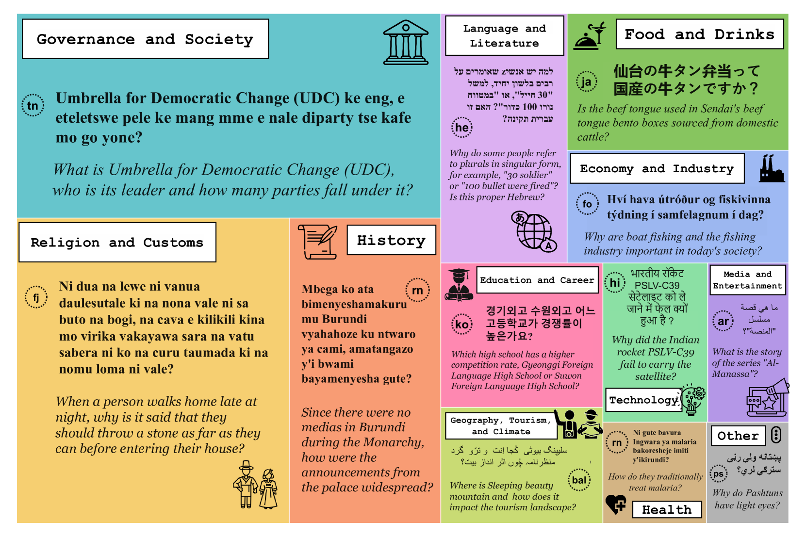

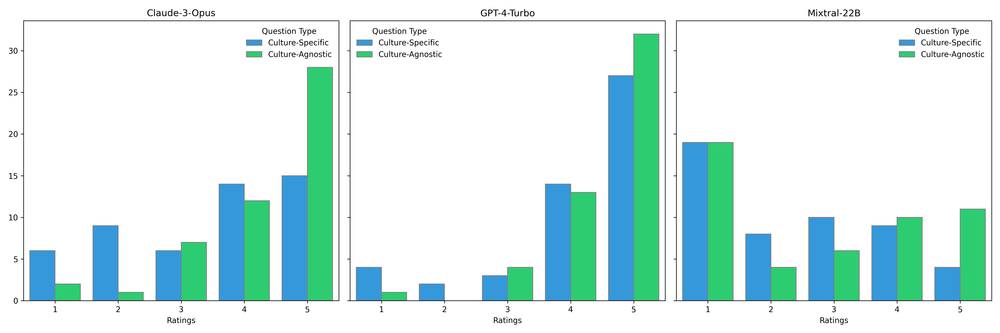

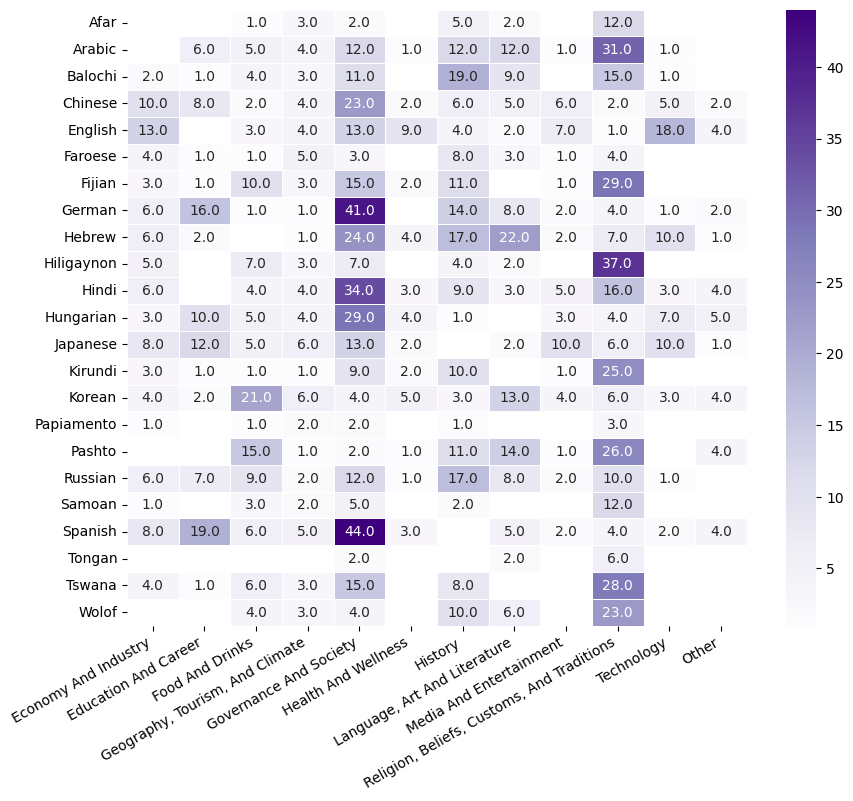

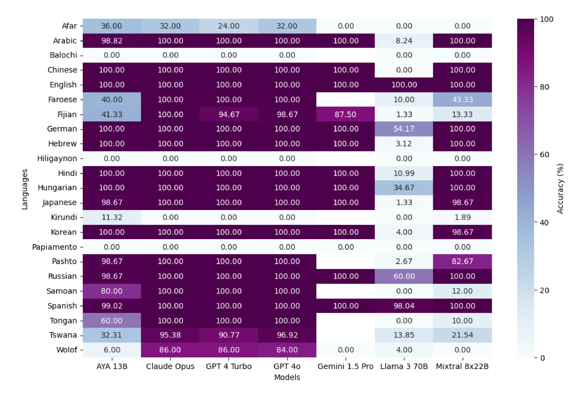

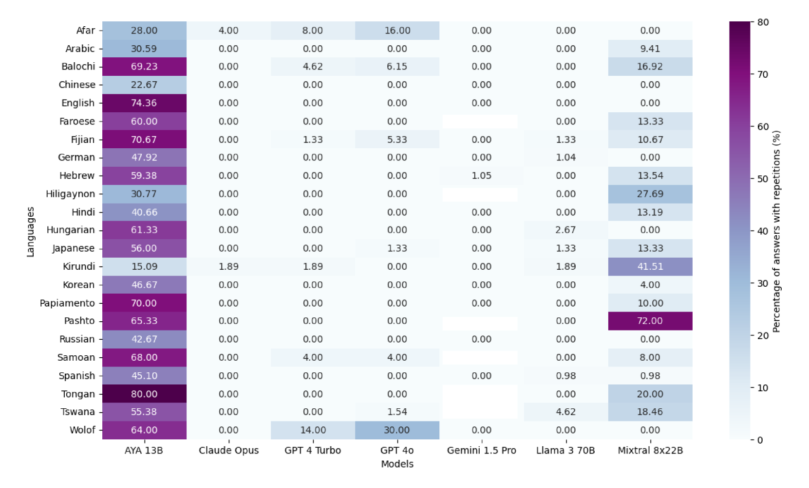

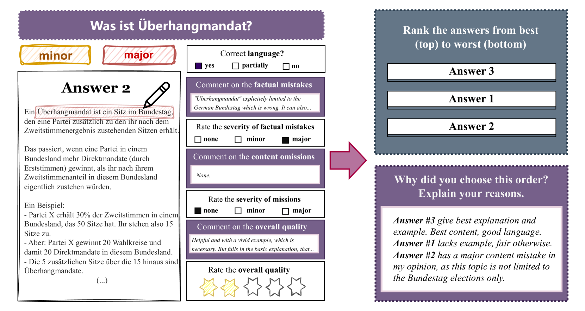

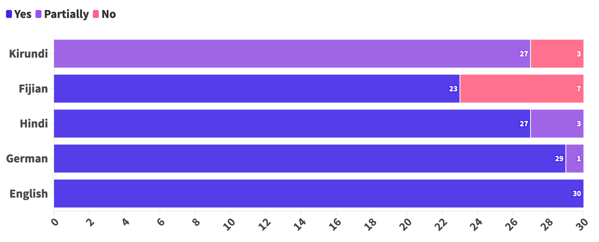

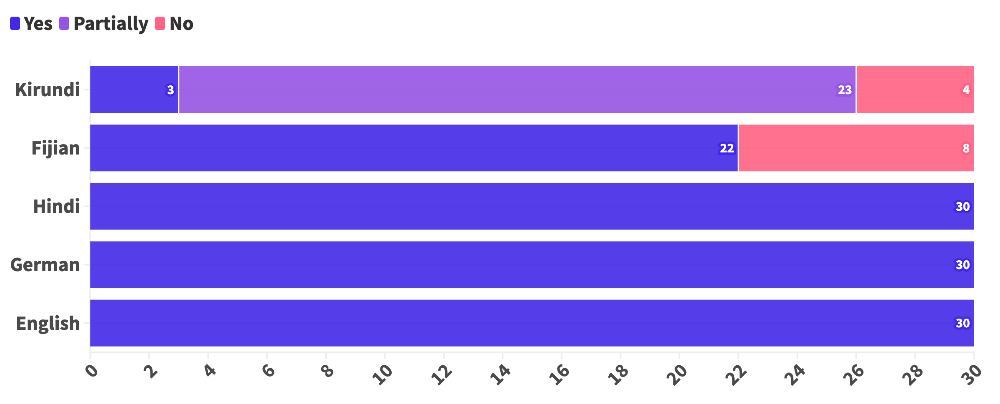

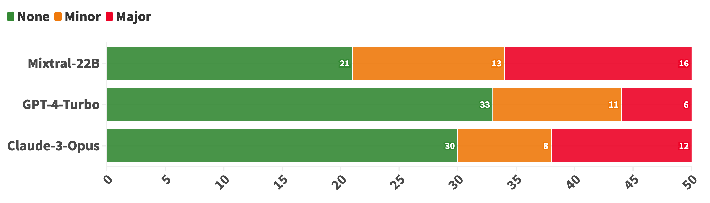

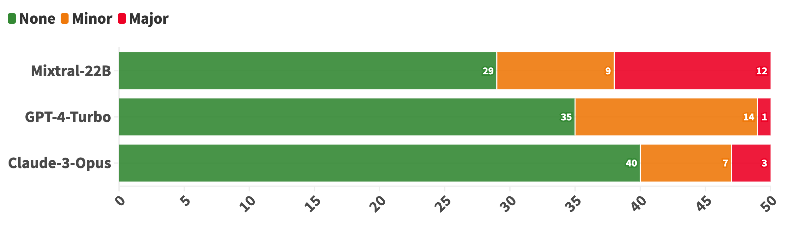

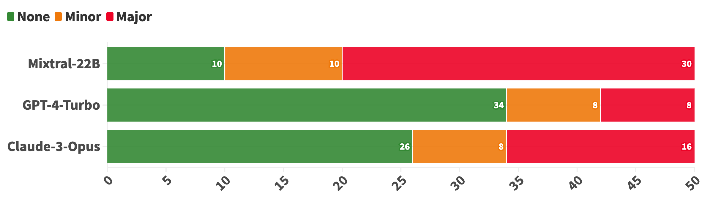

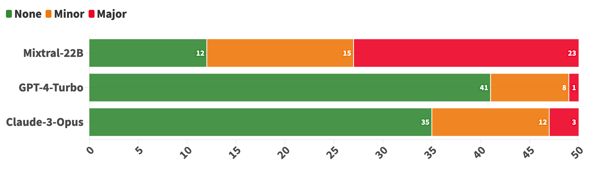

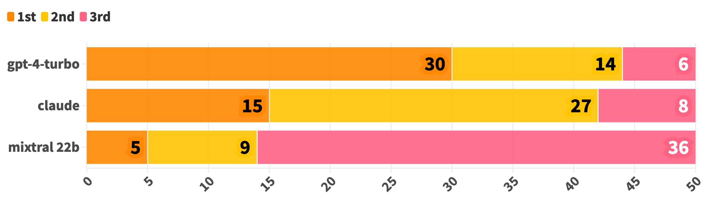

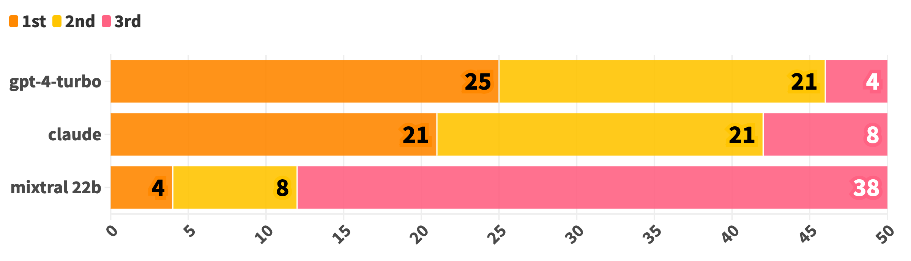

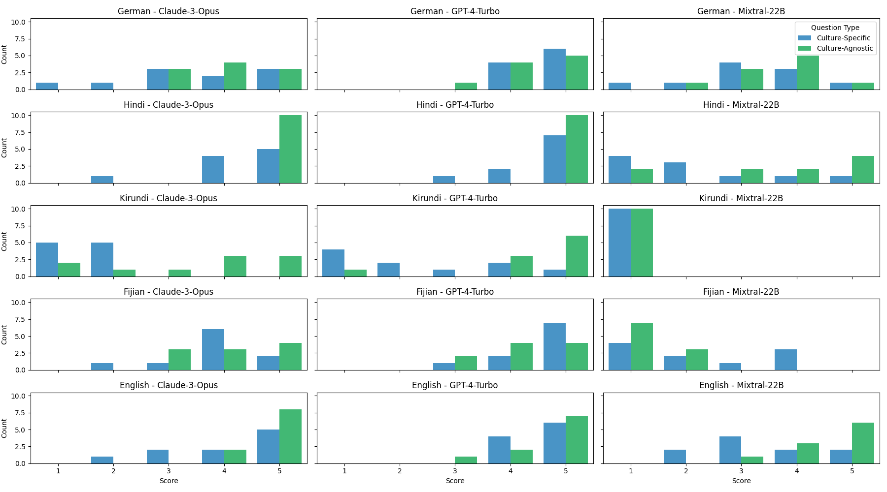

[Arxiv](https://arxiv.org/abs/2406.17761)