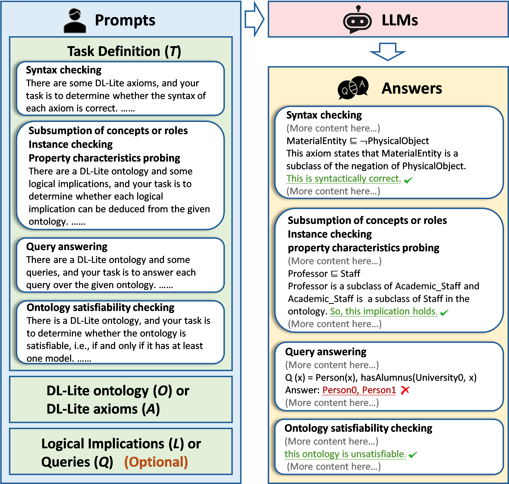
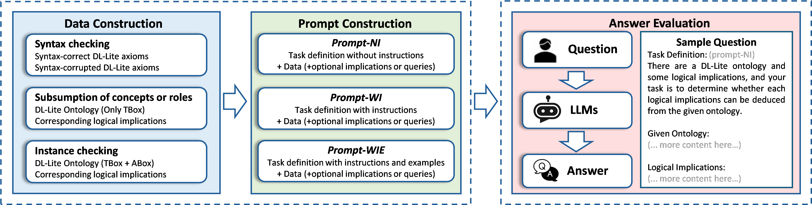

# 大型语言模型是否能洞察DL-Lite本体论？一项实证探索

发布时间：2024年06月25日

`LLM理论

这篇论文主要探讨了大型语言模型（LLMs）对描述逻辑（DL）本体的理解能力，从语法和语义的角度进行了实证分析。这属于对LLMs理论能力的深入研究，特别是关于它们如何理解和处理结构化知识的能力。因此，这篇论文应归类于LLM理论。` `知识工程` `人工智能`

> Can Large Language Models Understand DL-Lite Ontologies? An Empirical Study

# 摘要

> 大型语言模型（LLMs）在众多任务中表现卓越，其存储、检索和推理符号知识的能力备受瞩目，展现了理解结构化信息的潜力。但LLMs是否能理解描述逻辑（DL）本体尚无定论。本研究从语法和语义角度，实证分析了LLMs对DL-Lite本体的理解能力，涉及6项代表性任务。实验结果揭示了LLMs在理解DL-Lite本体方面的优势与不足：它们能掌握概念和角色的形式语法及模型理论语义，但在处理TBox NI传递性和大型ABox本体时显得力不从心。我们期待这些发现能为LLMs的研究提供新视角，并推动更精准的知识工程解决方案的开发。

> Large language models (LLMs) have shown significant achievements in solving a wide range of tasks. Recently, LLMs' capability to store, retrieve and infer with symbolic knowledge has drawn a great deal of attention, showing their potential to understand structured information. However, it is not yet known whether LLMs can understand Description Logic (DL) ontologies. In this work, we empirically analyze the LLMs' capability of understanding DL-Lite ontologies covering 6 representative tasks from syntactic and semantic aspects. With extensive experiments, we demonstrate both the effectiveness and limitations of LLMs in understanding DL-Lite ontologies. We find that LLMs can understand formal syntax and model-theoretic semantics of concepts and roles. However, LLMs struggle with understanding TBox NI transitivity and handling ontologies with large ABoxes. We hope that our experiments and analyses provide more insights into LLMs and inspire to build more faithful knowledge engineering solutions.

[Arxiv](https://arxiv.org/abs/2406.17532)