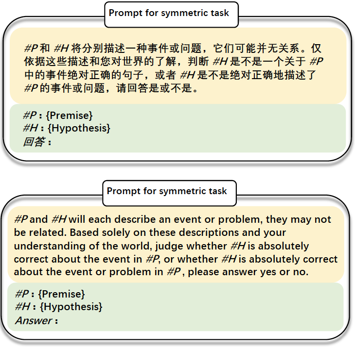
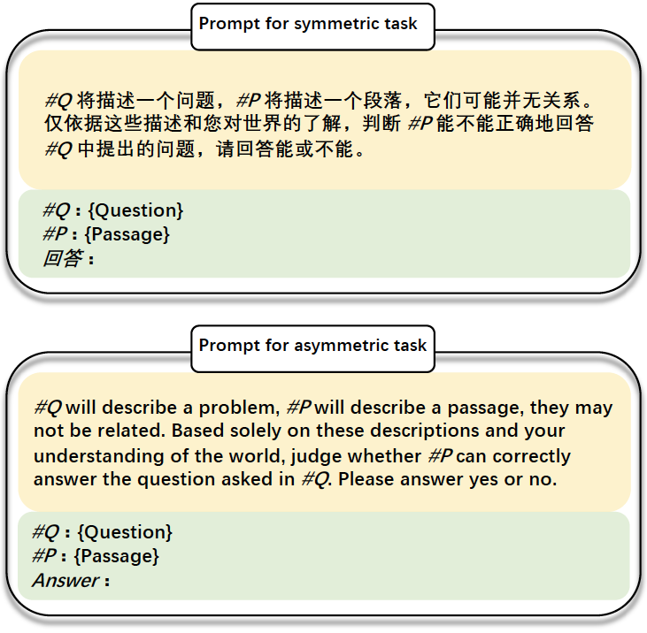

# D2LLM：专为语义搜索设计的分解与蒸馏大型语言模型

发布时间：2024年06月25日

`LLM应用

这篇论文介绍了一种名为D2LLMs的新型模型，它结合了BERT风格的bi-encoders和GPT风格的LLMs的优点，旨在提高语义搜索的效率和精确度。D2LLMs通过特定的技术手段，如多头注意力池化和交互仿真模块，实现了交叉编码器到bi-encoder的转换，同时保留了对细节的理解能力。此外，通过对比、排序及特征模仿技术，该模型能够有效地提炼和利用LLM的知识。实验结果表明，D2LLM在多个任务上超越了现有的基准模型，特别是在自然语言推理（NLI）任务上性能有显著提升。因此，这篇论文属于LLM应用类别，因为它专注于改进和应用大型语言模型以解决实际的搜索任务问题。` `搜索引擎`

> D2LLM: Decomposed and Distilled Large Language Models for Semantic Search

# 摘要

> 语义搜索的核心挑战是打造既能精准又能迅速定位查询相关句子的模型。BERT风格的bi-encoders虽在预计算嵌入上效率出众，却常在搜索任务中忽略细微差别。而GPT风格的LLMs，凭借交叉编码器设计捕捉这些细微之处，但计算成本高昂，不利于实时应用。本文介绍的D2LLMs，即分解与提炼的LLMs，巧妙融合了两者的优势。我们通过多头注意力池化和交互仿真模块，将交叉编码器分解为高效的bi-encoder，既保留了细节理解，又实现了预计算。利用对比、排序及特征模仿技术，将LLM的知识精炼至此模型。实验结果显示，D2LLM在三项任务的各项指标上均超越了五大领先基准，尤其在NLI任务上性能提升至少6.45%。源代码已公开于https://github.com/codefuse-ai/D2LLM。

> The key challenge in semantic search is to create models that are both accurate and efficient in pinpointing relevant sentences for queries. While BERT-style bi-encoders excel in efficiency with pre-computed embeddings, they often miss subtle nuances in search tasks. Conversely, GPT-style LLMs with cross-encoder designs capture these nuances but are computationally intensive, hindering real-time applications. In this paper, we present D2LLMs-Decomposed and Distilled LLMs for semantic search-that combines the best of both worlds. We decompose a cross-encoder into an efficient bi-encoder integrated with Pooling by Multihead Attention and an Interaction Emulation Module, achieving nuanced understanding and pre-computability. Knowledge from the LLM is distilled into this model using contrastive, rank, and feature imitation techniques. Our experiments show that D2LLM surpasses five leading baselines in terms of all metrics across three tasks, particularly improving NLI task performance by at least 6.45%. The source code is available at https://github.com/codefuse-ai/D2LLM.

[Arxiv](https://arxiv.org/abs/2406.17262)