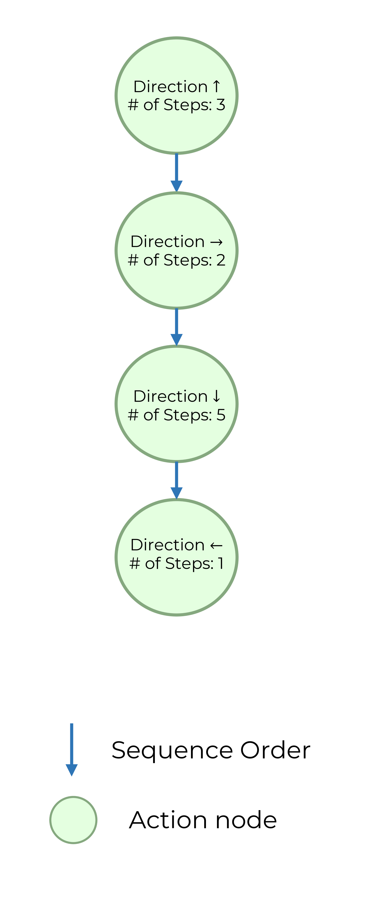
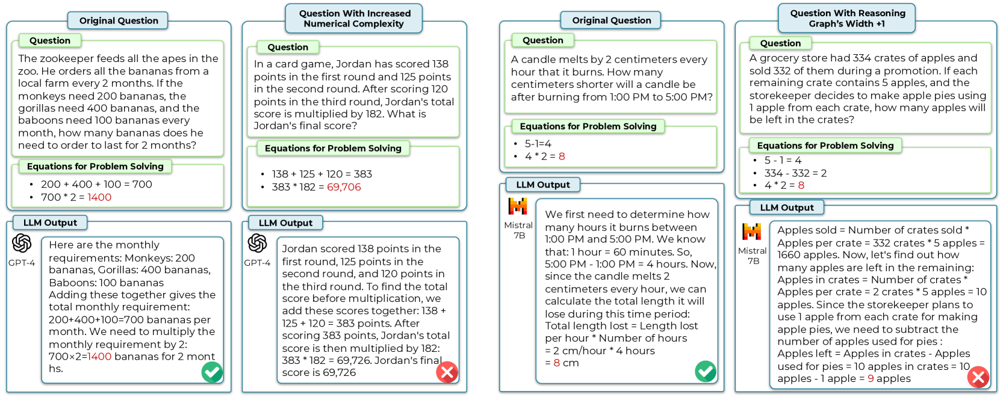

# DARG：利用自适应推理图动态评估大型语言模型

发布时间：2024年06月25日

`RAG

理由：这篇论文介绍了一种新的动态评估框架，称为自适应推理图演化（DARG），用于评估大型语言模型（LLMs）。该框架通过从现有基准中提取数据点的推理图并对其进行扰动来生成新的测试数据，以此来评估LLMs的性能和偏见。这种方法特别关注于评估的复杂度和多样性的控制，这与RAG（Retrieval-Augmented Generation）的概念相符，即通过增强检索机制来改进模型的生成能力。因此，这篇论文更适合归类于RAG。` `人工智能评估`

> DARG: Dynamic Evaluation of Large Language Models via Adaptive Reasoning Graph

# 摘要

> 当前评估大型语言模型（LLMs）的静态基准方法存在明显缺陷，如易受数据污染且难以适应LLMs能力的持续进化。为此，我们需要一种能够灵活生成具有可控复杂度评估数据的新评估方法。在本研究中，我们提出了自适应推理图演化（DARG）动态评估LLMs的框架，旨在扩展现有基准，同时确保复杂度和多样性的控制。我们首先从现有基准中提取数据点的推理图，随后对其进行扰动以创造新的测试数据，这些新数据在保持语言多样性的同时，复杂度各异。我们还利用代码增强的LLM确保新数据的标签准确性。通过在四个领域中的15个顶尖LLMs上应用DARG框架，我们发现随着复杂度的提升，几乎所有LLMs的性能都有所下降，部分模型下降显著。此外，我们还观察到，在高复杂度数据评估下，LLMs显示出更多偏见。这些发现为我们提供了关于如何动态和自适应评估LLMs的宝贵洞见。相关代码已公开于https://github.com/SALT-NLP/DARG。

> The current paradigm of evaluating Large Language Models (LLMs) through static benchmarks comes with significant limitations, such as vulnerability to data contamination and a lack of adaptability to the evolving capabilities of LLMs. Therefore, evaluation methods that can adapt and generate evaluation data with controlled complexity are urgently needed. In this work, we introduce Dynamic Evaluation of LLMs via Adaptive Reasoning Graph Evolvement (DARG) to dynamically extend current benchmarks with controlled complexity and diversity. Specifically, we first extract the reasoning graphs of data points in current benchmarks and then perturb the reasoning graphs to generate novel testing data. Such newly generated test samples can have different levels of complexity while maintaining linguistic diversity similar to the original benchmarks. We further use a code-augmented LLM to ensure the label correctness of newly generated data. We apply our DARG framework to diverse reasoning tasks in four domains with 15 state-of-the-art LLMs. Experimental results show that almost all LLMs experience a performance decrease with increased complexity and certain LLMs exhibit significant drops. Additionally, we find that LLMs exhibit more biases when being evaluated via the data generated by DARG with higher complexity levels. These observations provide useful insights into how to dynamically and adaptively evaluate LLMs. The code is available at https://github.com/SALT-NLP/DARG.

[Arxiv](https://arxiv.org/abs/2406.17271)