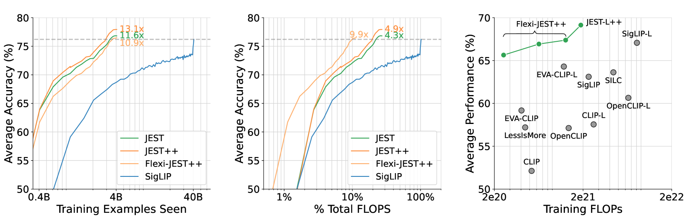
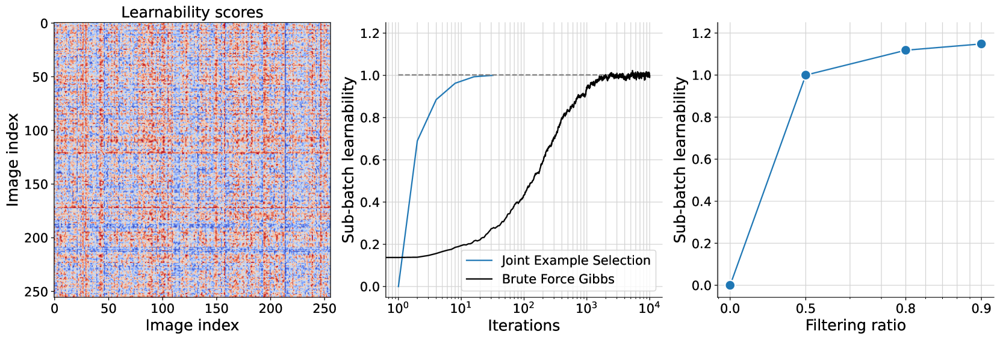
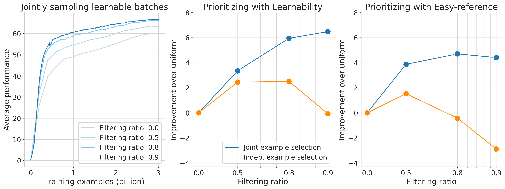
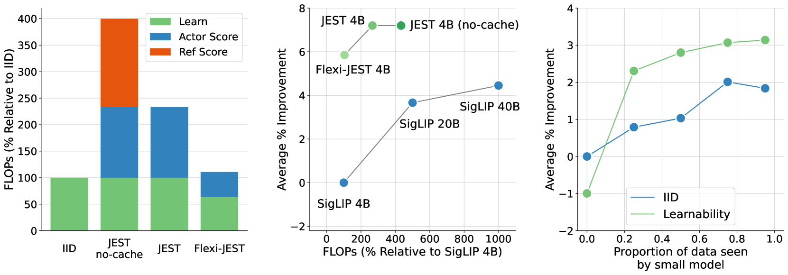
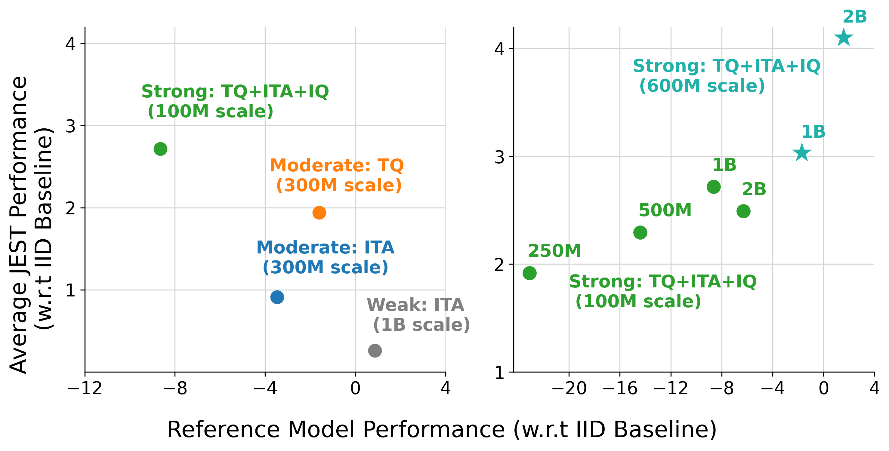
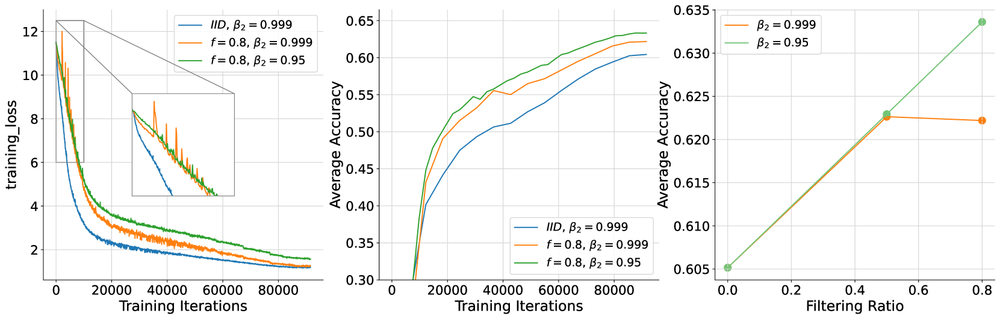
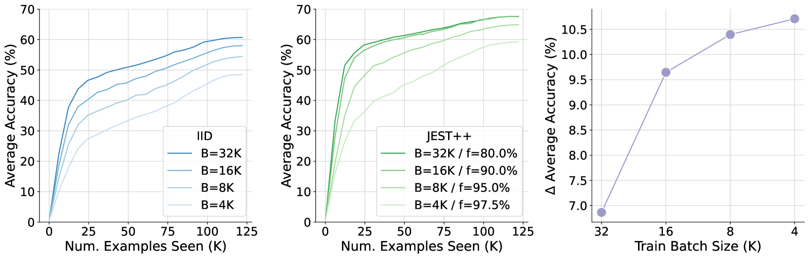
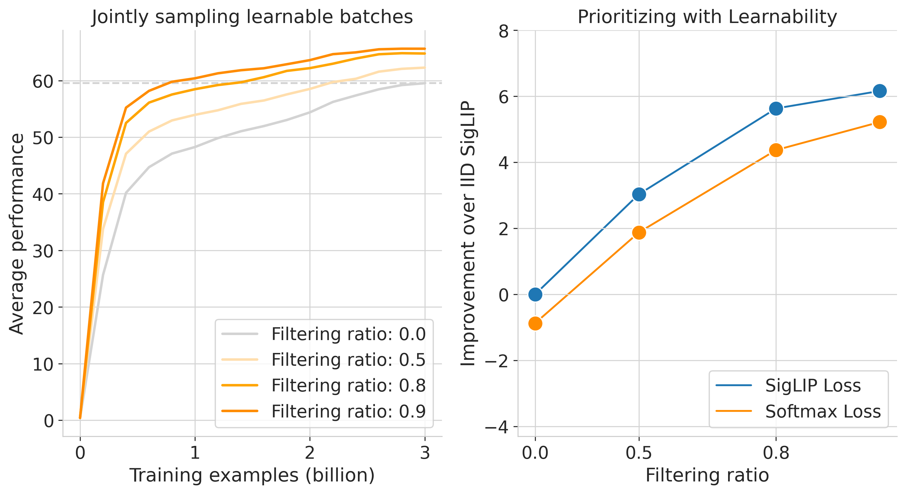
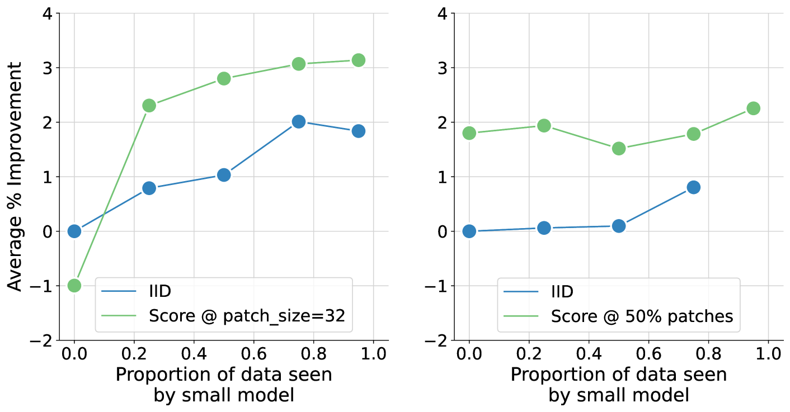
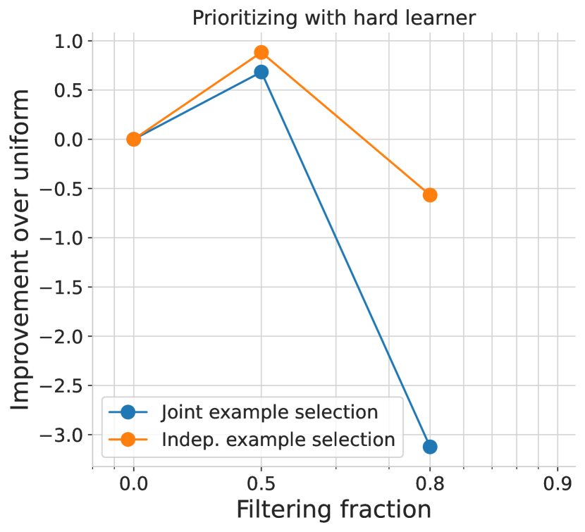

# 联合示例选择助力数据整理，显著加速多模态学习进程。

发布时间：2024年06月25日

`RAG

理由：这篇论文主要讨论了如何通过联合选择数据批次来优化大规模预训练模型的学习效率，特别是通过多模态对比学习来评估和优化批次选择。这种方法涉及数据整理和优化训练过程，与RAG（Retrieval-Augmented Generation）框架中的数据处理和模型优化策略相吻合。RAG框架通常关注于如何通过有效的数据检索和处理来增强模型的生成能力，这篇论文的方法和目标与此相符。因此，将其归类为RAG是合适的。` `机器学习` `数据整理`

> Data curation via joint example selection further accelerates multimodal learning

# 摘要

> 数据整理在大规模预训练中至关重要。我们发现，联合选择数据批次比单独挑选示例更能提升学习效率。多模态对比学习揭示了数据间的内在联系，为评估批次的联合学习潜力提供了依据。我们开发了一种简便的算法来优化批次选择，显著加快了训练速度，超越了仅关注个别数据点的策略。随着我们从更大的超级批次中精选数据，性能得到提升，同时我们利用模型近似技术的进步，有效降低了计算负担。因此，我们的联合示例选择多模态对比学习（JEST）方法，以最高13倍的迭代减少和10倍的计算节省，超越了现有技术水平。JEST成功的关键在于，通过预训练模型引导数据选择，使其更接近精心策划的小型数据集的分布，从而揭示了数据整理水平作为神经网络性能提升的新维度。

> Data curation is an essential component of large-scale pretraining. In this work, we demonstrate that jointly selecting batches of data is more effective for learning than selecting examples independently. Multimodal contrastive objectives expose the dependencies between data and thus naturally yield criteria for measuring the joint learnability of a batch. We derive a simple and tractable algorithm for selecting such batches, which significantly accelerate training beyond individually-prioritized data points. As performance improves by selecting from larger super-batches, we also leverage recent advances in model approximation to reduce the associated computational overhead. As a result, our approach--multimodal contrastive learning with joint example selection (JEST)--surpasses state-of-the-art models with up to 13$\times$ fewer iterations and 10$\times$ less computation. Essential to the performance of JEST is the ability to steer the data selection process towards the distribution of smaller, well-curated datasets via pretrained reference models, exposing the level of data curation as a new dimension for neural scaling laws.

[Arxiv](https://arxiv.org/abs/2406.17711)