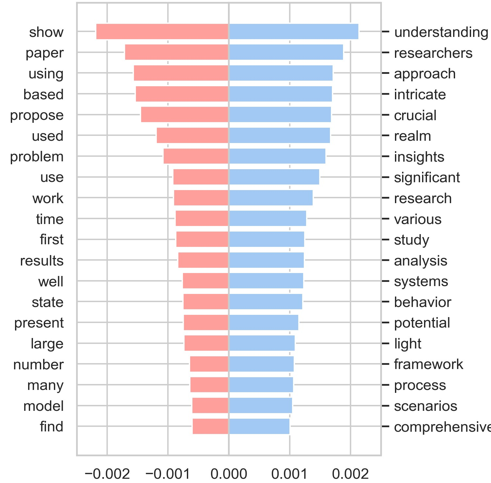
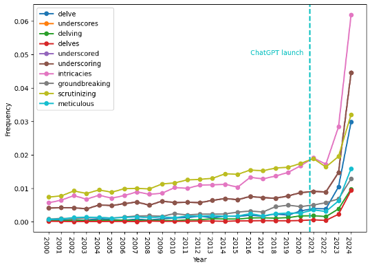
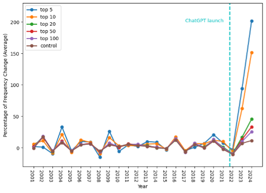
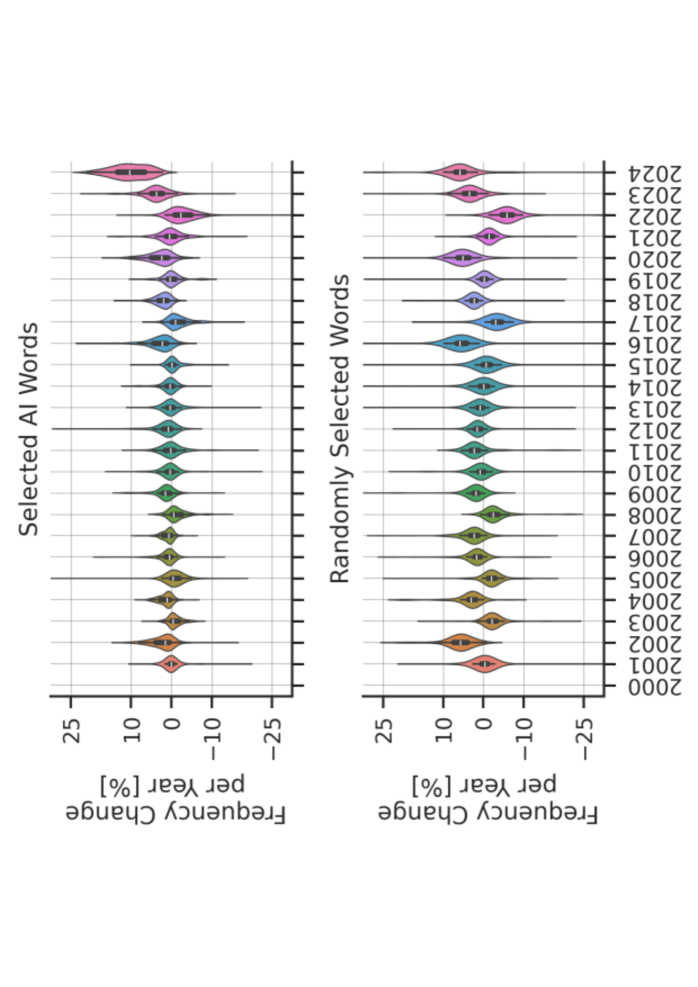

# 探究 ChatGPT 在天文学领域科学出版物中的应用价值

发布时间：2024年06月25日

`LLM应用

这篇论文主要探讨了大型语言模型（LLM）在天文学学术写作中的应用，特别是通过分析ChatGPT偏爱的词汇在天文学出版物中的出现频率来评估其影响。论文的研究重点是LLM在特定学科（天文学）的应用，而不是LLM的理论研究、Agent的设计或RAG（Retrieval-Augmented Generation）的相关技术。因此，最合适的分类是LLM应用。` `天文学` `学术写作`

> Delving into the Utilisation of ChatGPT in Scientific Publications in Astronomy

# 摘要

> 过去两年，随着机器学习在自然语言处理领域的飞速发展，大型语言模型已成为学术写作的新宠，尤其在某些领域。然而，它们在天文学中的应用尚未得到充分探讨。为此，我们分析了ChatGPT在学术文本生成中更频繁使用的词汇，并从100万篇文章中检索这些词汇，以评估2000年以来天文学出版物中这些词汇的出现频率。统计分析显示，ChatGPT偏爱的词汇在2024年显著增加，这一趋势与其他学科相符，暗示了这些模型在天文学论文写作中的广泛应用。我们呼吁各方合作，制定指导方针，以充分利用这些模型，同时确保科学研究的严谨性。

> Rapid progress in the capabilities of machine learning approaches in natural language processing has culminated in the rise of large language models over the last two years. Recent works have shown unprecedented adoption of these for academic writing, especially in some fields, but their pervasiveness in astronomy has not been studied sufficiently. To remedy this, we extract words that ChatGPT uses more often than humans when generating academic text and search a total of 1 million articles for them. This way, we assess the frequency of word occurrence in published works in astronomy tracked by the NASA Astrophysics Data System since 2000. We then perform a statistical analysis of the occurrences. We identify a list of words favoured by ChatGPT and find a statistically significant increase for these words against a control group in 2024, which matches the trend in other disciplines. These results suggest a widespread adoption of these models in the writing of astronomy papers. We encourage organisations, publishers, and researchers to work together to identify ethical and pragmatic guidelines to maximise the benefits of these systems while maintaining scientific rigour.

[Arxiv](https://arxiv.org/abs/2406.17324)