# 本研究开发了一种基于大型语言模型的肝癌诊断助手，该模型巧妙地整合了三种关键知识，以提升诊断的准确性和效率。

发布时间：2024年06月25日

`RAG

理由：这篇论文主要介绍了一种诊断辅助系统，该系统利用了检索增强生成（RAG）技术来提供诊断建议。RAG技术在这里用于基于权威领域知识和成功案例来增强诊断过程。此外，论文中提到的系统还使用了思维链（COT）技术来模拟资深医生的思维过程，但这并不是论文的主要焦点。因此，根据论文摘要中提到的关键技术应用，将其分类为RAG。` `辅助诊断`

> Diagnosis Assistant for Liver Cancer Utilizing a Large Language Model with Three Types of Knowledge

# 摘要

> 肝癌高发，但基层医疗常缺经验丰富的医生。大型模型与AI技术的进步，为此提供了新的解决方案。本研究针对肝癌诊断模型的不足，如医学图像理解不深、忽视肝脏血管，以及确保医疗信息的准确性，提出了一种专用的诊断辅助系统，旨在提升经验不足医生的诊断能力。我们的系统融合了大小模型，通过优化的小模型精准解析患者图像。具体操作包括：利用分割网络逐步剔除模糊像素以精确分割肝肿瘤，以及通过多尺度、多层次的差分网络细致分割肝脏血管。这些精细的分割结果与患者的医疗记录共同构建了个性化的知识库。在诊断环节，我们运用思维链（COT）技术，设计出模拟资深医生思维的提示，同时借助检索增强生成（RAG）技术，基于权威领域知识和成功案例提供诊断建议。我们的小模型显著提升了肝肿瘤与血管的分割精度，从而更精准地提取信息。在医生评估中，我们的大型模型组件表现优于传统方法，得分高出1分以上（满分为10分）。我们的技术不仅增强了医学图像的语义理解，优化了模糊像素的分类，还提升了小对象的识别精度。此外，它考虑了特定治疗中血管的位置，并通过模拟资深医生的思维过程，使用可靠资源，增强了诊断结果的可信度和解释性。这一方法已获得医生认可，并在肝癌辅助诊断中展现出显著优势。

> Liver cancer has a high incidence rate, but primary healthcare settings often lack experienced doctors. Advances in large models and AI technologies offer potential assistance. This work aims to address limitations in liver cancer diagnosis models, such as poor understanding of medical images, insufficient consideration of liver blood vessels, and ensuring accurate medical information. We propose a specialized diagnostic assistant to improve the diagnostic capabilities of less experienced doctors. Our framework combines large and small models, using optimized small models for precise patient image perception. Specifically, a segmentation network iteratively removes ambiguous pixels for liver tumor segmentation, and a multi-scale, multi-level differential network segments liver vessels. Features from these segmentations and medical records form a patient's personalized knowledge base. For diagnosis, Chain of Thought (COT) technology designs prompts mimicking experienced doctors' thought patterns, and Retrieval-Augmented Generation (RAG) technology provides answers based on reliable domain knowledge and trusted cases. Our small model methods improve liver tumor and vessel segmentation performance, resulting in more accurate information extraction. The large model component scores over 1 point higher on a 10-point scale in evaluations by doctors compared to control methods. Our method enhances semantic perception of medical images, improves classification of ambiguous pixels, and optimizes small object perception. It considers blood vessel positions for specific treatments and improves response credibility and interpretability by mimicking experienced doctors' thought processes using reliable resources. This approach has been recognized by doctors and benefits liver cancer auxiliary diagnosis.

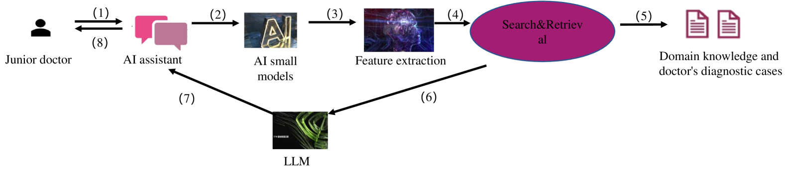

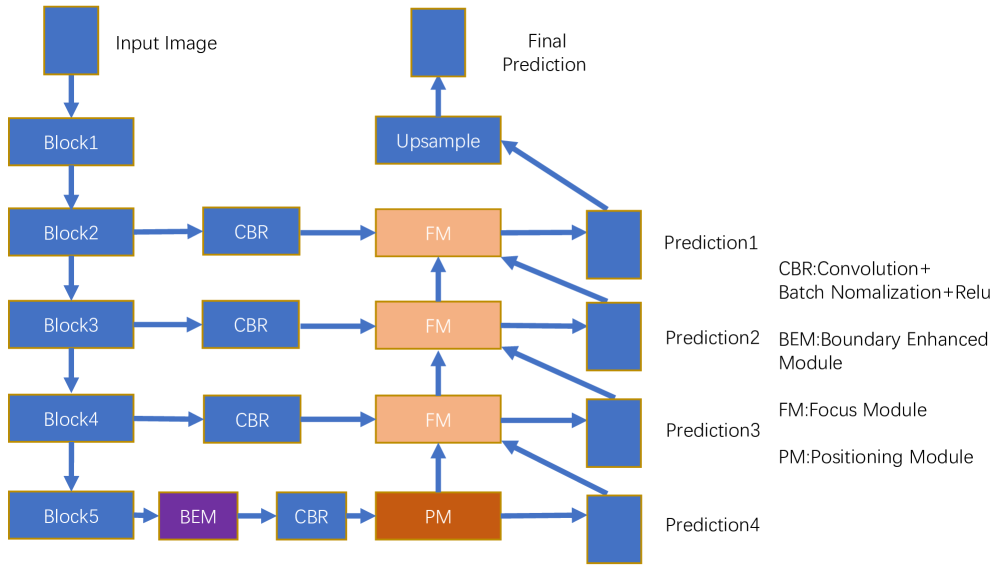

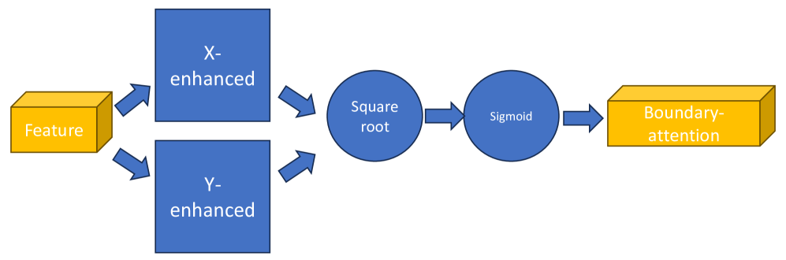

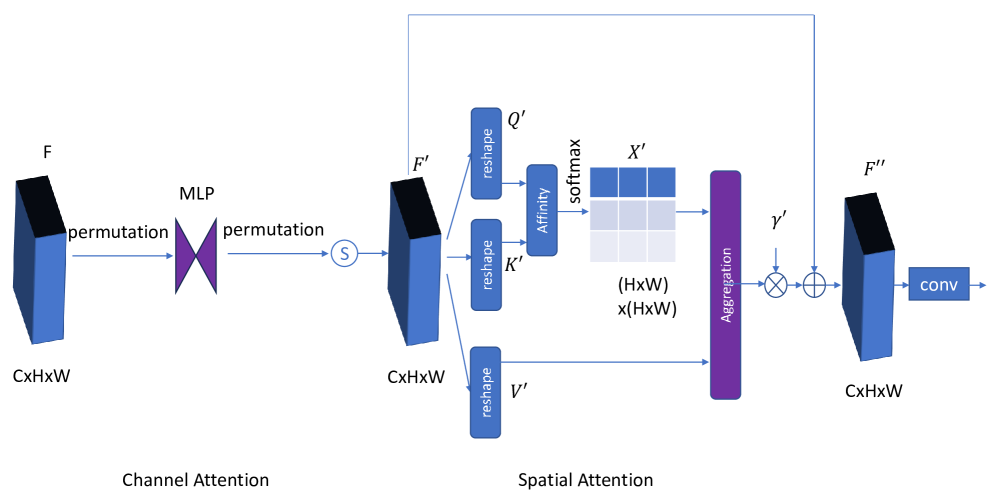

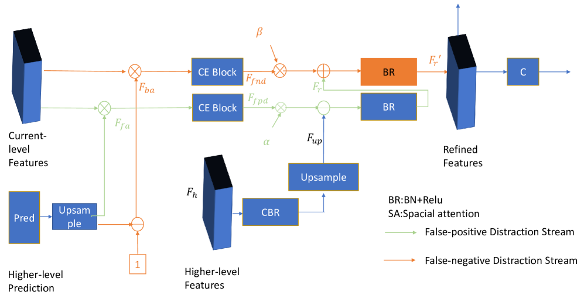

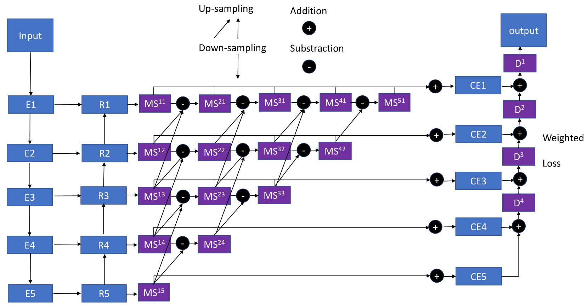

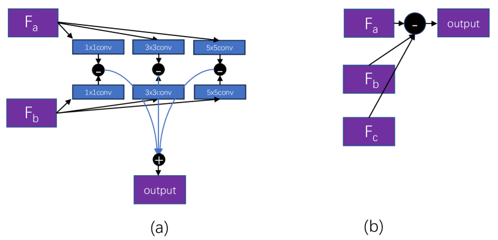

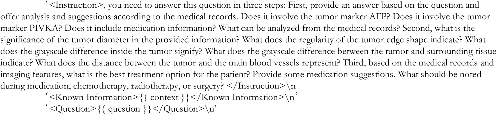

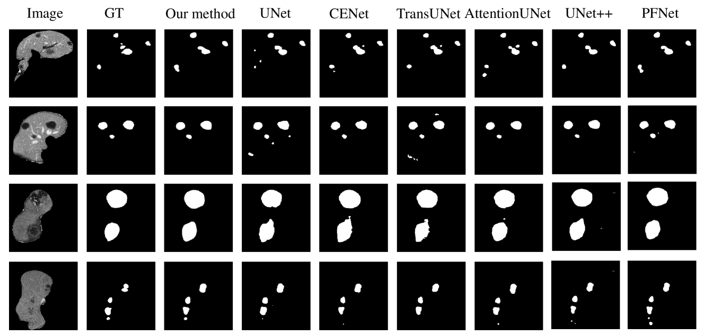

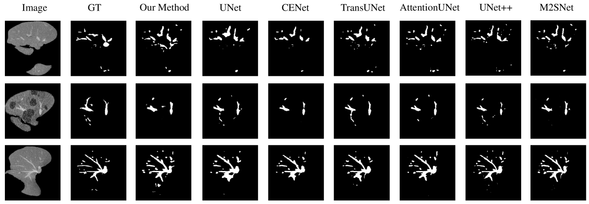

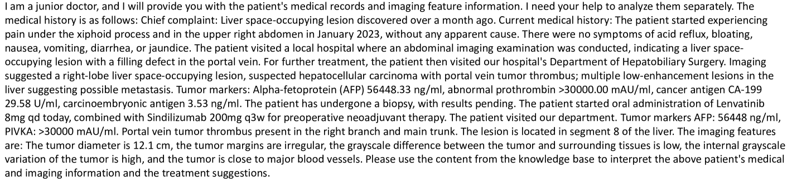

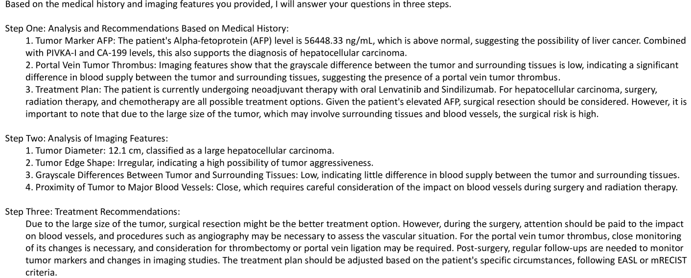

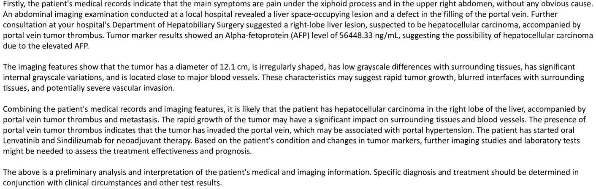

[Arxiv](https://arxiv.org/abs/2406.18039)