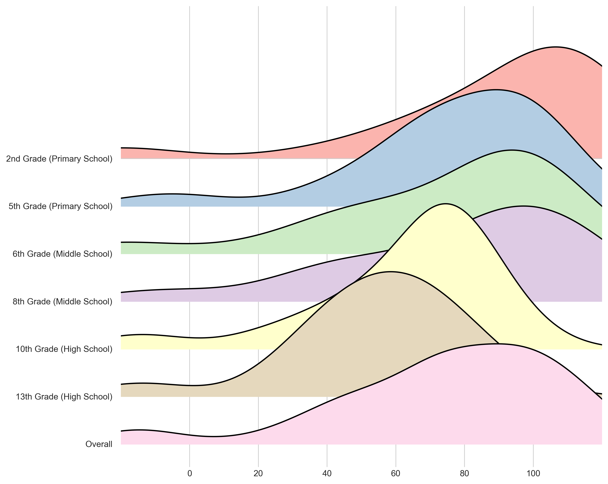
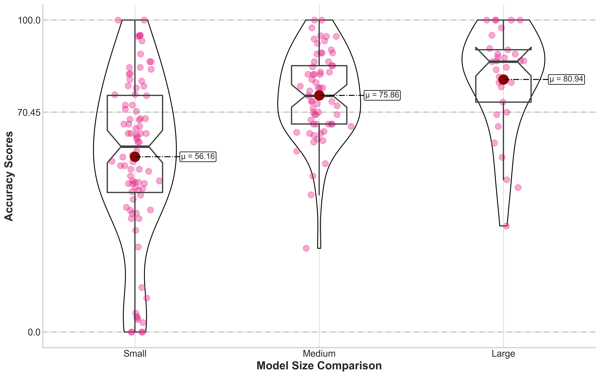
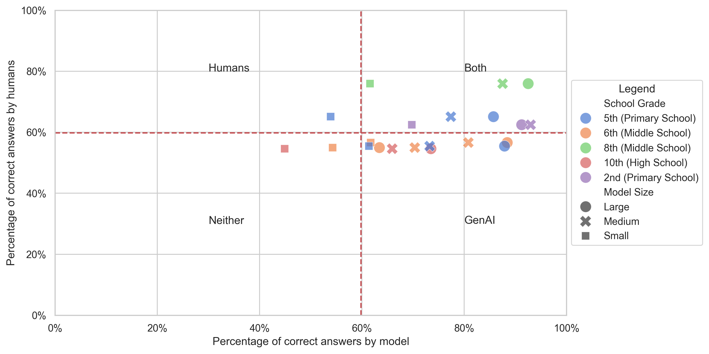

# 学而不辍：探究LLMs在INVALSI意大利测试中的表现水平

发布时间：2024年06月25日

`LLM应用

这篇论文主要关注大型语言模型（LLMs）在非英语语言中的应用评估，特别是针对意大利语的评估。通过引入基于INVALSI测试的结构化基准，论文旨在确保LLMs在非英语环境中的适用性和文化相关性。这涉及到对LLMs的性能进行详细评估，并与人类表现进行比较，以及鼓励持续的模型评估。因此，这篇论文属于LLM应用分类，因为它专注于LLMs在特定语言环境中的实际应用和评估。` `语言模型评估`

> Disce aut Deficere: Evaluating LLMs Proficiency on the INVALSI Italian Benchmark

# 摘要

> 大型语言模型（LLMs）的最新进展极大地增强了它们在生成和操纵语言方面的能力，展现了它们在多领域的应用潜力。为了确保LLMs在非英语语言中的广泛适用性和文化相关性，对其进行评估至关重要。我们通过引入基于INVALSI测试的结构化基准来应对这一挑战，这些测试是意大利教育能力评估的成熟工具。我们的研究贡献有三：首先，我们为LLMs的自动化评估量身定制了INVALSI基准，确保测试格式适应自动化处理的同时，不失原测试的核心。其次，我们详细评估了当前的LLMs，为学术界提供了关键的参考。最后，我们通过视觉比较，展示了这些模型与人类表现的对比。此外，我们鼓励研究人员提交模型进行持续评估，使该基准保持时效性和价值。

> Recent advancements in Large Language Models (LLMs) have significantly enhanced their ability to generate and manipulate human language, highlighting their potential across various applications. Evaluating LLMs in languages other than English is crucial for ensuring their linguistic versatility, cultural relevance, and applicability in diverse global contexts, thus broadening their usability and effectiveness. We tackle this challenge by introducing a structured benchmark using the INVALSI tests, a set of well-established assessments designed to measure educational competencies across Italy. Our study makes three primary contributions: Firstly, we adapt the INVALSI benchmark for automated LLM evaluation, which involves rigorous adaptation of the test format to suit automated processing while retaining the essence of the original tests. Secondly, we provide a detailed assessment of current LLMs, offering a crucial reference point for the academic community. Finally, we visually compare the performance of these models against human results. Additionally, researchers are invited to submit their models for ongoing evaluation, ensuring the benchmark remains a current and valuable resource.

[Arxiv](https://arxiv.org/abs/2406.17535)