# 大型语言模型的双空间知识蒸馏

发布时间：2024年06月25日

`LLM理论

理由：这篇论文主要探讨了知识蒸馏（KD）在大型语言模型（LLM）中的应用，特别是在模型压缩和知识迁移方面的理论创新。论文提出了双空间知识蒸馏（DSKD）框架，这是一种新的理论框架，旨在优化知识蒸馏过程，并通过跨模型注意力机制实现不同词汇表模型的表示对齐。这些内容涉及LLM的理论层面，特别是在模型间的知识转移和表示学习方面，因此归类为LLM理论。` `模型压缩`

> Dual-Space Knowledge Distillation for Large Language Models

# 摘要

> 知识蒸馏（KD）是一种通过将大型语言模型的知识迁移至小型模型来实现模型压缩的有效方法。在白盒KD方法中，通常通过最小化两个模型输出分布的差异来促进知识的转移。然而，现有框架中，两个模型的输出分布源自各自的输出空间，使用独立的预测头，这导致了教师模型与学生模型在表示和分布层面的相似度不高。此外，这种差异还限制了不同词汇表模型间的知识蒸馏过程，这在大型语言模型中颇为常见。为此，我们提出了双空间知识蒸馏（DSKD）框架，它统一了两个模型的输出空间，以优化知识蒸馏过程。基于DSKD，我们还开发了一种跨模型注意力机制，能自动对齐不同词汇表模型的表示。因此，我们的框架不仅支持多种KD距离函数（如KL散度），还能实现任意两个大型语言模型间的知识蒸馏，不受词汇表限制。实验结果显示，DSKD在任务无关的指令遵循基准上显著超越了现有的白盒KD框架及不同词汇表LLMs的KD方法。

> Knowledge distillation (KD) is known as a promising solution to compress large language models (LLMs) via transferring their knowledge to smaller models. During this process, white-box KD methods usually minimize the distance between the output distributions of the two models so that more knowledge can be transferred. However, in the current white-box KD framework, the output distributions are from the respective output spaces of the two models, using their own prediction heads. We argue that the space discrepancy will lead to low similarity between the teacher model and the student model on both representation and distribution levels. Furthermore, this discrepancy also hinders the KD process between models with different vocabularies, which is common for current LLMs. To address these issues, we propose a dual-space knowledge distillation (DSKD) framework that unifies the output spaces of the two models for KD. On the basis of DSKD, we further develop a cross-model attention mechanism, which can automatically align the representations of the two models with different vocabularies. Thus, our framework is not only compatible with various distance functions for KD (e.g., KL divergence) like the current framework, but also supports KD between any two LLMs regardless of their vocabularies. Experiments on task-agnostic instruction-following benchmarks show that DSKD significantly outperforms the current white-box KD framework with various distance functions, and also surpasses existing KD methods for LLMs with different vocabularies.

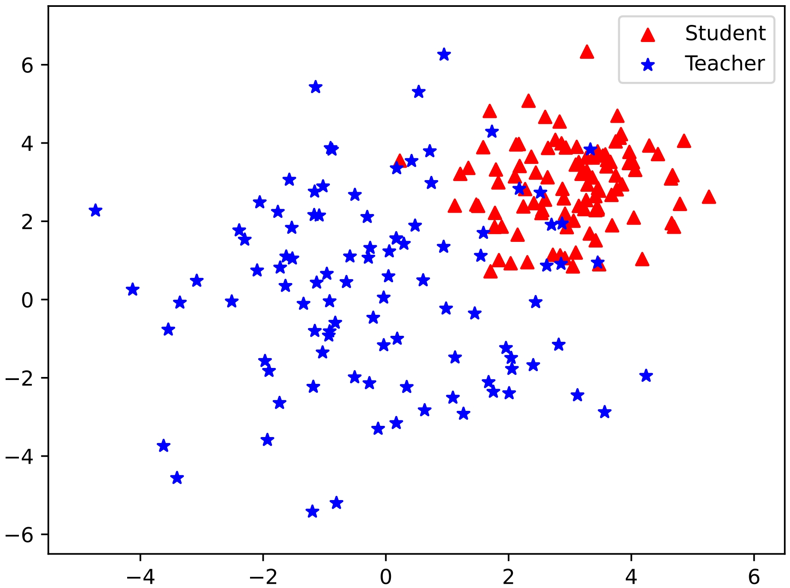

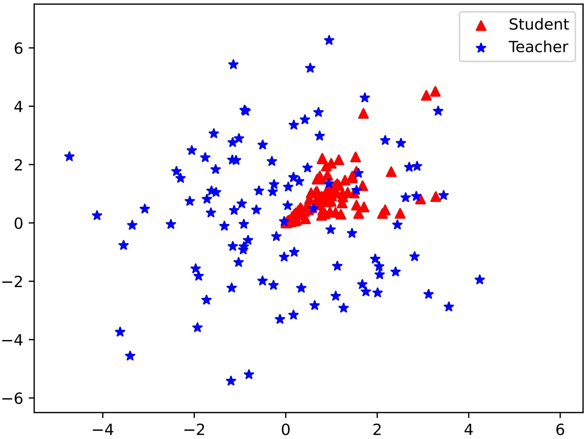

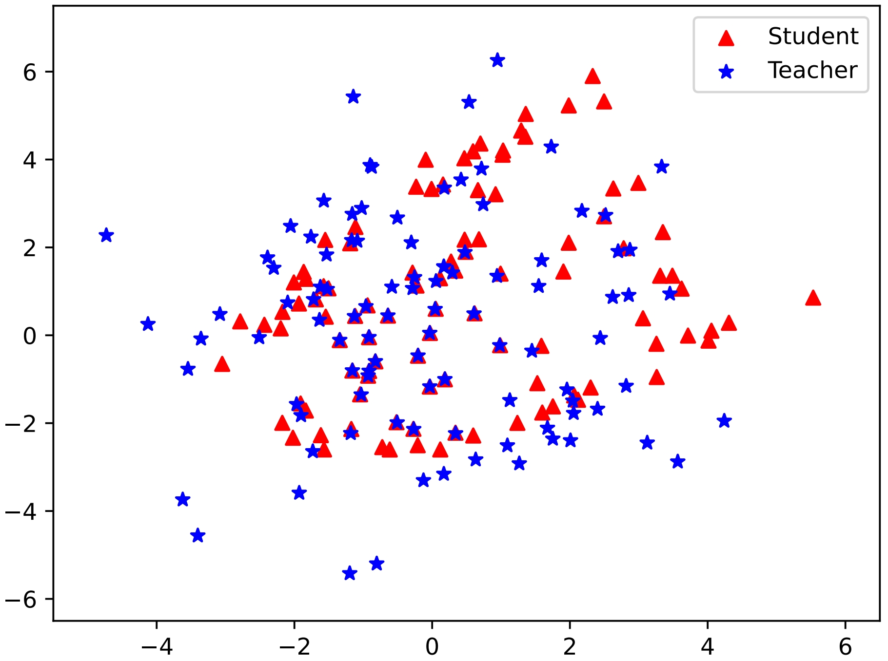

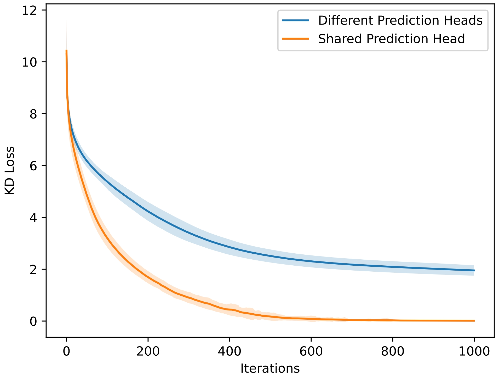

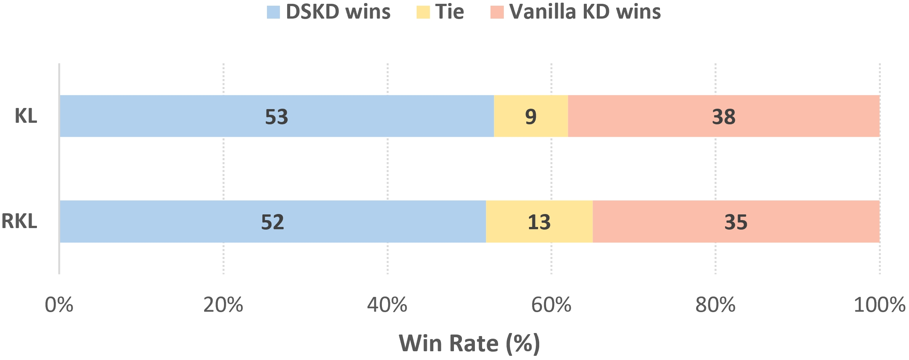

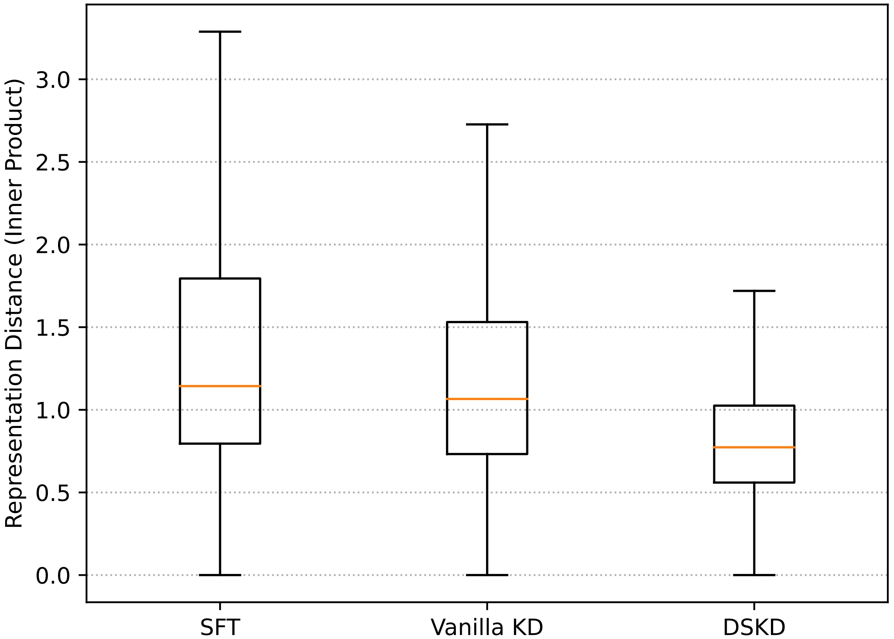

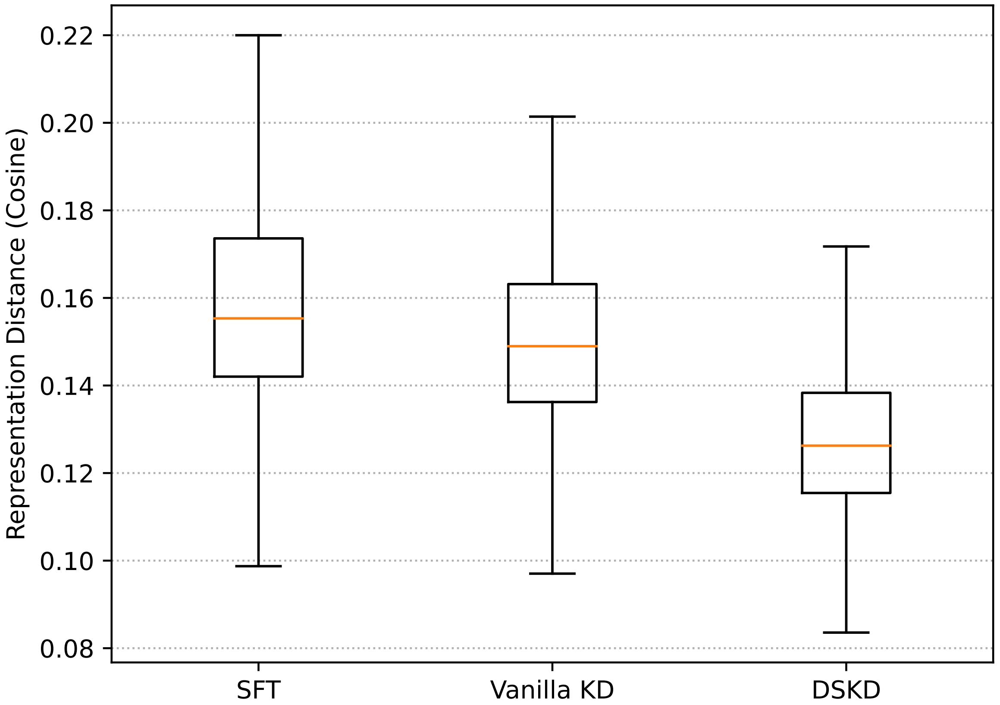

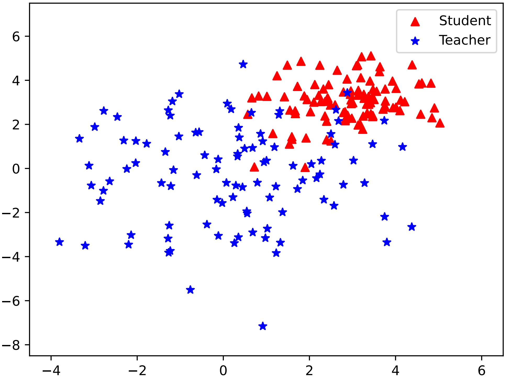

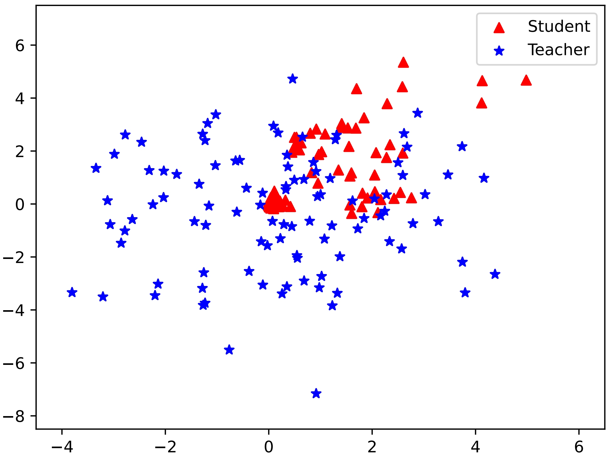

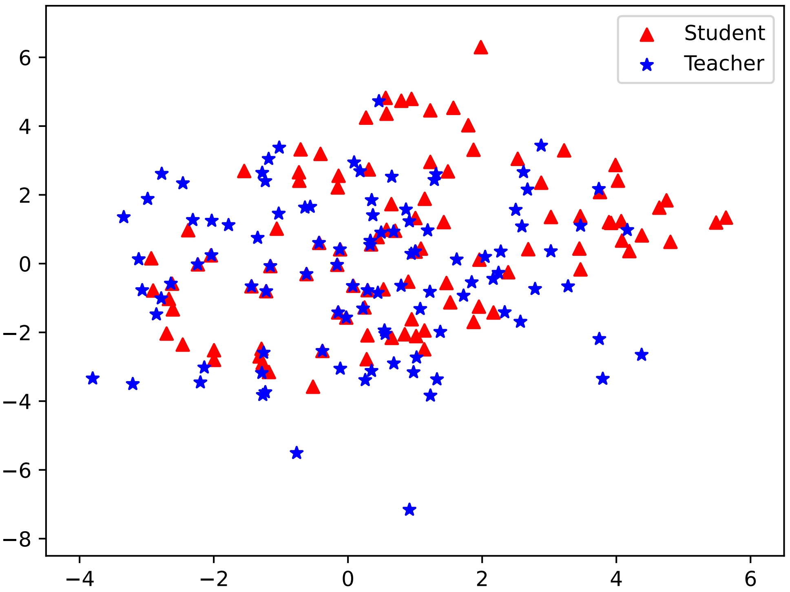

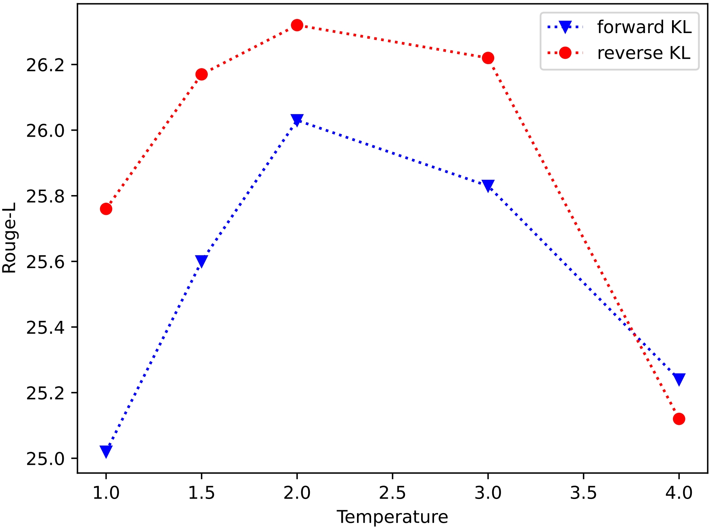

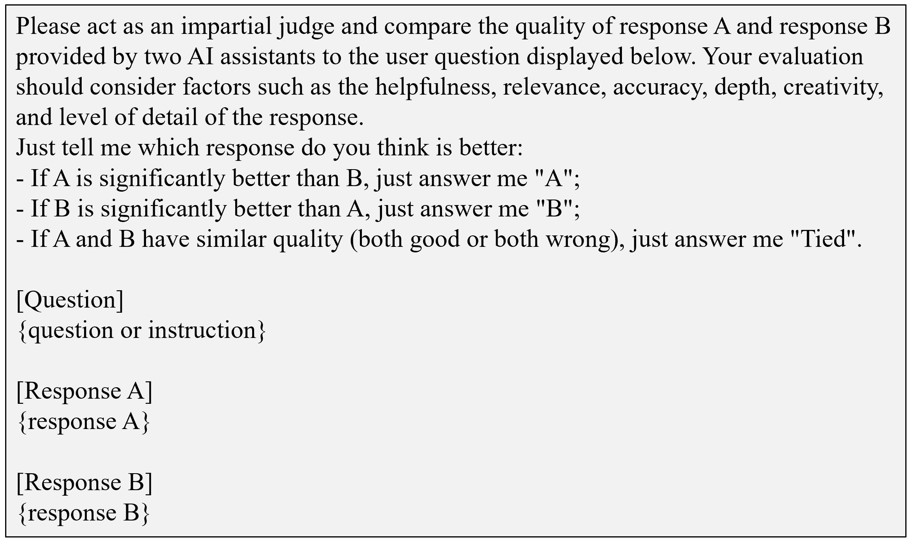

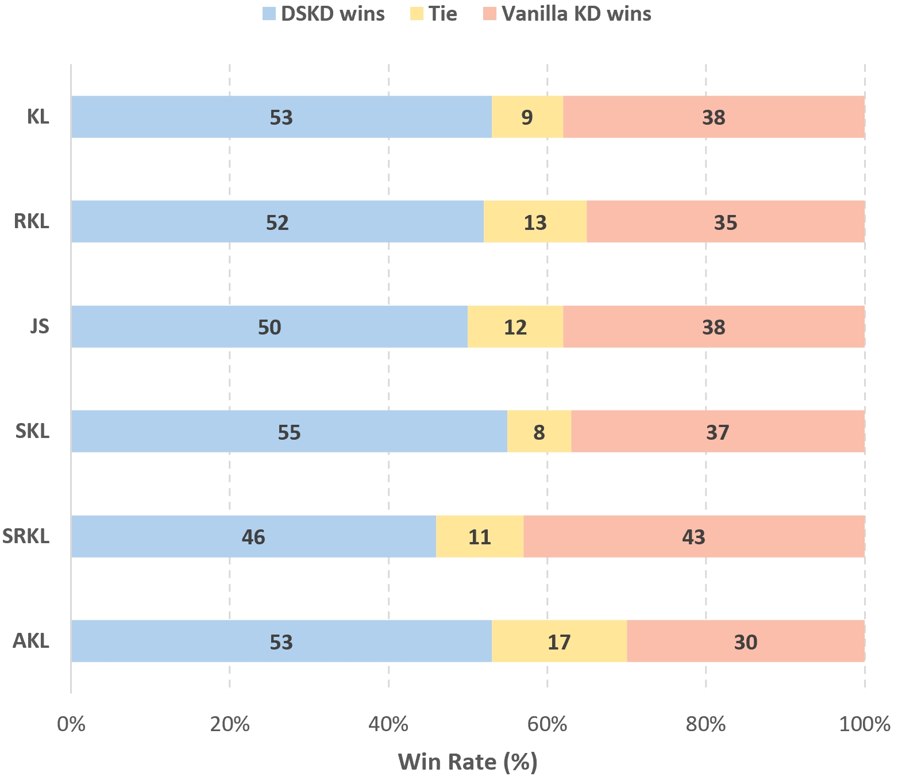

[Arxiv](https://arxiv.org/abs/2406.17328)