# 基于Fisher-Rao梯度流的高效多模态无导数贝叶斯推断

发布时间：2024年06月25日

`RAG

理由：这篇论文主要探讨了针对概率分布的高效近似采样技术，特别是在科学工程领域大规模逆问题中的贝叶斯推断问题。它提出了一种基于Fisher-Rao梯度流的框架，并结合了高斯混合近似与算子分裂技术，以及卡尔曼方法来解决梯度不可行的问题。这些技术主要用于优化和改进概率模型的采样过程，这与RAG（Retrieval-Augmented Generation）领域的目标相符，即通过改进数据检索和处理技术来增强模型的性能。因此，这篇论文更适合归类于RAG。` `科学工程` `贝叶斯推断`

> Efficient, Multimodal, and Derivative-Free Bayesian Inference With Fisher-Rao Gradient Flows

# 摘要

> 本文探讨了针对已知归一化常数的概率分布的高效近似采样技术，特别聚焦于科学工程领域大规模逆问题中的贝叶斯推断问题。面对的计算难题包括：重复评估昂贵的前向模型、可能出现的多模态情况，以及前向模型梯度或伴随求解器的不可行性。尽管现有方法各自应对了部分挑战，我们提出了一种全面解决这三个问题的框架。该框架基于概率空间中的Fisher-Rao梯度流，构建了一个动态系统，该系统以均匀指数速率收敛至目标分布，有效减轻了计算负担。通过结合高斯混合近似与算子分裂技术，我们数值模拟了这一动态过程，成功捕捉了多模态特性。同时，采用卡尔曼方法实现了高斯成分及其权重的无导数更新，解决了梯度不可行的问题。这一创新方法催生了高斯混合卡尔曼逆（GMKI），一个高效且能处理多模态分布的无导数采样器。通过一系列理论与数值实验，包括概念验证、二维示例及大规模应用——从正时解数据中恢复纳维-斯托克斯初始条件，GMKI的有效性得到了充分验证。

> In this paper, we study efficient approximate sampling for probability distributions known up to normalization constants. We specifically focus on a problem class arising in Bayesian inference for large-scale inverse problems in science and engineering applications. The computational challenges we address with the proposed methodology are: (i) the need for repeated evaluations of expensive forward models; (ii) the potential existence of multiple modes; and (iii) the fact that gradient of, or adjoint solver for, the forward model might not be feasible.
  While existing Bayesian inference methods meet some of these challenges individually, we propose a framework that tackles all three systematically. Our approach builds upon the Fisher-Rao gradient flow in probability space, yielding a dynamical system for probability densities that converges towards the target distribution at a uniform exponential rate. This rapid convergence is advantageous for the computational burden outlined in (i). We apply Gaussian mixture approximations with operator splitting techniques to simulate the flow numerically; the resulting approximation can capture multiple modes thus addressing (ii). Furthermore, we employ the Kalman methodology to facilitate a derivative-free update of these Gaussian components and their respective weights, addressing the issue in (iii).
  The proposed methodology results in an efficient derivative-free sampler flexible enough to handle multi-modal distributions: Gaussian Mixture Kalman Inversion (GMKI). The effectiveness of GMKI is demonstrated both theoretically and numerically in several experiments with multimodal target distributions, including proof-of-concept and two-dimensional examples, as well as a large-scale application: recovering the Navier-Stokes initial condition from solution data at positive times.

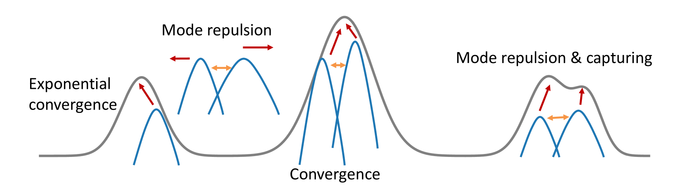

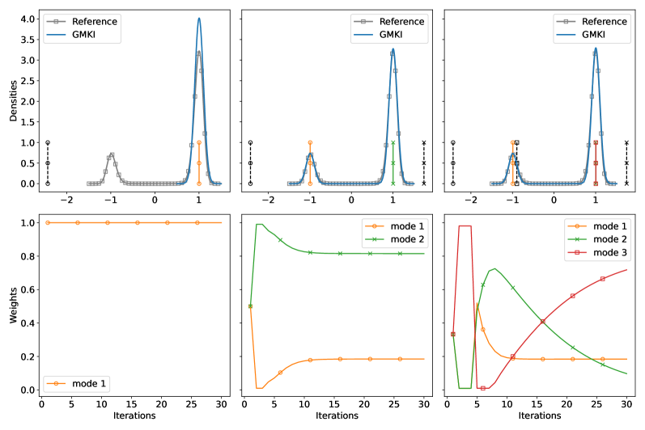

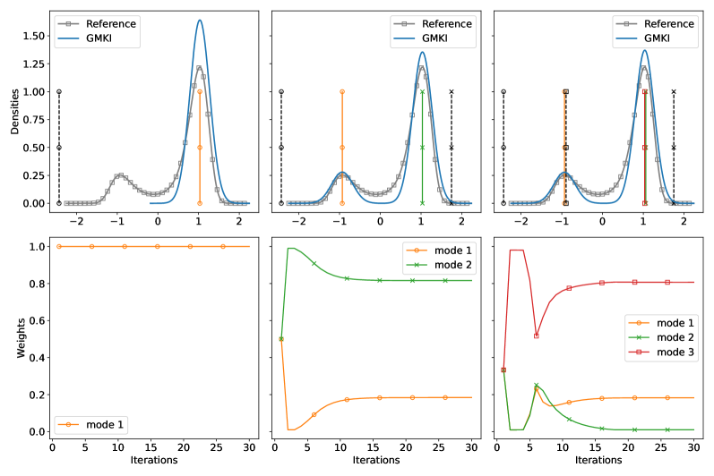

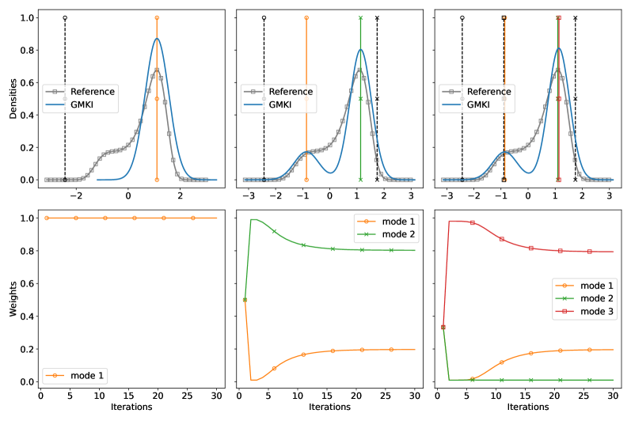

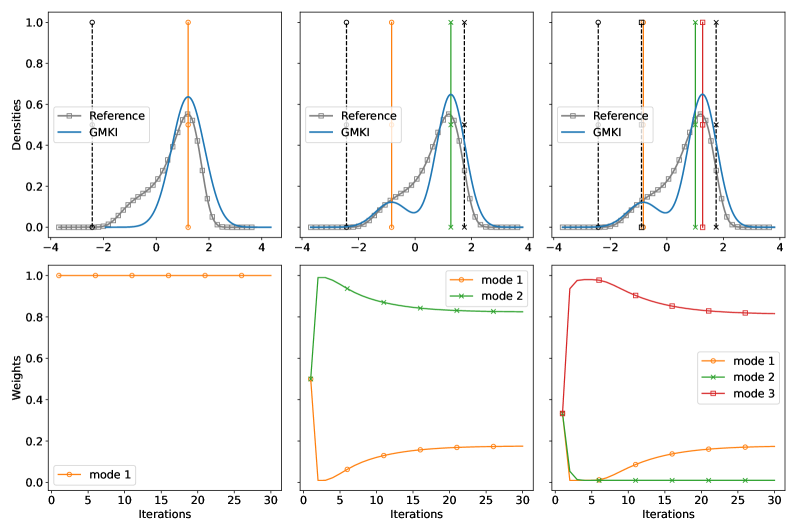

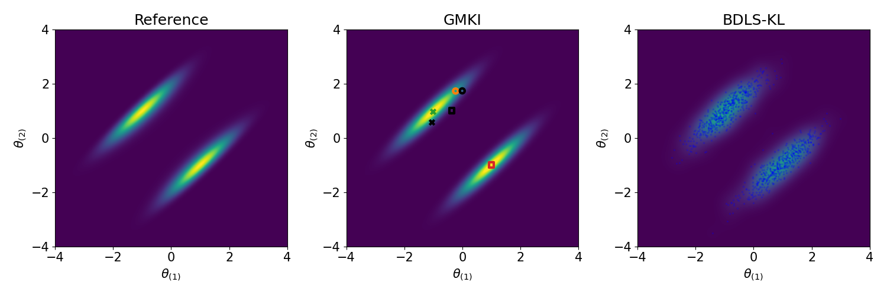

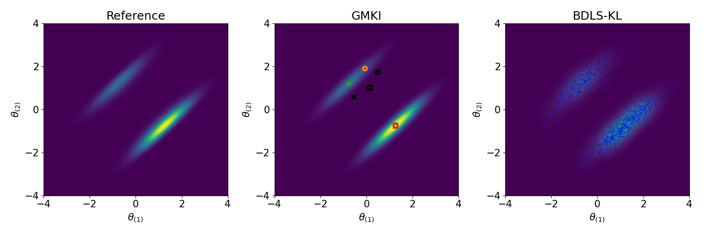

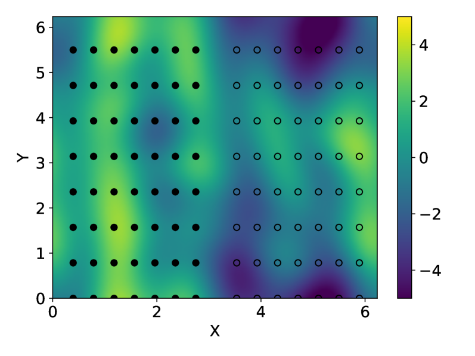

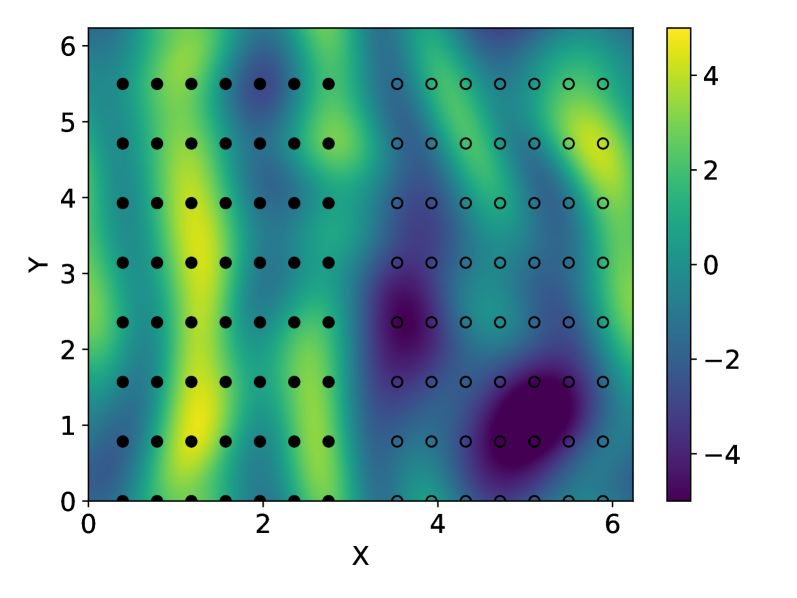

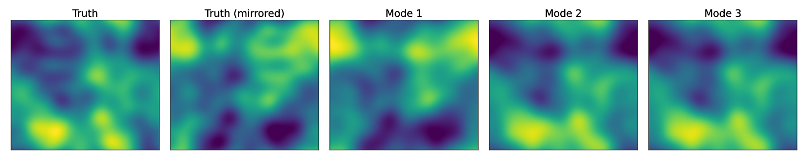

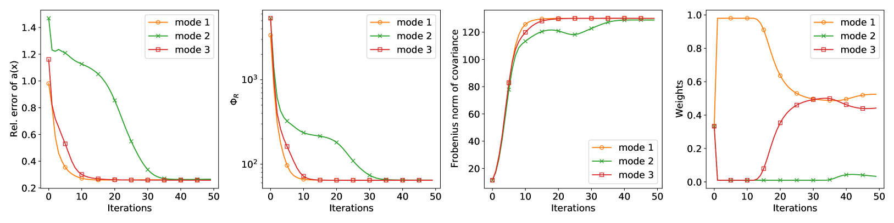

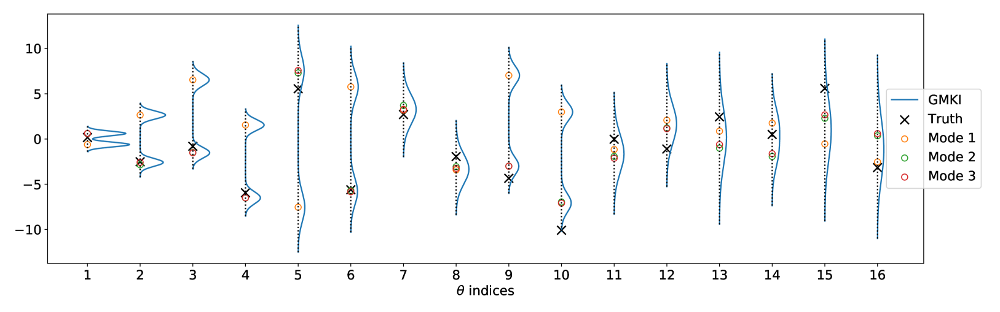

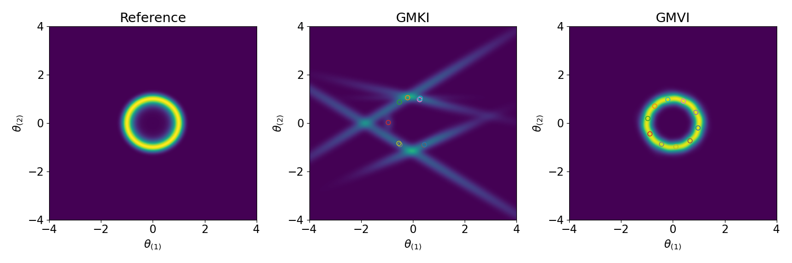

[Arxiv](https://arxiv.org/abs/2406.17263)