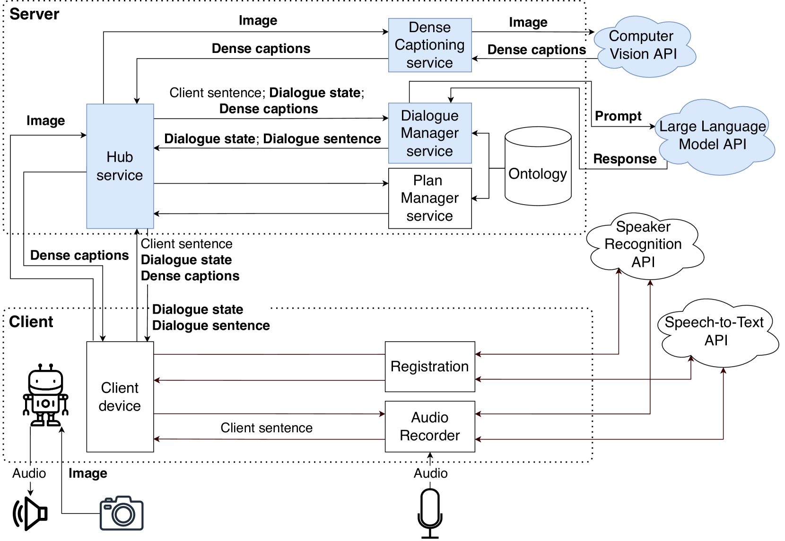
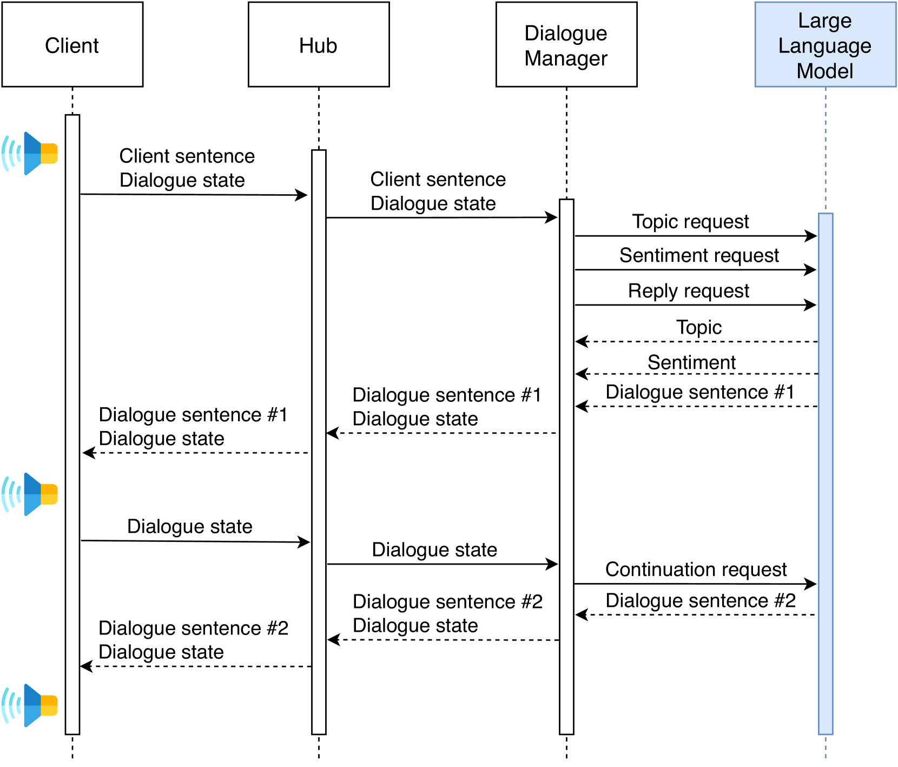
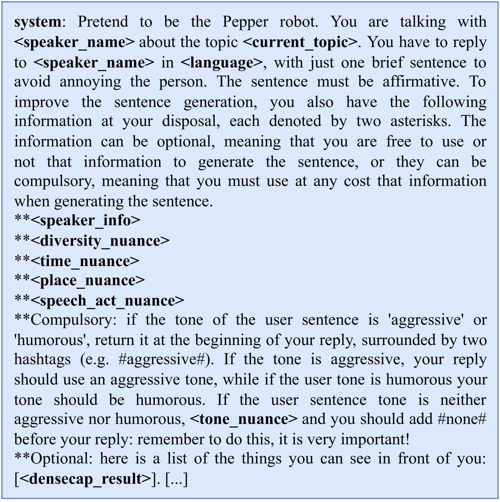
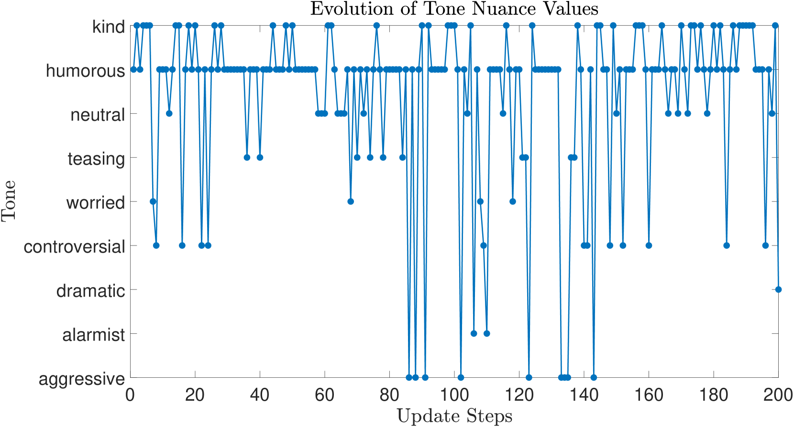
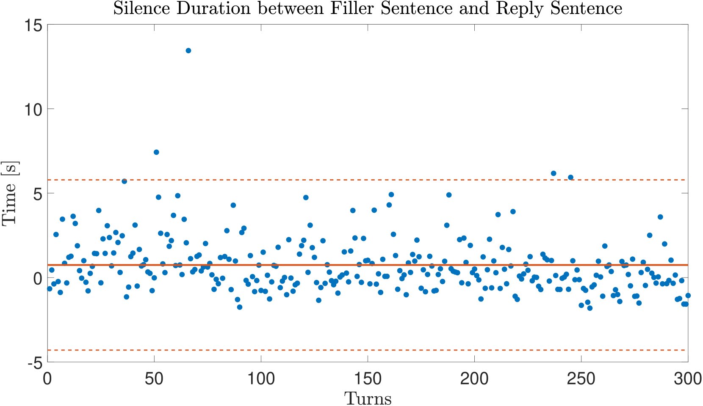

# 借助细微差别，提升基于LLM的人机交互，增强对多样性的敏感度

发布时间：2024年06月25日

`Agent

这篇论文描述了一个基于大型语言模型（LLMs）的自主对话系统，该系统能够适应不同背景、个性、年龄、性别和文化的人群。系统通过整合用户的详细信息、对话历史和特定指南来生成多样化感知的句子，这表明系统具有一定的自主性和适应性，能够根据不同的情境和用户特征进行调整。这种能力符合Agent的定义，即一个能够感知环境并采取行动以达到目标的系统。因此，这篇论文应归类为Agent。` `对话系统` `人工智能`

> Enhancing LLM-Based Human-Robot Interaction with Nuances for Diversity Awareness

# 摘要

> 本文展示了一个基于LLMs的多样化感知自主对话系统，该系统能适应不同背景、个性、年龄、性别和文化的人群。对话流程由系统的知识库结构引导，LLMs则负责生成多样化感知的句子。为了实现这一目标，系统会整合用户的详细信息、对话历史和特定指南，精心设计提示。通过控制实验和真实场景测试，我们评估了系统的多方面性能。

> This paper presents a system for diversity-aware autonomous conversation leveraging the capabilities of large language models (LLMs). The system adapts to diverse populations and individuals, considering factors like background, personality, age, gender, and culture. The conversation flow is guided by the structure of the system's pre-established knowledge base, while LLMs are tasked with various functions, including generating diversity-aware sentences. Achieving diversity-awareness involves providing carefully crafted prompts to the models, incorporating comprehensive information about users, conversation history, contextual details, and specific guidelines. To assess the system's performance, we conducted both controlled and real-world experiments, measuring a wide range of performance indicators.

[Arxiv](https://arxiv.org/abs/2406.17531)