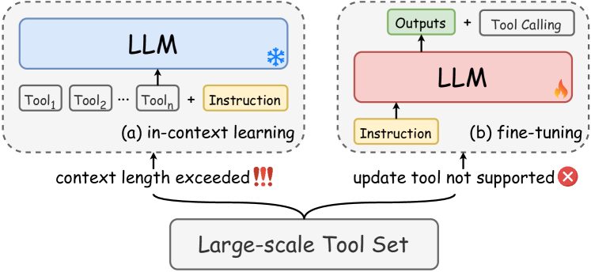
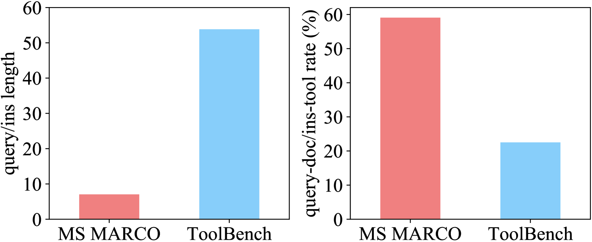
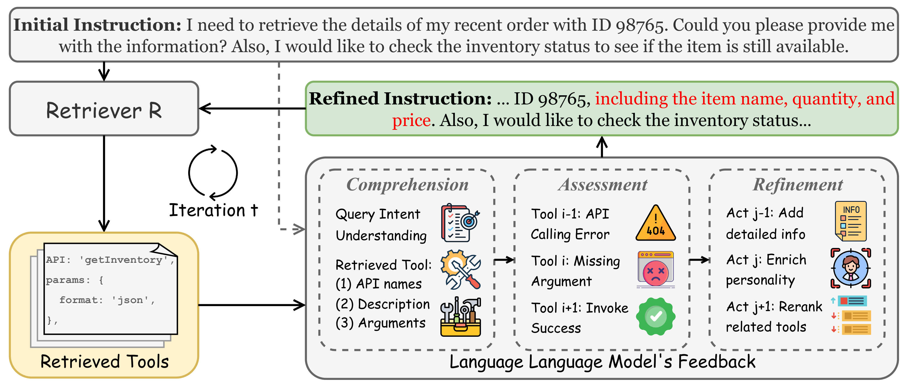
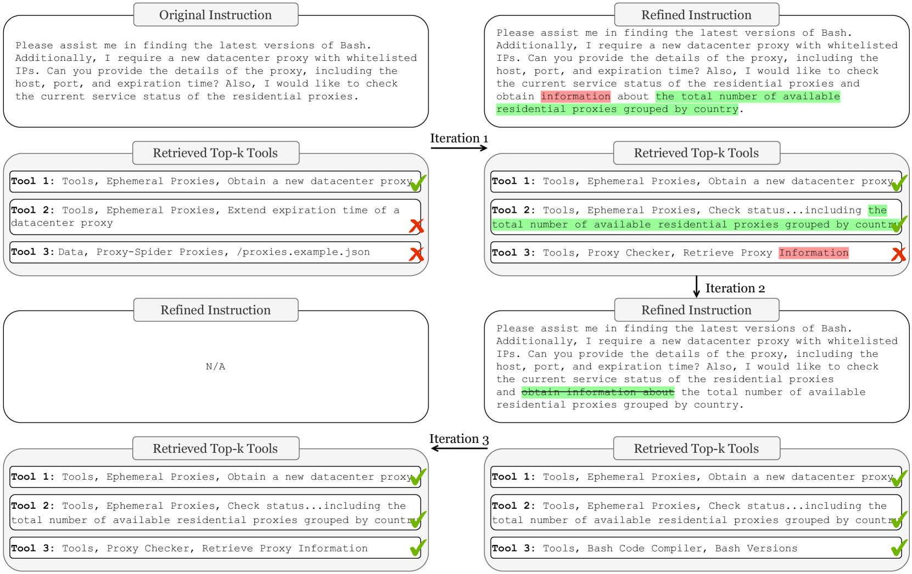

# 借助大型语言模型的迭代反馈，优化工具检索效率

发布时间：2024年06月25日

`Agent

理由：这篇论文主要探讨了如何通过迭代反馈机制优化大型语言模型（LLMs）在工具检索方面的能力，这是一种增强模型作为智能代理（Agent）在复杂环境中执行任务的能力。论文中提到的“工具学习”和“工具检索”是Agent领域中的关键概念，涉及如何使模型更有效地利用外部工具来完成任务。因此，这篇论文更适合归类于Agent分类。` `人工智能`

> Enhancing Tool Retrieval with Iterative Feedback from Large Language Models

# 摘要

> 工具学习旨在借助外部工具提升大型语言模型（LLMs）的能力，近期备受瞩目。现有研究表明，LLMs能通过情境学习或微调有效管理多种工具。但在实际应用中，工具种类繁多且更新频繁，这使得专门的工具检索机制显得尤为重要。工具检索面临的挑战包括：复杂的用户指令与工具描述，以及检索与使用模型间的错位。为此，我们提出利用LLM的迭代反馈来优化工具检索。具体做法是，让LLM在多轮交互中为工具检索模型提供反馈，逐步加深其对指令和工具的理解，缩小两组件间的差距。我们构建了一个全面的基准来评估工具检索模型，实验结果显示，我们的方法在领域内外的评估中均表现卓越。

> Tool learning aims to enhance and expand large language models' (LLMs) capabilities with external tools, which has gained significant attention recently. Current methods have shown that LLMs can effectively handle a certain amount of tools through in-context learning or fine-tuning. However, in real-world scenarios, the number of tools is typically extensive and irregularly updated, emphasizing the necessity for a dedicated tool retrieval component. Tool retrieval is nontrivial due to the following challenges: 1) complex user instructions and tool descriptions; 2) misalignment between tool retrieval and tool usage models. To address the above issues, we propose to enhance tool retrieval with iterative feedback from the large language model. Specifically, we prompt the tool usage model, i.e., the LLM, to provide feedback for the tool retriever model in multi-round, which could progressively improve the tool retriever's understanding of instructions and tools and reduce the gap between the two standalone components. We build a unified and comprehensive benchmark to evaluate tool retrieval models. The extensive experiments indicate that our proposed approach achieves advanced performance in both in-domain evaluation and out-of-domain evaluation.

[Arxiv](https://arxiv.org/abs/2406.17465)