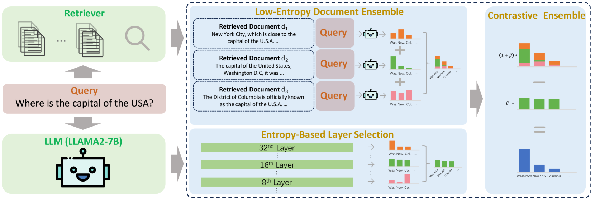
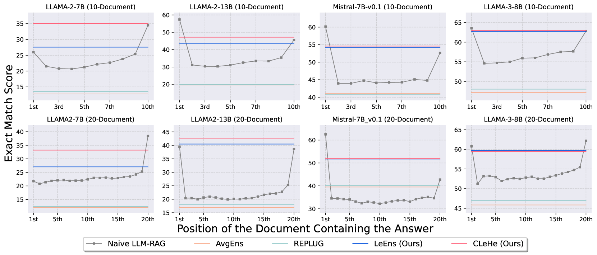
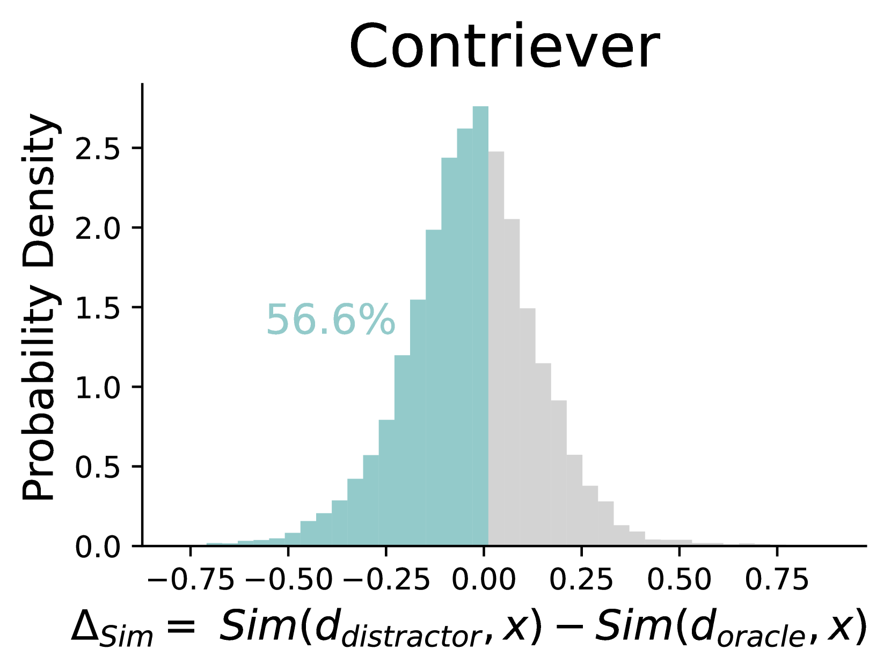
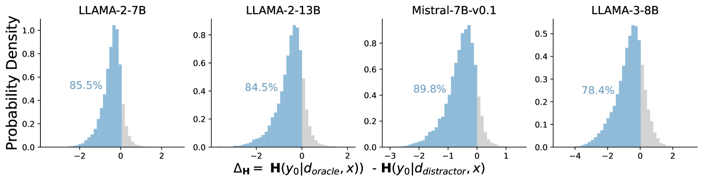
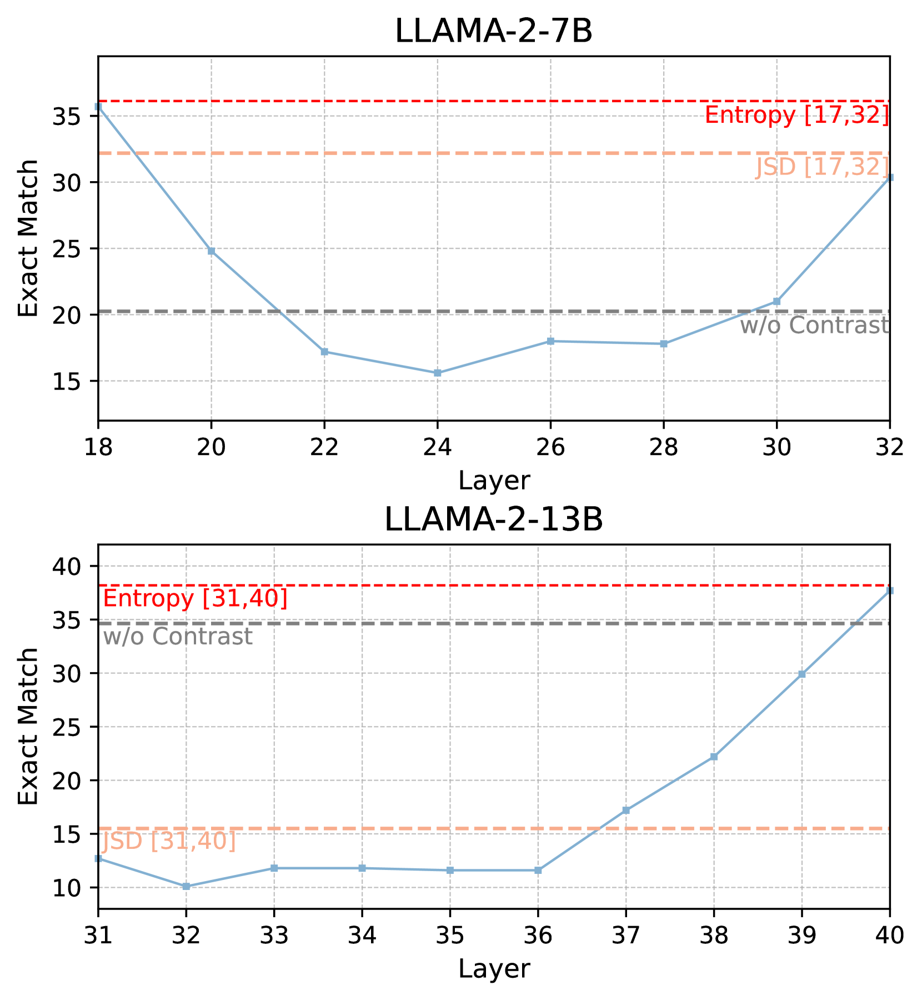
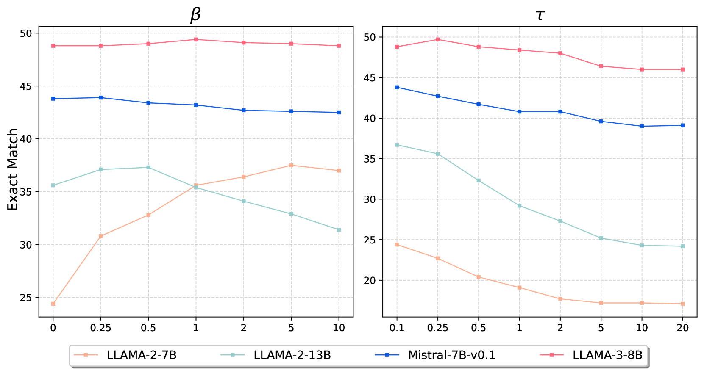
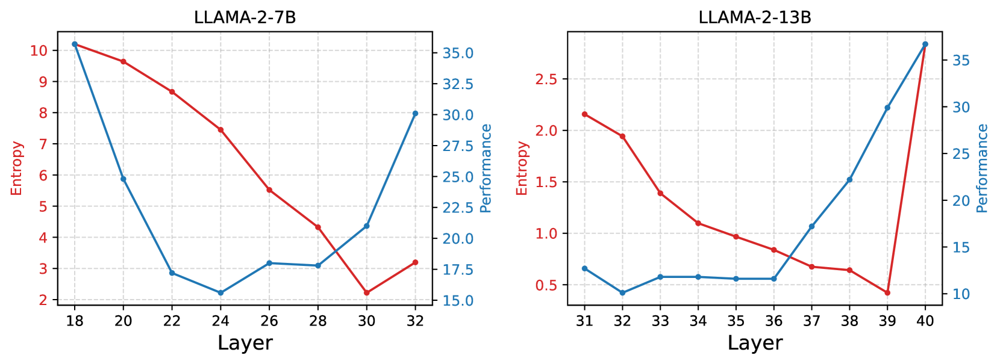
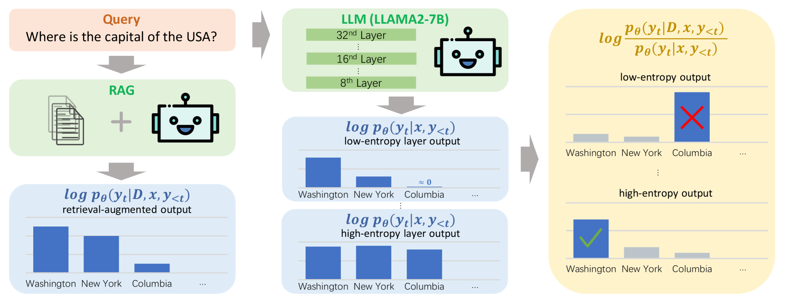

# 熵驱动解码：提升检索增强型大型语言模型的效能

发布时间：2024年06月25日

`RAG

这篇论文主要讨论了如何通过一种基于熵的新颖解码策略来提升大型语言模型（LLMs）生成回复的事实准确性，并减少内外知识源噪声的干扰。这种方法特别关注于如何有效地集成和利用外部知识，以提高模型的性能。这与RAG（Retrieval-Augmented Generation）模型的概念相吻合，RAG模型是一种结合了检索和生成的方法，旨在更好地利用外部知识来增强语言模型的生成能力。因此，这篇论文应归类于RAG。` `问答系统`

> Entropy-Based Decoding for Retrieval-Augmented Large Language Models

# 摘要

> 为了提升大型语言模型（LLMs）生成回复的事实准确性，引入外部知识已被证实有效。然而，这些模型仍受困于分心问题，生成的回复易受内外知识源噪声干扰。本文提出一种基于熵的新颖解码策略，无需额外训练即可缓解此问题。该策略通过文档并行集成解码，优先处理低熵文档，强化上下文相关信息的提取，并引入对比机制，比较低熵集成分布与模型内部的高熵分布，确保外部信息的可靠性。在开放域问答数据集上的实验结果显示，我们的方法表现卓越。

> Augmenting Large Language Models (LLMs) with retrieved external knowledge has proven effective for improving the factual accuracy of generated responses. Despite their success, retrieval-augmented LLMs still face the distractibility issue, where the generated responses are negatively influenced by noise from both external and internal knowledge sources. In this paper, we introduce a novel, training-free decoding method guided by entropy considerations to mitigate this issue. Our approach utilizes entropy-based document-parallel ensemble decoding to prioritize low-entropy distributions from retrieved documents, thereby enhancing the extraction of relevant information of context. Additionally, it incorporates a contrastive decoding mechanism that contrasts the obtained low-entropy ensemble distribution with the high-entropy distribution derived from the model's internal knowledge across layers, which ensures a greater emphasis on reliable external information. Extensive experiments on open-domain question answering datasets demonstrate the superiority of our method.

[Arxiv](https://arxiv.org/abs/2406.17519)