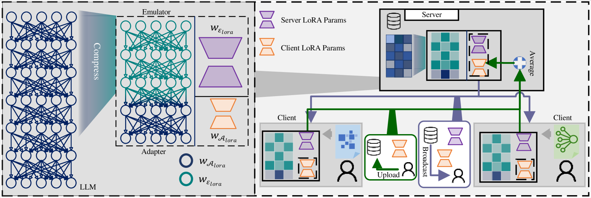
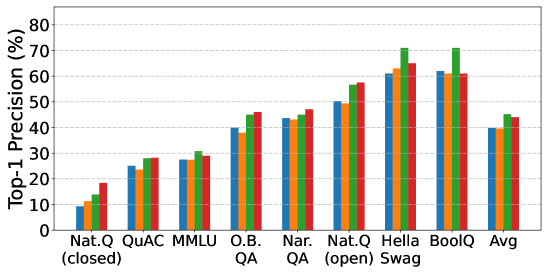
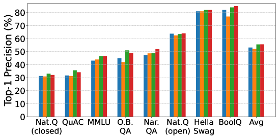
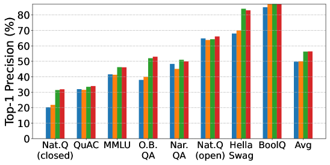

# FedBiOT：联邦学习中大型语言模型的局部微调，无需完整模型支持

发布时间：2024年06月25日

`LLM应用

这篇论文主要探讨了在联邦学习（FL）框架下如何高效微调大型语言模型（LLMs），特别是在计算和通信资源有限的情况下。论文提出了一种名为FedBiOT的新策略，该策略涉及创建一个压缩版的LLM，并在客户端对其关键部分——适配器进行微调。这种方法特别适用于处理分散且私有的特定领域数据。论文通过实验验证了这种策略的有效性和效率，尤其是在减少资源消耗的同时保持模型性能。因此，这篇论文属于LLM应用分类，因为它关注的是LLM在实际应用中的优化和调整策略。` `联邦学习`

> FedBiOT: LLM Local Fine-tuning in Federated Learning without Full Model

# 摘要

> 大型语言模型（LLMs）在特定领域数据微调后，在多个领域任务上表现卓越。然而，这些数据往往分散且私有，这促使我们探索在联邦学习（FL）中如何高效微调LLMs。在计算和通信资源有限的情况下，我们开发了FedBiOT，一种创新的LLM微调策略。该策略中，服务器首先创建一个压缩版的LLM，并确保其性能与原模型相当。接着，客户端对这一压缩模型中的关键部分——适配器进行微调。值得注意的是，由于服务器无法触及客户端的私有数据，用于模型对齐和微调的数据分布存在差异。为此，我们将问题转化为双层优化，旨在减少数据差异带来的影响，并制定了服务器和客户端的更新策略。通过在LLaMA-2上的大量实验，我们验证了适配器在重新融入全局模型时的高效性能，并展示了FedBiOT在资源消耗上的显著优势，同时保持了与现有技术相当的性能水平。

> Large language models (LLMs) show amazing performance on many domain-specific tasks after fine-tuning with some appropriate data. However, many domain-specific data are privately distributed across multiple owners. Thus, this dilemma raises the interest in how to perform LLM fine-tuning in federated learning (FL). However, confronted with limited computation and communication capacities, FL clients struggle to fine-tune an LLM effectively. To this end, we introduce FedBiOT, a resource-efficient LLM fine-tuning approach to FL. Specifically, our method involves the server generating a compressed LLM and aligning its performance with the full model. Subsequently, the clients fine-tune a lightweight yet important part of the compressed model, referred to as an adapter. Notice that as the server has no access to the private data owned by the clients, the data used for alignment by the server has a different distribution from the one used for fine-tuning by clients. We formulate the problem into a bi-level optimization problem to minimize the negative effect of data discrepancy and derive the updating rules for the server and clients. We conduct extensive experiments on LLaMA-2, empirically showing that the adapter has exceptional performance when reintegrated into the global LLM. The results also indicate that the proposed FedBiOT significantly reduces resource consumption compared to existing benchmarks, all while achieving comparable performance levels.

[Arxiv](https://arxiv.org/abs/2406.17706)