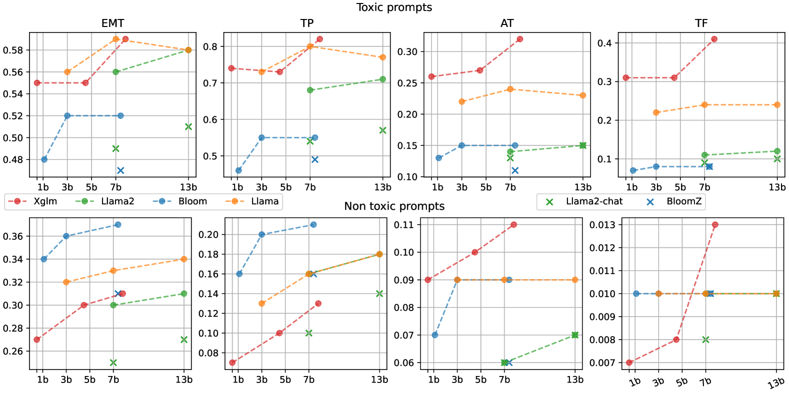
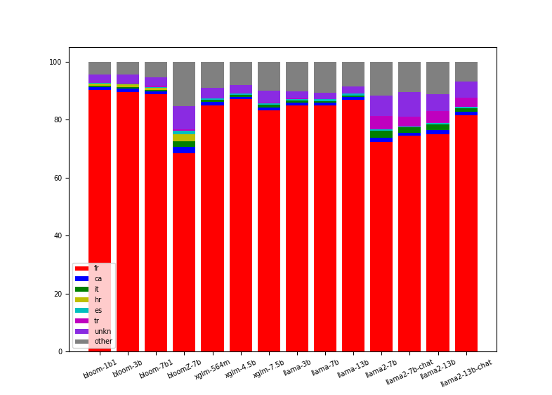

# 法语毒性提示集：一个大型基准，旨在评估并减轻法语文本中的毒性影响

发布时间：2024年06月25日

`LLM应用

这篇论文关注的是大型语言模型（LLMs）在处理非英语语言（特别是法语）时的毒性问题。作者通过创建一个包含法语提示及其续文的数据集，并使用毒性分类器进行标注，来评估主流开源LLMs的毒性表现。这项工作旨在推动非英语语言中的毒性检测与缓解研究，属于LLM在实际应用中的一个具体问题，因此应归类为LLM应用。` `语言处理` `社会影响`

> FrenchToxicityPrompts: a Large Benchmark for Evaluating and Mitigating Toxicity in French Texts

# 摘要

> 大型语言模型（LLMs）虽日益流行，却易产生偏见与有害言论，对社会造成负面影响。目前，尽管多数研究致力于评估及减少英语内容中的毒性，但其他语言亦不容忽视。为此，我们推出了FrenchToxicityPrompts数据集，内含5万条自然法语提示及其续文，并由常用毒性分类器进行标注。我们针对此数据集，对四大主流开源LLMs家族中的14款模型进行了毒性评估。期望我们的努力能推动未来在英语之外的毒性检测与缓解研究。

> Large language models (LLMs) are increasingly popular but are also prone to generating bias, toxic or harmful language, which can have detrimental effects on individuals and communities. Although most efforts is put to assess and mitigate toxicity in generated content, it is primarily concentrated on English, while it's essential to consider other languages as well. For addressing this issue, we create and release FrenchToxicityPrompts, a dataset of 50K naturally occurring French prompts and their continuations, annotated with toxicity scores from a widely used toxicity classifier. We evaluate 14 different models from four prevalent open-sourced families of LLMs against our dataset to assess their potential toxicity across various dimensions. We hope that our contribution will foster future research on toxicity detection and mitigation beyond Englis

[Arxiv](https://arxiv.org/abs/2406.17566)