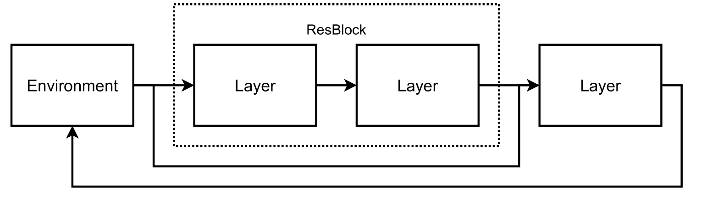
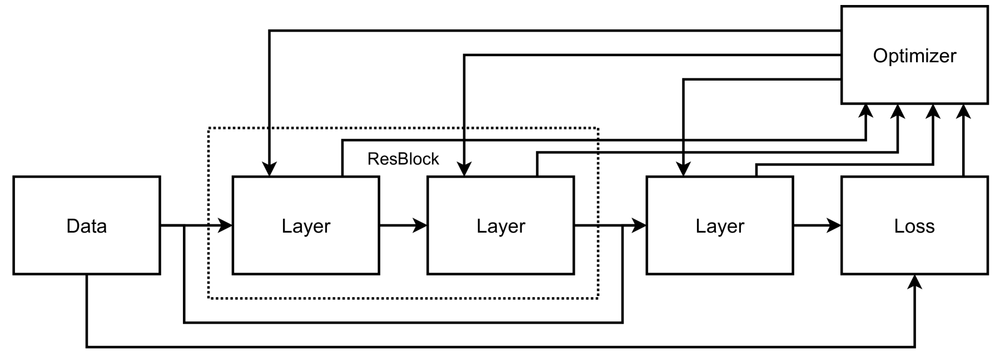
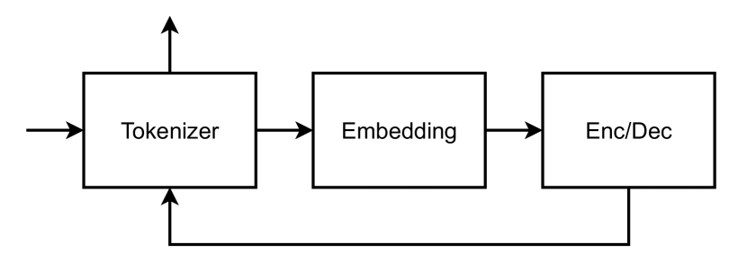
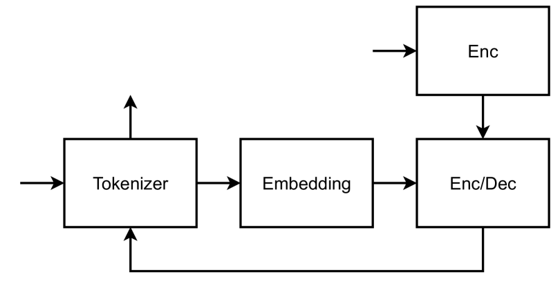
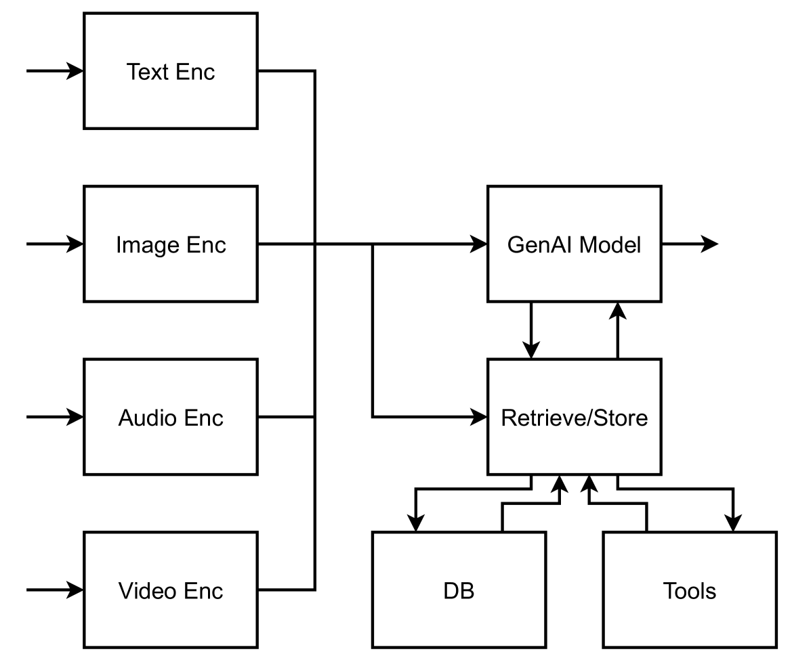
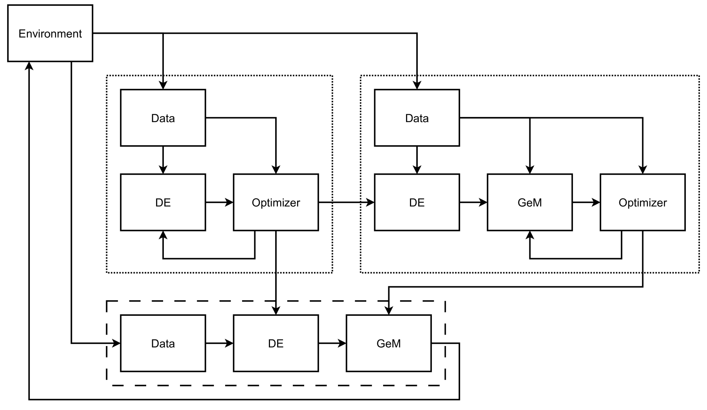
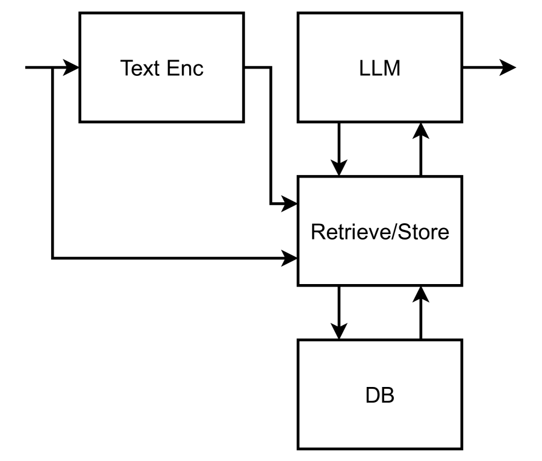
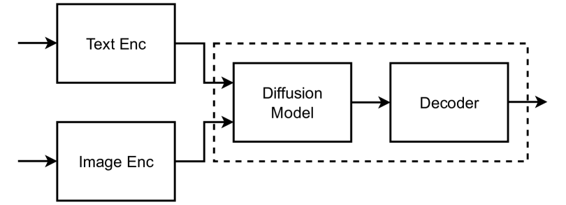
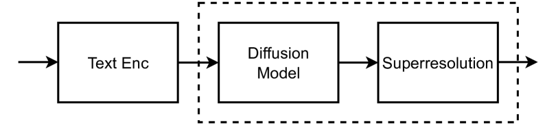

# 生成式AI：系统视角下的探索

发布时间：2024年06月25日

`LLM应用` `人工智能` `计算机科学`

> Generative AI Systems: A Systems-based Perspective on Generative AI

# 摘要

> 大型语言模型（LLM）通过实现自然语言与机器的交流，彻底革新了AI领域。生成式AI（GenAI）的最新进展，如GPT-4V和Gemini，展示了LLM作为多模态系统的巨大潜力。这一新研究方向催生了生成式AI系统（GenAISys），这些系统不仅能够进行多模态处理和内容创作，还能进行决策。GenAISys利用自然语言作为沟通桥梁，并借助模态编码器作为数据处理的I/O接口，同时整合数据库和外部工具，通过信息检索与存储模块与系统互动。本文旨在探索生成式AI系统的新研究方向，包括系统设计、构建与训练，以及从系统视角能学到什么。解答GenAI系统内部机制的疑问，需要跨学科的探索。

> Large Language Models (LLMs) have revolutionized AI systems by enabling communication with machines using natural language. Recent developments in Generative AI (GenAI) like Vision-Language Models (GPT-4V) and Gemini have shown great promise in using LLMs as multimodal systems. This new research line results in building Generative AI systems, GenAISys for short, that are capable of multimodal processing and content creation, as well as decision-making. GenAISys use natural language as a communication means and modality encoders as I/O interfaces for processing various data sources. They are also equipped with databases and external specialized tools, communicating with the system through a module for information retrieval and storage. This paper aims to explore and state new research directions in Generative AI Systems, including how to design GenAISys (compositionality, reliability, verifiability), build and train them, and what can be learned from the system-based perspective. Cross-disciplinary approaches are needed to answer open questions about the inner workings of GenAI systems.

[Arxiv](https://arxiv.org/abs/2407.11001)