# 草法：利用结构化稀疏梯度，高效低耗地训练大型语言模型

发布时间：2024年06月25日

`LLM理论

理由：这篇论文主要探讨了大型语言模型（LLM）训练中的优化问题，特别是通过提出一种新的优化方法（Grass）来解决GPU内存限制的问题。这种方法通过稀疏投影技术优化梯度处理，减少了内存和计算负担，提高了系统吞吐量。这些内容主要涉及LLM的训练优化理论和技术，因此归类为LLM理论。` `机器学习` `高性能计算`

> Grass: Compute Efficient Low-Memory LLM Training with Structured Sparse Gradients

# 摘要

> 大型语言模型（LLM）的训练与微调常因GPU内存有限而受阻。尽管现有基于投影的优化方法通过将梯度映射至低维空间来缓解优化器状态的内存压力，但它们往往依赖密集的投影矩阵，这反而增加了计算与内存负担。为此，我们创新性地提出了Grass（GRAdient Stuctured Sparsification），一种利用稀疏投影技术将梯度转化为结构化稀疏更新的方法。这一设计不仅大幅降低了优化器状态的内存需求，还极大地减少了梯度相关的内存、计算及通信开销，显著提升了系统吞吐量。通过在预训练和微调任务上的大量实验验证，Grass展现出了与全秩训练及现有投影方法相媲美的性能。尤为引人注目的是，Grass使得在单个40GB A100 GPU上进行13B参数LLaMA模型的半精度预训练成为现实——这一壮举是以往方法所无法企及的——并在8-GPU系统上实现了高达两倍的吞吐量提升。相关代码已公开于https://github.com/aashiqmuhamed/GRASS。

> Large language model (LLM) training and finetuning are often bottlenecked by limited GPU memory. While existing projection-based optimization methods address this by projecting gradients into a lower-dimensional subspace to reduce optimizer state memory, they typically rely on dense projection matrices, which can introduce computational and memory overheads. In this work, we propose Grass (GRAdient Stuctured Sparsification), a novel approach that leverages sparse projections to transform gradients into structured sparse updates. This design not only significantly reduces memory usage for optimizer states but also minimizes gradient memory footprint, computation, and communication costs, leading to substantial throughput improvements. Extensive experiments on pretraining and finetuning tasks demonstrate that Grass achieves competitive performance to full-rank training and existing projection-based methods. Notably, Grass enables half-precision pretraining of a 13B parameter LLaMA model on a single 40GB A100 GPU--a feat infeasible for previous methods--and yields up to a $2\times$ throughput improvement on an 8-GPU system. Code can be found at https://github.com/aashiqmuhamed/GRASS .

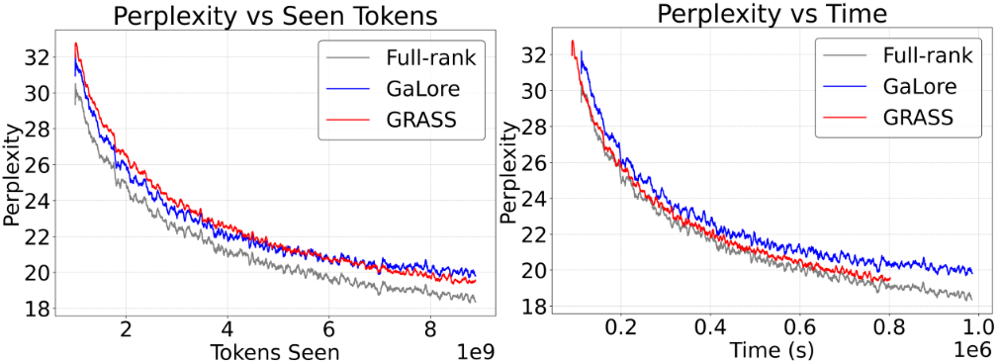

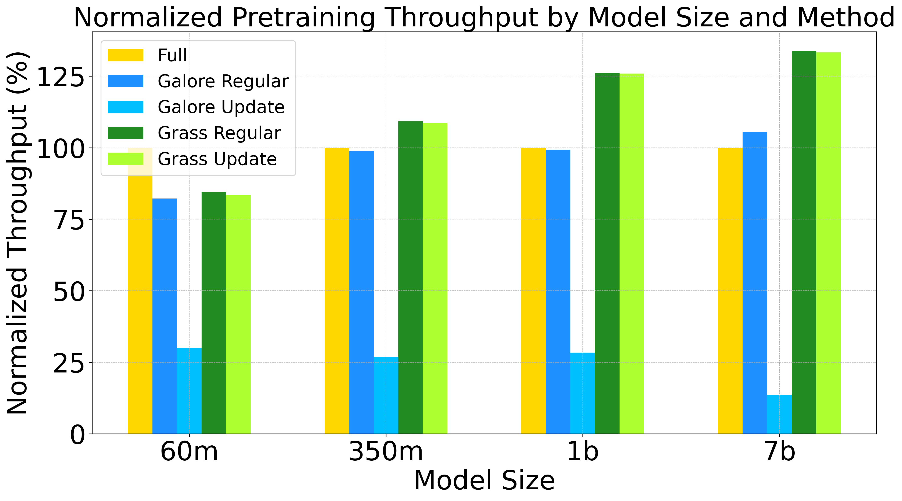

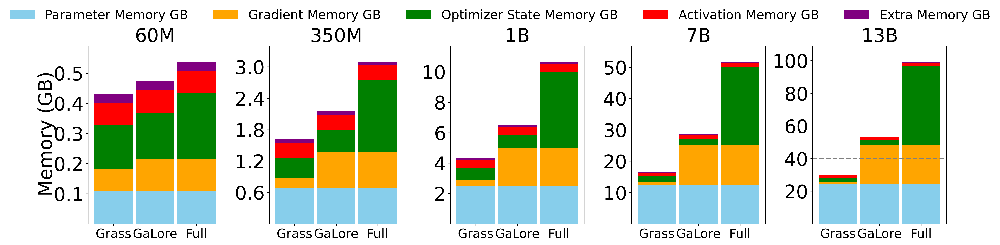

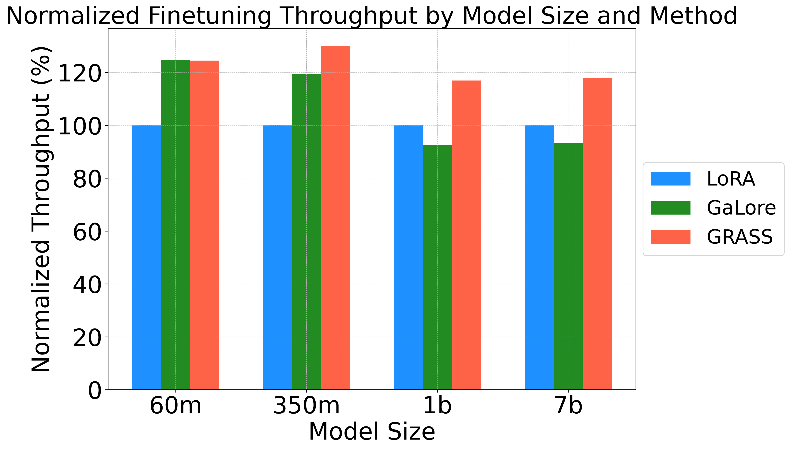

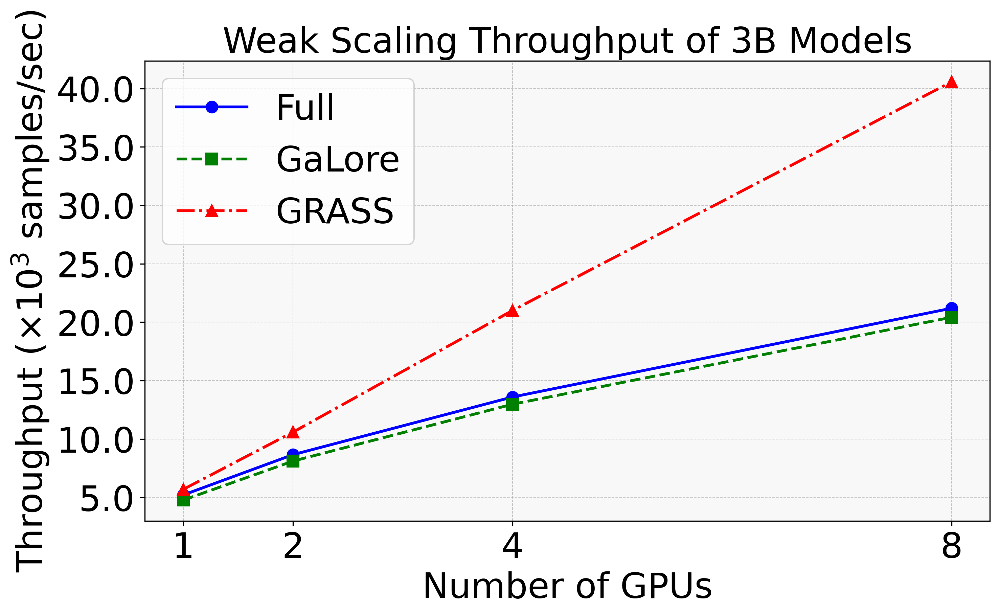

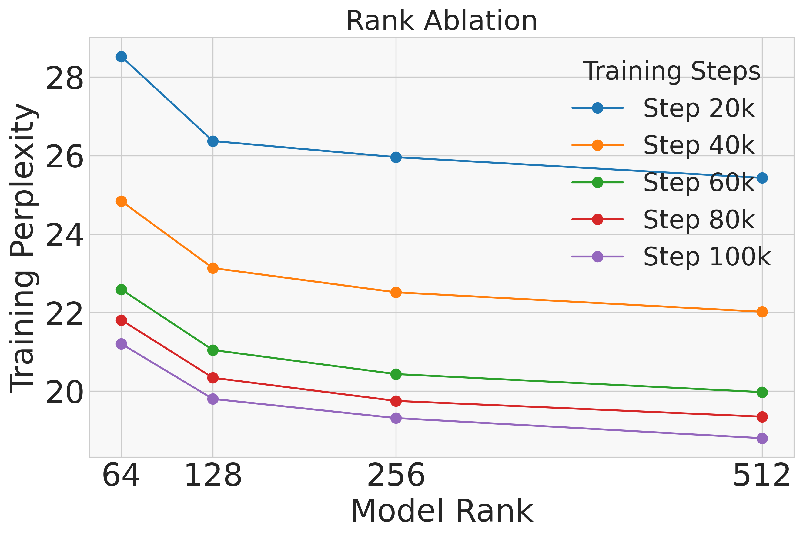

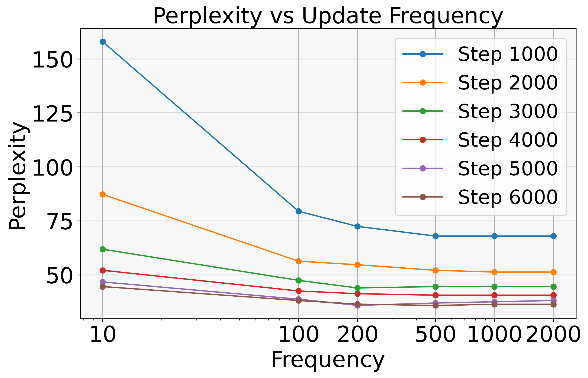

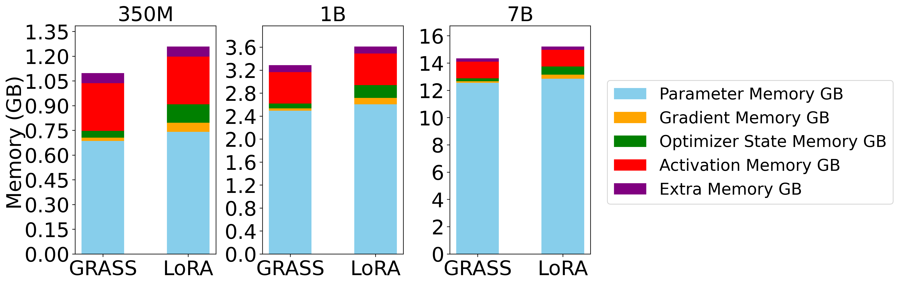

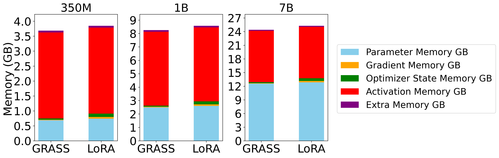

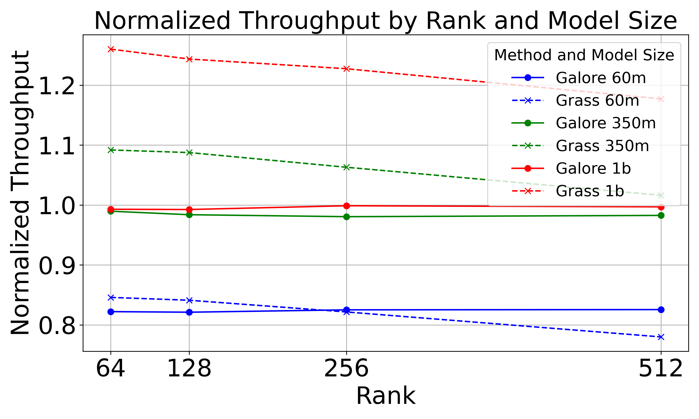

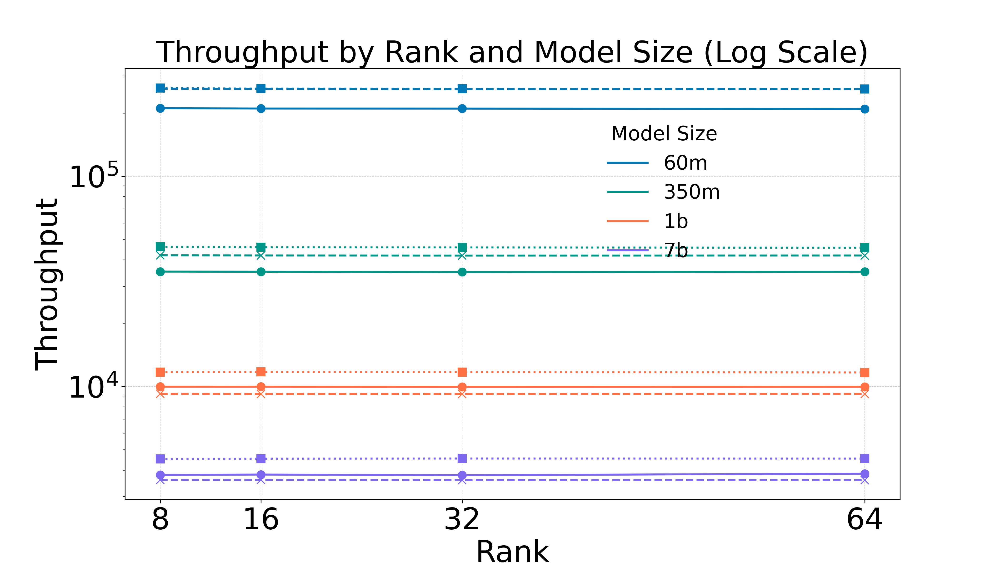

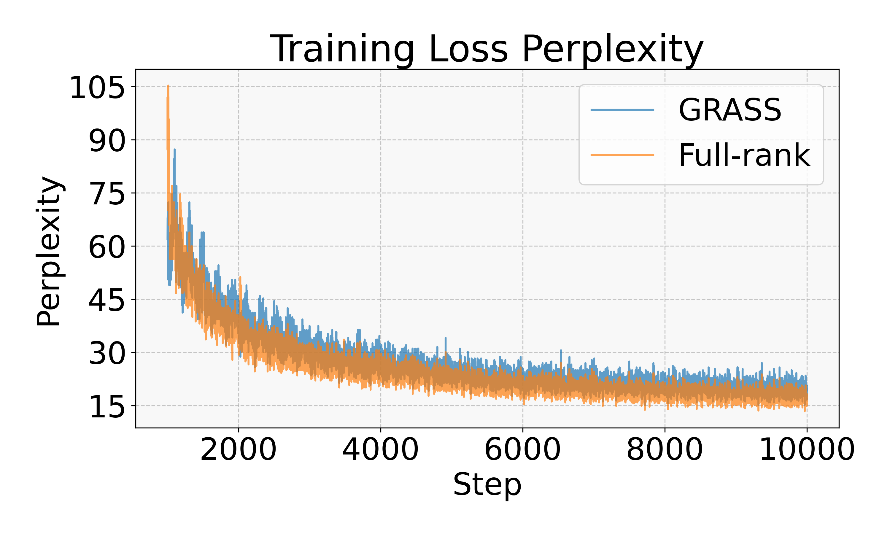

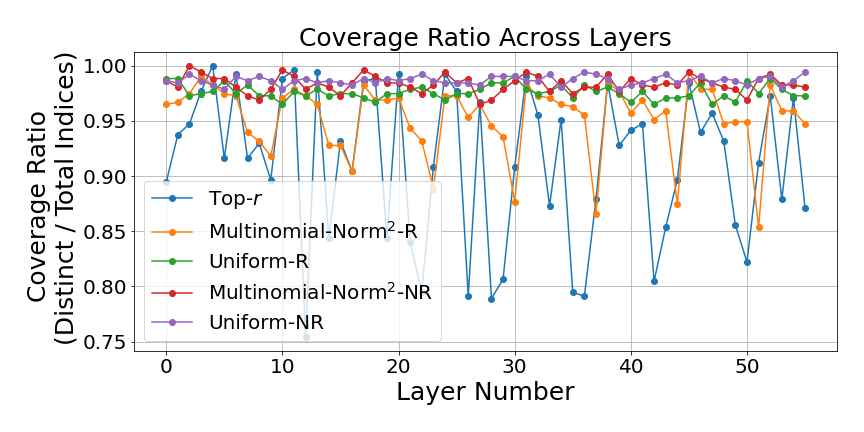

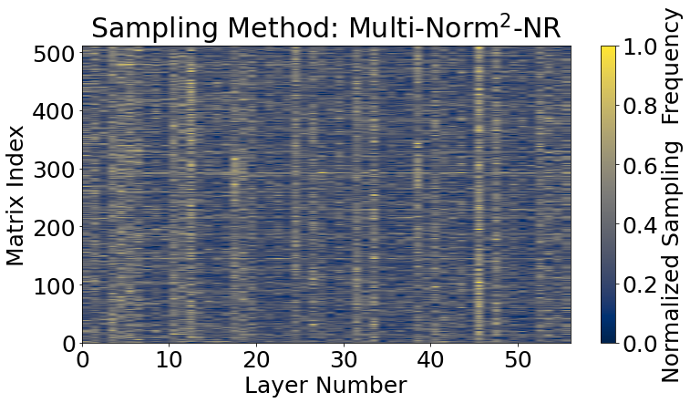

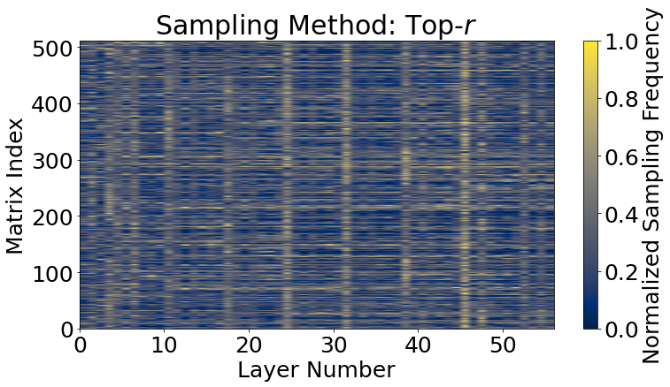

[Arxiv](https://arxiv.org/abs/2406.17660)