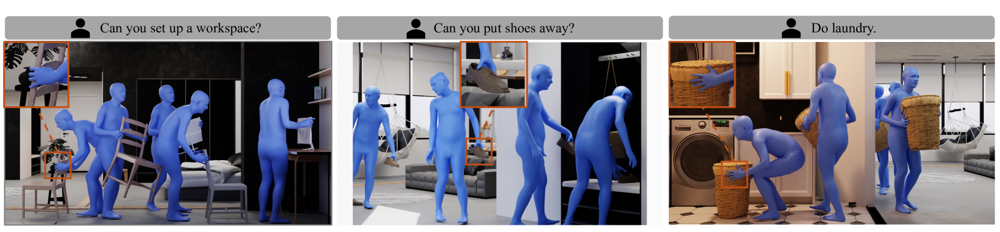
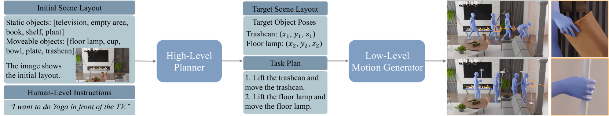
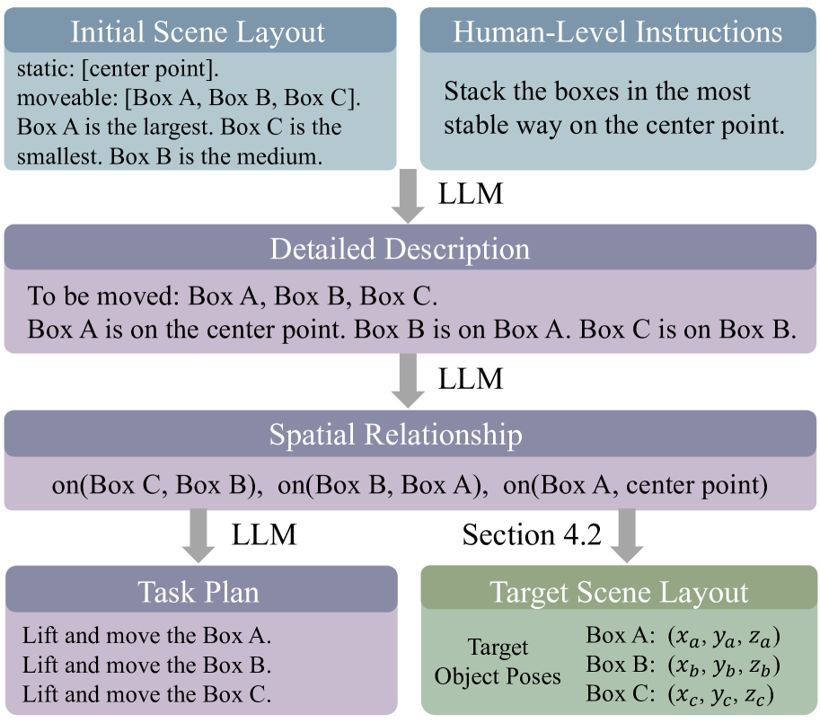
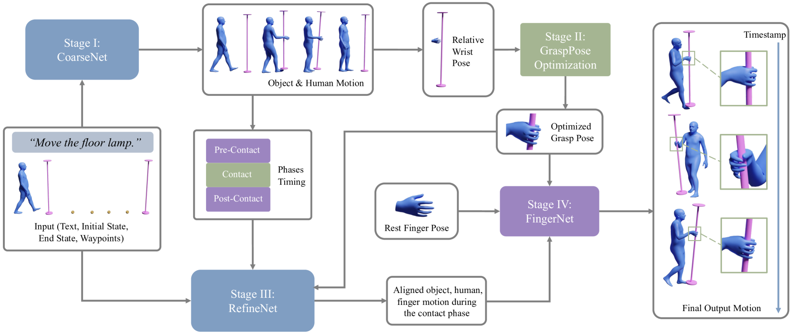
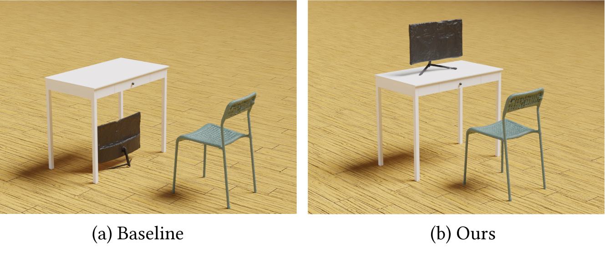

# 通过人类指令掌握人机交互

发布时间：2024年06月25日

`Agent

理由：这篇论文主要探讨了智能代理在特定环境中根据人类指令执行多样化任务的能力，包括导航、互动以及生成物体和人体的运动。它利用大型语言模型（LLM）来规划任务并生成详细的子任务，然后通过低级运动生成器来实现这些任务。这个系统展示了代理如何自主地执行复杂的交互任务，这是典型的Agent研究领域。虽然论文中使用了LLM，但其核心在于代理的行为和能力，而不是LLM的理论或应用。因此，将其归类为Agent更为合适。` `机器人技术` `虚拟现实`

> Human-Object Interaction from Human-Level Instructions

# 摘要

> 智能代理需自主地在特定环境中导航与互动，以执行基于人类指令的多样化日常任务。为此，代理需具备世界常识和知识的基础理解，以及精确的移动与互动技能，以执行由指令衍生的详细任务计划。本研究聚焦于在特定环境中，依据人类指令合成连续的人与大型物体的交互。我们的目标在于生成同步的物体运动、全身人体运动及精细的指尖运动，这些都是实现真实交互的关键。我们的框架融合了大型语言模型（LLM）规划模块与低级运动生成器。LLM用于解析物体间的空间关系，并精确确定其在目标场景中的位置与方向。LLM规划器进一步细化任务计划，明确一系列子任务。此任务计划与目标物体姿态一同输入低级运动生成器，该生成器流畅地在导航与互动模块间切换。我们首次展示了能够从人类指令同步合成物体、全身及指尖运动的完整系统。实验验证了我们高级规划器在生成合理目标布局上的效能，以及低级运动生成器在为多类物体创造真实交互上的能力。更多成果请访问我们的项目页面：https://hoifhli.github.io/。

> Intelligent agents need to autonomously navigate and interact within contextual environments to perform a wide range of daily tasks based on human-level instructions. These agents require a foundational understanding of the world, incorporating common sense and knowledge, to interpret such instructions. Moreover, they must possess precise low-level skills for movement and interaction to execute the detailed task plans derived from these instructions. In this work, we address the task of synthesizing continuous human-object interactions for manipulating large objects within contextual environments, guided by human-level instructions. Our goal is to generate synchronized object motion, full-body human motion, and detailed finger motion, all essential for realistic interactions. Our framework consists of a large language model (LLM) planning module and a low-level motion generator. We use LLMs to deduce spatial object relationships and devise a method for accurately determining their positions and orientations in target scene layouts. Additionally, the LLM planner outlines a detailed task plan specifying a sequence of sub-tasks. This task plan, along with the target object poses, serves as input for our low-level motion generator, which seamlessly alternates between navigation and interaction modules. We present the first complete system that can synthesize object motion, full-body motion, and finger motion simultaneously from human-level instructions. Our experiments demonstrate the effectiveness of our high-level planner in generating plausible target layouts and our low-level motion generator in synthesizing realistic interactions for diverse objects. Please refer to our project page for more results: https://hoifhli.github.io/.

[Arxiv](https://arxiv.org/abs/2406.17840)