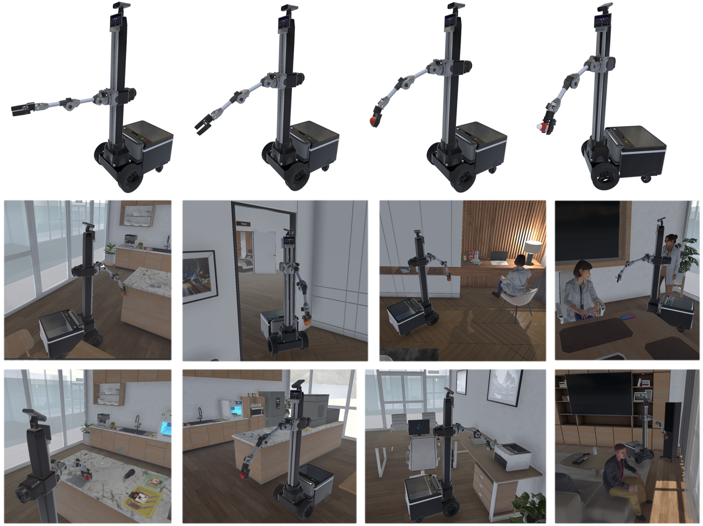

# 建筑内以人为本的实体交付评估基准

发布时间：2024年06月25日

`Agent

理由：这篇论文主要关注的是具身智能在商业场景中的应用，特别是在建筑内配送的模拟环境中，通过开发虚拟环境系统和数据集来指导机器人服务。这涉及到创建自主的机器人角色，这些角色可以执行任务并与环境交互，这是典型的Agent行为。虽然文中提到了大型多模态模型，但这主要是作为数据集的基准，而不是研究的重点。因此，这篇论文更适合归类为Agent，因为它主要探讨了智能体在特定环境中的行为和交互。` `建筑配送` `人机交互`

> Human-centered In-building Embodied Delivery Benchmark

# 摘要

> 具身智能的概念近期广受认可，激发了人们对这一领域商业化潜力的思考。本研究提出了一种以人为中心的建筑内配送商业场景模拟，并为此开发了一套全新的虚拟环境系统，模拟了极地研究站的多层建筑空间。该系统包含自主人类角色和机器人，具备抓取和移动能力，以及丰富的交互物品。我们在此基础上创建了一个包含13,000条指令的数据集，用于指导机器人服务。通过模拟人类行为并分析日常需求，我们提出了一种基于大型多模态模型的方法，作为该数据集的基准。与以往研究不同，我们的工作聚焦于商业场景下的人机交互虚拟环境，旨在为具身智能领域开辟新的研究视角和探索路径。

> Recently, the concept of embodied intelligence has been widely accepted and popularized, leading people to naturally consider the potential for commercialization in this field. In this work, we propose a specific commercial scenario simulation, human-centered in-building embodied delivery. Furthermore, for this scenario, we have developed a brand-new virtual environment system from scratch, constructing a multi-level connected building space modeled after a polar research station. This environment also includes autonomous human characters and robots with grasping and mobility capabilities, as well as a large number of interactive items. Based on this environment, we have built a delivery dataset containing 13k language instructions to guide robots in providing services. We simulate human behavior through human characters and sample their various needs in daily life. Finally, we proposed a method centered around a large multimodal model to serve as the baseline system for this dataset. Compared to past embodied data work, our work focuses on a virtual environment centered around human-robot interaction for commercial scenarios. We believe this will bring new perspectives and exploration angles to the embodied community.

[Arxiv](https://arxiv.org/abs/2406.17898)