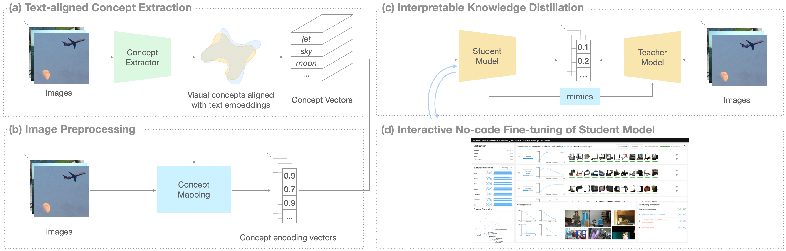
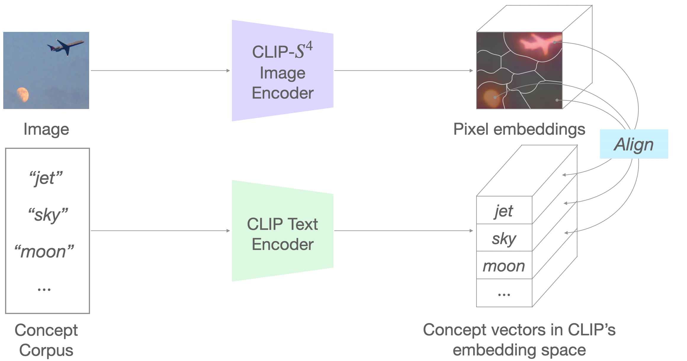
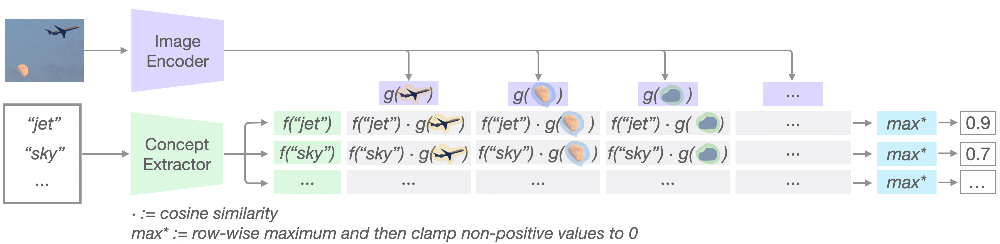
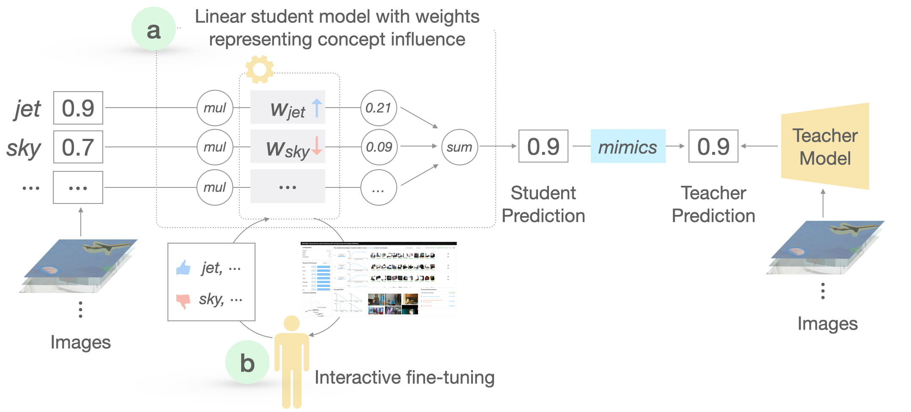
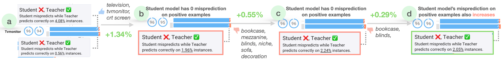
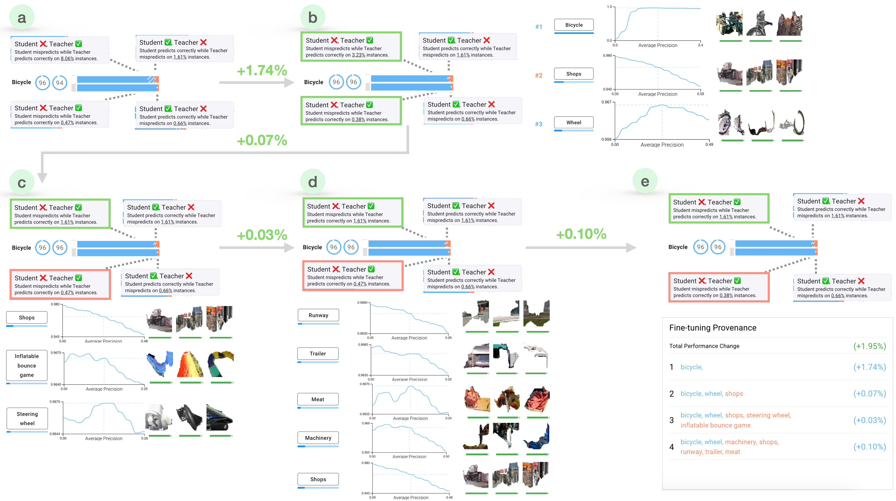
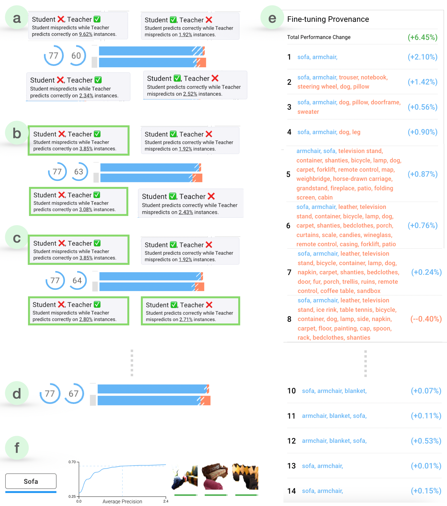
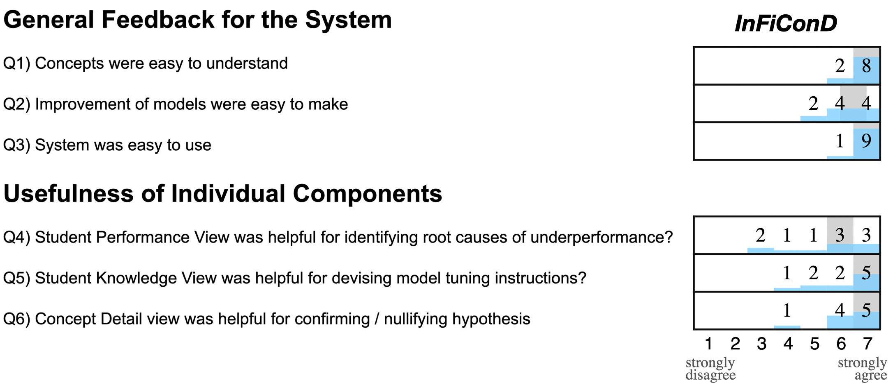

# InFiConD：交互式无代码微调，融合基于概念的知识蒸馏技术

发布时间：2024年06月25日

`LLM应用

理由：这篇论文主要讨论了如何通过InFiConD框架实现知识蒸馏，即将大型教师模型的知识迁移到小型学生模型中，特别是在计算资源受限的环境中。这种方法涉及到大型预训练模型的应用，特别是在知识蒸馏和模型微调方面，这些都是LLM（大型语言模型）应用领域的关键技术。此外，论文中提到的用户界面和可视化方法，以及对知识转移过程的理解，都是为了使LLM的应用更加广泛和易用，这进一步支持了将其分类为LLM应用。` `人工智能` `教育技术`

> InFiConD: Interactive No-code Fine-tuning with Concept-based Knowledge Distillation

# 摘要

> 随着大规模预训练模型的兴起，它们在多种下游任务中的应用日益广泛，但在计算资源受限的环境中部署仍面临挑战。知识蒸馏作为一种解决方案应运而生，它将大型教师模型的知识迁移至小型学生模型，然而这一过程通常需要深厚的AI/ML技术背景。为此，本文推出了InFiConD框架，该框架利用视觉概念实现知识蒸馏，并支持无代码的学生模型微调。我们构建了一套基于多模态模型提取的文本对齐视觉概念的知识蒸馏流程，并设计了模仿教师模型响应方式的线性学生模型。InFiConD的用户界面允许用户通过直接调整概念影响来交互式地微调模型。通过实证研究和用户调查，我们验证了InFiConD的有效性，证明了其人机交互和可视化方法能够帮助用户高效地创建、分析模型，并理解知识转移过程。本文还探讨了InFiConD如何通过交互式和可视化手段，使知识蒸馏和微调对更多具有特定领域需求的用户更加易用和灵活。

> The emergence of large-scale pre-trained models has heightened their application in various downstream tasks, yet deployment is a challenge in environments with limited computational resources. Knowledge distillation has emerged as a solution in such scenarios, whereby knowledge from large teacher models is transferred into smaller student' models, but this is a non-trivial process that traditionally requires technical expertise in AI/ML. To address these challenges, this paper presents InFiConD, a novel framework that leverages visual concepts to implement the knowledge distillation process and enable subsequent no-code fine-tuning of student models. We develop a novel knowledge distillation pipeline based on extracting text-aligned visual concepts from a concept corpus using multimodal models, and construct highly interpretable linear student models based on visual concepts that mimic a teacher model in a response-based manner. InFiConD's interface allows users to interactively fine-tune the student model by manipulating concept influences directly in the user interface. We validate InFiConD via a robust usage scenario and user study. Our findings indicate that InFiConD's human-in-the-loop and visualization-driven approach enables users to effectively create and analyze student models, understand how knowledge is transferred, and efficiently perform fine-tuning operations. We discuss how this work highlights the potential of interactive and visual methods in making knowledge distillation and subsequent no-code fine-tuning more accessible and adaptable to a wider range of users with domain-specific demands.

[Arxiv](https://arxiv.org/abs/2406.17838)