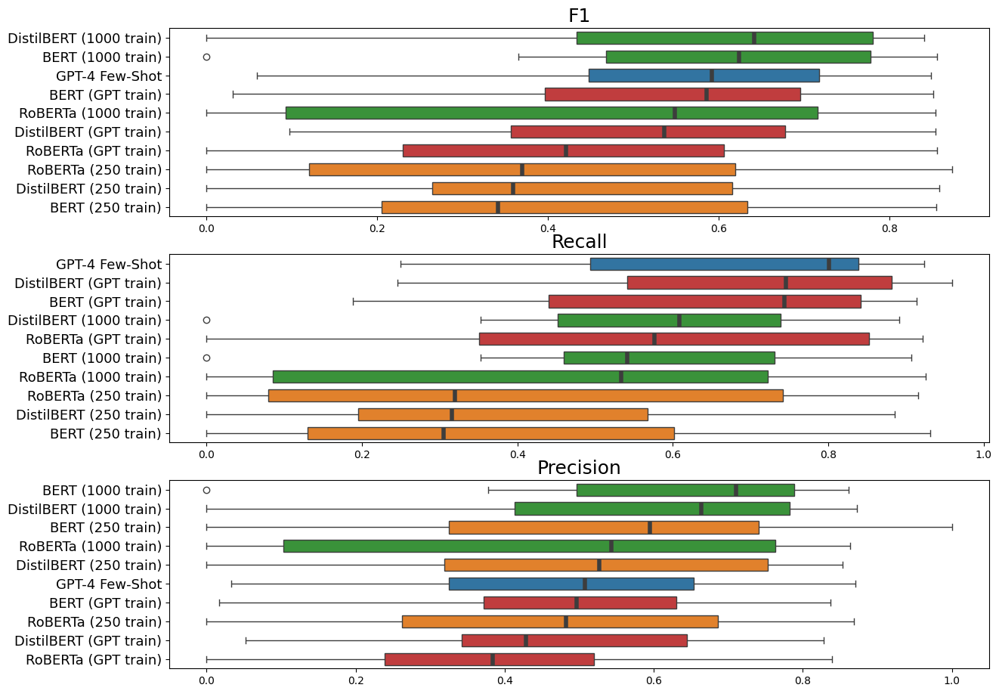
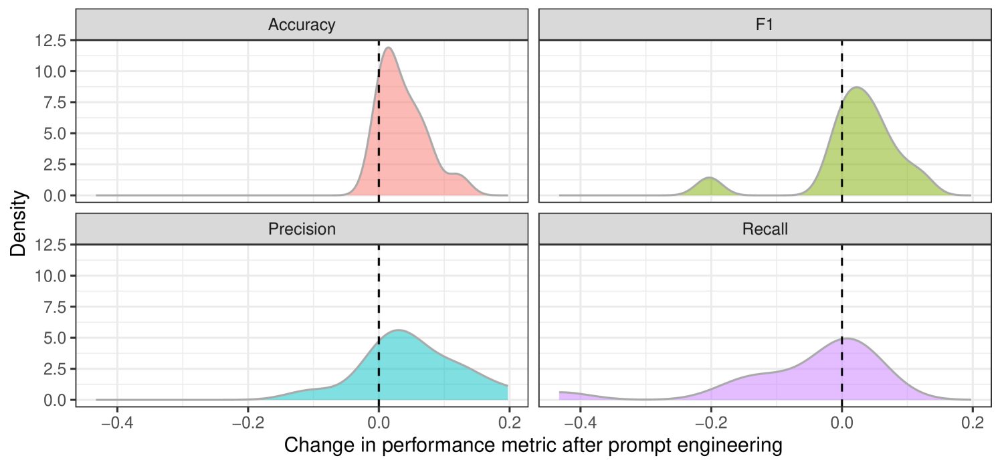
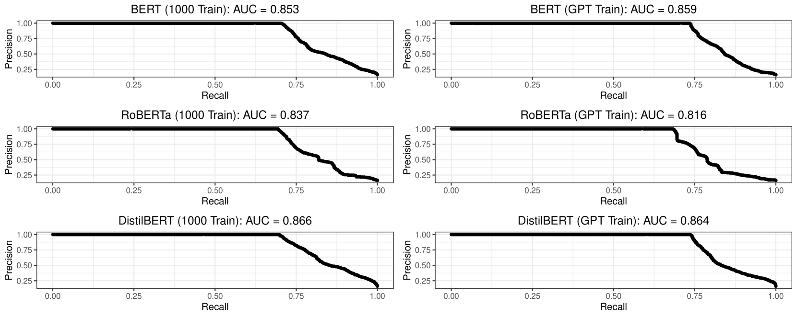
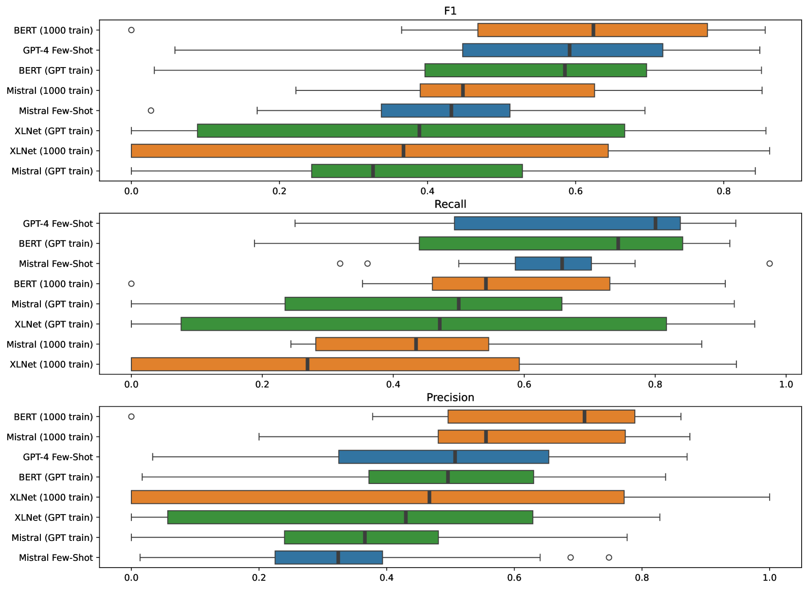
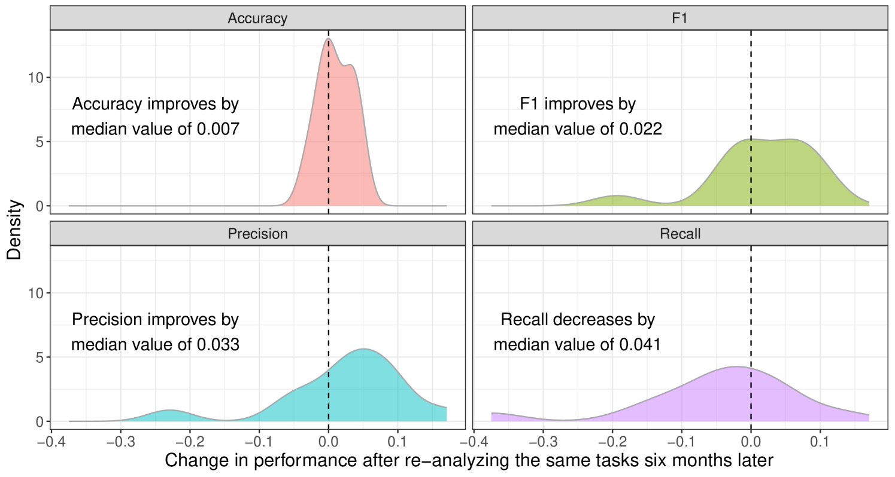

# 利用大型语言模型生成的标签进行知识蒸馏，实现自动化监督式文本分类

发布时间：2024年06月25日

`LLM应用

这篇论文探讨了使用生成型大型语言模型（LLMs）生成的标签来替代或补充人工训练数据，以优化监督文本分类器的方法。研究通过复制并评估14项分类任务的性能，验证了这种方法的有效性。这种方法利用了LLM生成的标签进行微调，显示出与使用人工标注数据微调的分类器相当的性能，表明这是一种快速、高效且经济的监督文本分类器构建方法。因此，这篇论文属于LLM应用分类，因为它关注的是LLM在实际应用中的使用，特别是在计算社会科学领域的文本分类任务中。` `计算社会科学` `文本分类`

> Knowledge Distillation in Automated Annotation: Supervised Text Classification with LLM-Generated Training Labels

# 摘要

> 计算社会科学（CSS）领域，研究者常依赖人工标注数据来优化监督文本分类器。本研究探讨了利用生成型大型语言模型（LLMs）生成的标签替代或补充人工训练数据的可能性，并提出了一套推荐的工作流程。通过复制并评估14项分类任务的性能，我们验证了这一方法。所用数据集源自近期高影响力期刊中的CSS文章，这些数据集因存储于加密档案中而较少受到污染。在每个任务中，我们对比了使用GPT-4标签微调的分类器与人工标注微调的分类器，以及与GPT-4和Mistral-7B在少量样本上下文学习中的表现。结果显示，LLM生成的标签微调的分类器与人工标注微调的分类器性能相当。这表明，利用LLM生成的标签进行微调，是一种快速、高效且经济的监督文本分类器构建方法。

> Computational social science (CSS) practitioners often rely on human-labeled data to fine-tune supervised text classifiers. We assess the potential for researchers to augment or replace human-generated training data with surrogate training labels from generative large language models (LLMs). We introduce a recommended workflow and test this LLM application by replicating 14 classification tasks and measuring performance. We employ a novel corpus of English-language text classification data sets from recent CSS articles in high-impact journals. Because these data sets are stored in password-protected archives, our analyses are less prone to issues of contamination. For each task, we compare supervised classifiers fine-tuned using GPT-4 labels against classifiers fine-tuned with human annotations and against labels from GPT-4 and Mistral-7B with few-shot in-context learning. Our findings indicate that supervised classification models fine-tuned on LLM-generated labels perform comparably to models fine-tuned with labels from human annotators. Fine-tuning models using LLM-generated labels can be a fast, efficient and cost-effective method of building supervised text classifiers.

[Arxiv](https://arxiv.org/abs/2406.17633)