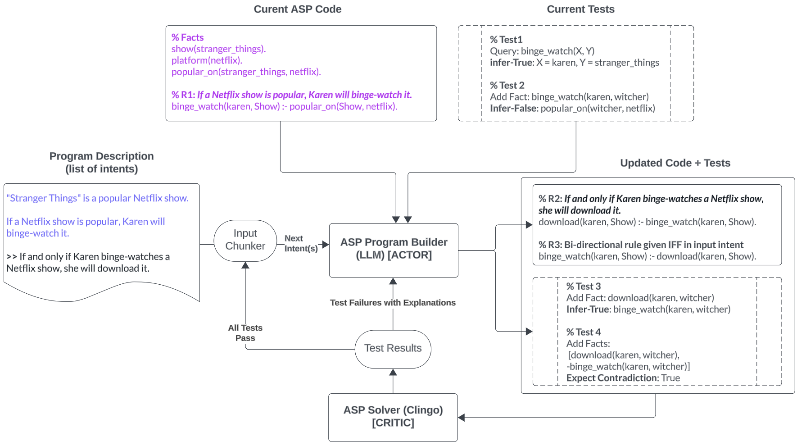
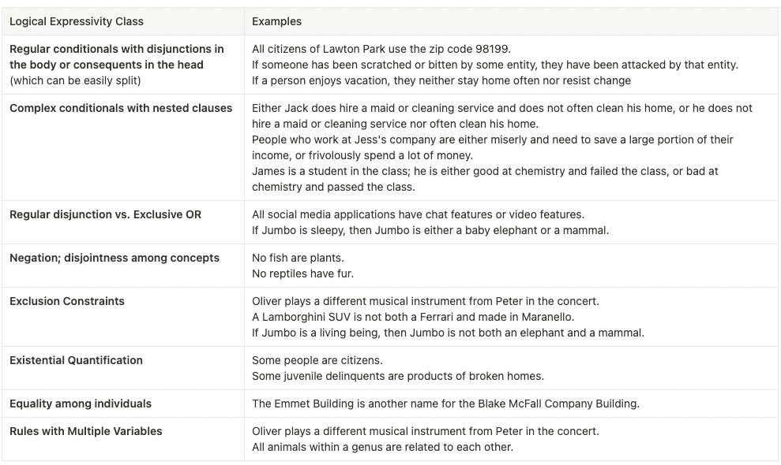
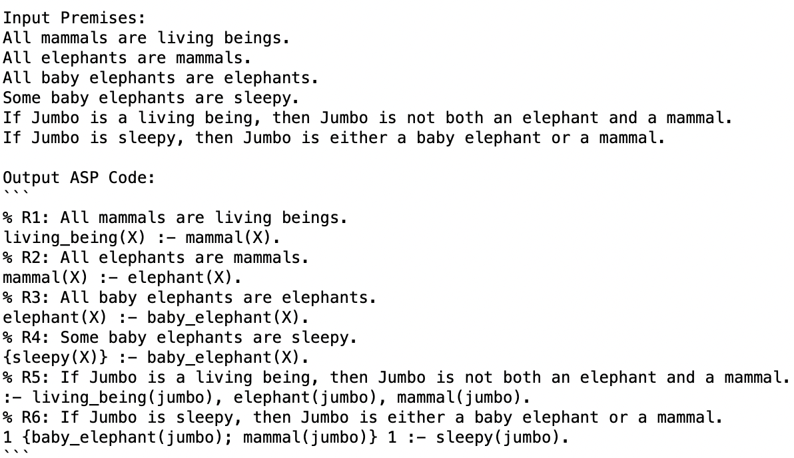
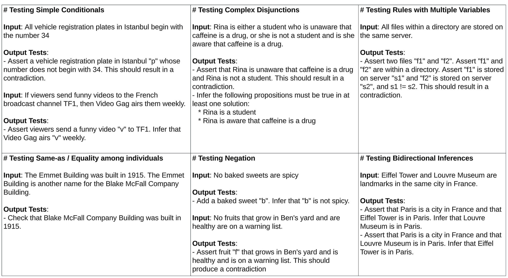
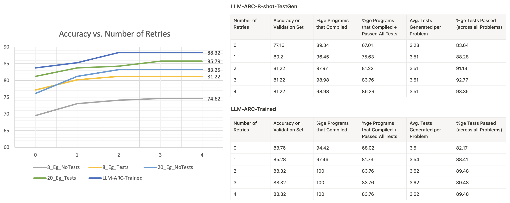

# LLM-ARC：借助自动化推理批评提升大型语言模型能力

发布时间：2024年06月25日

`LLM应用

这篇论文介绍了 LLM-ARC，一个结合了自动化推理批评器（ARC）的神经符号框架，旨在提升大型语言模型（LLMs）的逻辑推理能力。该框架通过 Actor-Critic 方法，利用 LLM 生成逻辑程序并进行语义测试，同时 ARC 评估并反馈测试结果，推动迭代优化。这种方法在 FOLIO 基准测试中取得了高准确率，证明了其在复杂逻辑推理任务中的有效性。因此，这篇论文属于LLM应用分类，因为它专注于开发和应用技术来增强 LLM 在特定任务（逻辑推理）上的性能。` `逻辑推理`

> LLM-ARC: Enhancing LLMs with an Automated Reasoning Critic

# 摘要

> 我们推出了 LLM-ARC，这一神经符号框架通过结合自动化推理批评器（ARC），显著提升了大型语言模型（LLMs）的逻辑推理能力。在 Actor-Critic 方法中，LLM 作为 Actor 生成逻辑程序并进行语义测试，而 ARC 则负责评估并反馈测试结果，推动迭代优化。采用答案集编程（ASP）的 LLM-ARC，在 FOLIO 基准测试中取得了 88.32% 的顶尖准确率，该测试专为复杂逻辑推理设计。实验结果超越了仅依赖 LLM 的基线，凸显了逻辑测试与自我迭代优化的关键作用。我们通过全自动自监督训练循环，利用 Critic 反馈进行端到端对话训练，实现了最佳性能。此外，我们还探讨了进一步的改进空间，并进行了详尽的错误分析，证明了 LLM-ARC 在处理复杂自然语言推理任务时的强大与高效。

> We introduce LLM-ARC, a neuro-symbolic framework designed to enhance the logical reasoning capabilities of Large Language Models (LLMs), by combining them with an Automated Reasoning Critic (ARC). LLM-ARC employs an Actor-Critic method where the LLM Actor generates declarative logic programs along with tests for semantic correctness, while the Automated Reasoning Critic evaluates the code, runs the tests and provides feedback on test failures for iterative refinement. Implemented using Answer Set Programming (ASP), LLM-ARC achieves a new state-of-the-art accuracy of 88.32% on the FOLIO benchmark which tests complex logical reasoning capabilities. Our experiments demonstrate significant improvements over LLM-only baselines, highlighting the importance of logic test generation and iterative self-refinement. We achieve our best result using a fully automated self-supervised training loop where the Actor is trained on end-to-end dialog traces with Critic feedback. We discuss potential enhancements and provide a detailed error analysis, showcasing the robustness and efficacy of LLM-ARC for complex natural language reasoning tasks.

[Arxiv](https://arxiv.org/abs/2406.17663)