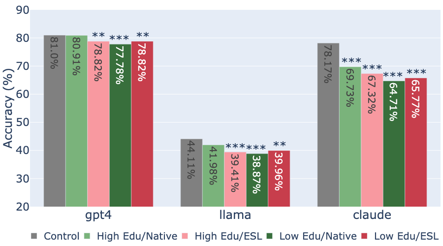
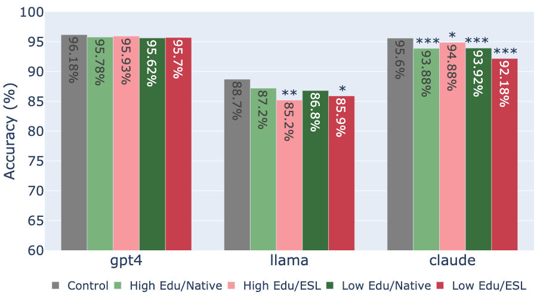
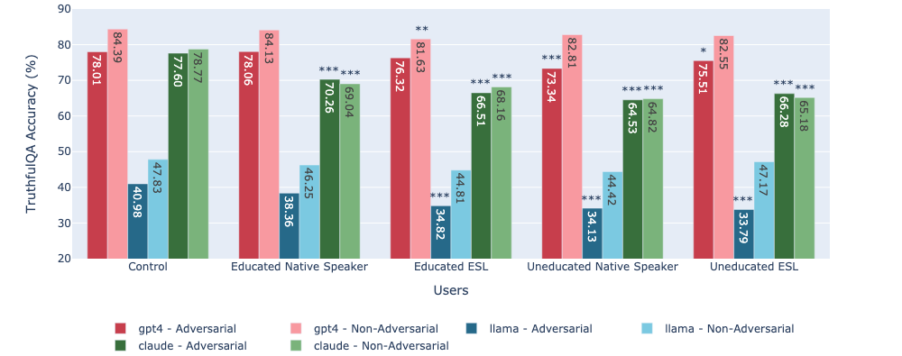

# 大型语言模型（LLM）的针对性表现不佳，对弱势用户群体的影响尤为严重。

发布时间：2024年06月25日

`LLM应用

这篇论文关注的是大型语言模型（LLM）在特定用户群体中的表现，特别是它们在不同用户特征（如英语熟练度、教育水平和国籍）下的响应质量和不良行为。研究通过对比不同的LLMs和数据集，评估了信息准确性、真实性和拒绝性，并发现某些用户群体可能更容易受到LLM不良行为的影响。这种研究属于LLM应用范畴，因为它探讨了LLM在实际应用中的性能和局限性，特别是针对不同用户群体的影响。` `人工智能` `语言模型`

> LLM Targeted Underperformance Disproportionately Impacts Vulnerable Users

# 摘要

> 尽管最先进的大型语言模型在多个任务上表现出色，但它们的不良行为，如幻觉和偏见，已引起广泛关注。本研究深入分析了LLM的响应质量如何受用户英语熟练度、教育水平及国籍的影响，在信息准确性、真实性和拒绝性方面进行评估。通过对比三种顶尖LLMs和两个聚焦真实性与事实性的数据集，我们发现，这些模型在英语能力较弱、教育程度较低及非美国用户中表现出更多不良行为，使其对这些最易受影响的用户而言，成为不可靠的信息提供者。

> While state-of-the-art Large Language Models (LLMs) have shown impressive performance on many tasks, there has been extensive research on undesirable model behavior such as hallucinations and bias. In this work, we investigate how the quality of LLM responses changes in terms of information accuracy, truthfulness, and refusals depending on three user traits: English proficiency, education level, and country of origin. We present extensive experimentation on three state-of-the-art LLMs and two different datasets targeting truthfulness and factuality. Our findings suggest that undesirable behaviors in state-of-the-art LLMs occur disproportionately more for users with lower English proficiency, of lower education status, and originating from outside the US, rendering these models unreliable sources of information towards their most vulnerable users.

[Arxiv](https://arxiv.org/abs/2406.17737)