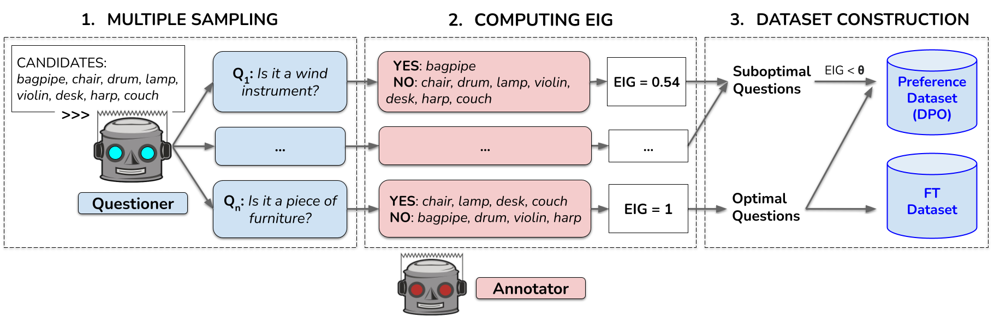
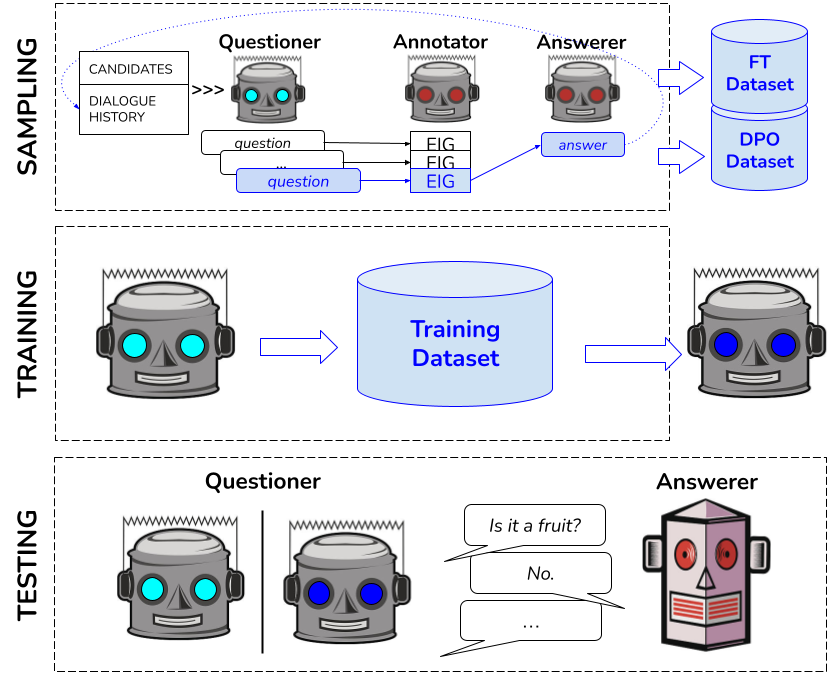

# 提升 LLMs 提问能力：借助偏好优化与预期信息增益，让大型语言模型更擅长提出富含信息的问题。

发布时间：2024年06月25日

`Agent

理由：这篇论文主要关注的是如何提升大型语言模型（LLM）在特定任务（如20个问题游戏）中生成问题的信息性。通过使用直接偏好优化（DPO）算法来改进模型生成问题的质量，这涉及到模型的应用和优化，但更侧重于模型作为智能代理在特定任务中的表现和改进，因此更适合归类为Agent。` `信息检索`

> Learning to Ask Informative Questions: Enhancing LLMs with Preference Optimization and Expected Information Gain

# 摘要

> 问题在信息搜索任务中至关重要，但大型语言模型，尤其是开源模型，在生成信息丰富的问题上表现不佳，这一点通过预期信息增益（EIG）来衡量。本文提出了一种方法，旨在提升20个问题游戏对话中LLM生成问题的信息性。我们为每个游戏从LLAMA 2-CHAT 7B模型中抽取多个问题，并配对低EIG和高EIG问题，应用直接偏好优化（DPO）算法。结果表明，这种方法即使在DPO模型未训练的领域，也能生成更高质量的问题。

> Questions are essential tools for acquiring the necessary information to complete information-seeking tasks. However, large language models (LLMs), especially open-source models, often perform poorly in generating informative questions, as measured by expected information gain (EIG). In this paper, we propose a method to enhance the informativeness of LLM-generated questions in 20-question game dialogues. We sample multiple questions from the same model (LLAMA 2-CHAT 7B) for each game and create pairs of low-EIG and high-EIG questions to apply a Direct Preference Optimization (DPO) algorithm. Our results show that this method produces more effective questions (in terms of EIG), even in domains different from those used to train the DPO model.

[Arxiv](https://arxiv.org/abs/2406.17453)