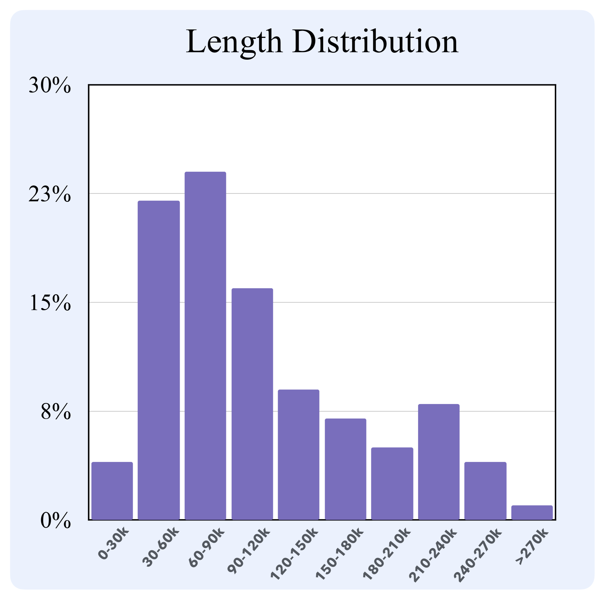

# 文档全覆盖：扩展多文档问答基准，全面评估长上下文大型语言模型的能力

发布时间：2024年06月25日

`RAG

理由：这篇论文主要关注的是长上下文建模能力的评估，并推出了一个新型基准Loong，用于评估大型语言模型（LLMs）在多文档问答任务中的表现。特别提到了检索增强生成（RAG）模型在Loong基准上的表现不佳，这表明论文的重点在于评估和改进现有的生成模型，尤其是RAG模型，在处理长上下文场景下的性能。因此，这篇论文更适合归类为RAG。` `问答系统` `基准测试`

> Leave No Document Behind: Benchmarking Long-Context LLMs with Extended Multi-Doc QA

# 摘要

> 长上下文建模能力备受瞩目，催生了拥有超长上下文窗口的大型语言模型（LLMs）。然而，现有评估基准通过添加无关噪声文本来人为延长测试案例，与实际应用场景脱节。为此，我们推出了新型基准Loong，通过多文档问答（QA）任务模拟真实场景。在Loong中，每份文档都与答案紧密相关，忽略任一文档都将导致答案错误。此外，Loong涵盖了四种任务类型，包括焦点定位、比较、聚类和推理链，全面评估长上下文理解能力。实验结果显示，现有模型仍有提升空间，而检索增强生成（RAG）在Loong上的表现不佳，证实了Loong在评估长上下文建模能力方面的可靠性。

> Long-context modeling capabilities have garnered widespread attention, leading to the emergence of Large Language Models (LLMs) with ultra-context windows. Meanwhile, benchmarks for evaluating long-context LLMs are gradually catching up. However, existing benchmarks employ irrelevant noise texts to artificially extend the length of test cases, diverging from the real-world scenarios of long-context applications. To bridge this gap, we propose a novel long-context benchmark, Loong, aligning with realistic scenarios through extended multi-document question answering (QA). Unlike typical document QA, in Loong's test cases, each document is relevant to the final answer, ignoring any document will lead to the failure of the answer. Furthermore, Loong introduces four types of tasks with a range of context lengths: Spotlight Locating, Comparison, Clustering, and Chain of Reasoning, to facilitate a more realistic and comprehensive evaluation of long-context understanding. Extensive experiments indicate that existing long-context language models still exhibit considerable potential for enhancement. Retrieval augmented generation (RAG) achieves poor performance, demonstrating that Loong can reliably assess the model's long-context modeling capabilities.

[Arxiv](https://arxiv.org/abs/2406.17419)