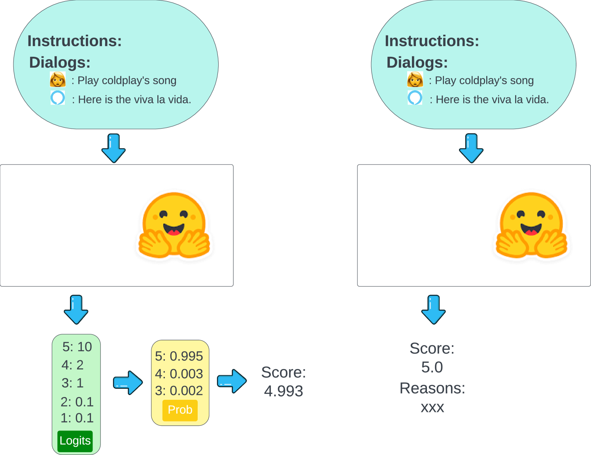
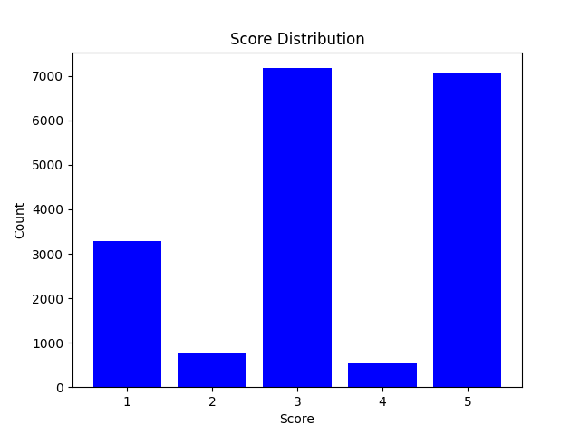
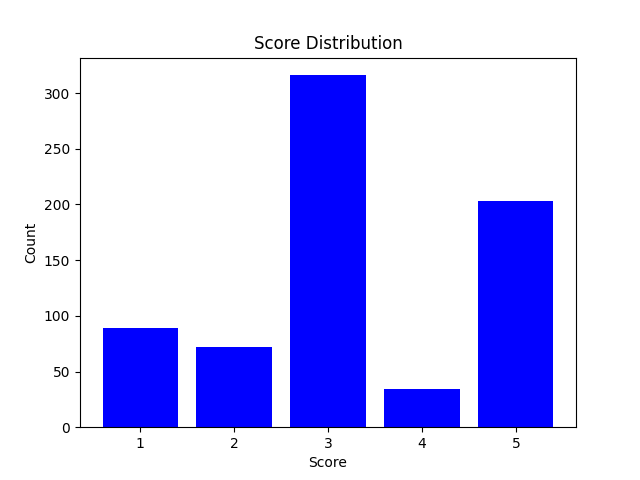

# 借助大型语言模型（LLMs）评估对话质量

发布时间：2024年06月25日

`LLM应用

这篇论文探讨了利用大型语言模型（LLMs）进行对话质量自动评估的方法和效果。研究中涉及了模型大小、上下文示例选择算法、思维链（CoT）推理及标签提取方法等因素的调整，并展示了这些调整如何影响评估的准确性。由于论文主要关注的是LLMs在实际应用中的性能和优化，特别是在对话AI评估领域的应用，因此将其归类为LLM应用。` `对话系统`

> Leveraging LLMs for Dialogue Quality Measurement

# 摘要

> 在面向任务的对话AI评估领域，无监督方法与人类评价关联度低，监督方法则泛化能力不足。大型语言模型（LLMs）的最新进展在NLP任务中展现了卓越的零-shot和少-shot能力。本文深入探讨了利用LLMs进行对话质量自动评估，通过在公开及专有数据集上尝试多种配置，我们调整了模型大小、上下文示例选择算法等因素，并研究了“思维链”（CoT）推理及标签提取方法。研究发现：(1) 模型越大，对话标签越准确；(2) 算法精选的上下文示例优于随机挑选；(3) 要求LLM在给出最终标签前阐述理由的CoT推理显著提升了性能；(4) 经过微调的LLMs表现超越了未经调整的版本。研究结果揭示，经过精细调整且具备强大推理能力的LLMs，在自动对话评估中具有巨大潜力。

> In task-oriented conversational AI evaluation, unsupervised methods poorly correlate with human judgments, and supervised approaches lack generalization. Recent advances in large language models (LLMs) show robust zeroshot and few-shot capabilities across NLP tasks. This paper explores using LLMs for automated dialogue quality evaluation, experimenting with various configurations on public and proprietary datasets. Manipulating factors such as model size, in-context examples, and selection techniques, we examine "chain-of-thought" (CoT) reasoning and label extraction procedures. Our results show that (1) larger models yield more accurate dialogue labels; (2) algorithmic selection of in-context examples outperforms random selection; (3) CoT reasoning where an LLM is asked to provide justifications before outputting final labels improves performance; and (4) fine-tuned LLMs outperform out-of-the-box ones. Our results indicate that LLMs that are suitably fine-tuned and have sufficient reasoning capabilities can be leveraged for automated dialogue evaluation.

[Arxiv](https://arxiv.org/abs/2406.17304)