# LongIns：大型语言模型面临的挑战——长上下文指令型考试

发布时间：2024年06月25日

`LLM理论

这篇论文主要关注大型语言模型（LLMs）的长上下文能力，并提出了一个新的基准数据集LongIns来评估LLMs在长上下文环境下的表现。论文通过分析不同上下文长度下LLMs的表现，探讨了LLMs的推理能力。这属于对LLM理论的深入研究，因为它不仅评估了现有模型的性能，还揭示了模型在特定条件下的局限性，从而推动了对LLM理论的进一步理解和改进。因此，这篇论文应归类于LLM理论。` `人工智能`

> LongIns: A Challenging Long-context Instruction-based Exam for LLMs

# 摘要

> 近年来，大型语言模型（LLMs）的长上下文能力备受关注。尽管出现了多种评估基准来检验LLMs在不同情境下的表现，但这些基准大多侧重于测试LLMs的检索能力，而非其从大量信息中进行推理的能力。此外，尽管LLMs宣称拥有长达32k、128k、200k的上下文窗口，现有基准却未能准确反映其实际支持的上下文长度。为此，我们推出了LongIns基准数据集，这是一个专为LLMs设计的长上下文指令型挑战测试，基于现有数据集构建。LongIns包含三种评估模式：全局指令与单一任务（GIST）、局部指令与单一任务（LIST）、局部指令与多任务（LIMT）。通过LongIns的评估，我们发现：（1）. 拥有128k上下文长度的顶级模型GPT-4在16k上下文窗口的测试中表现不佳；（2）. 在短上下文窗口（小于4k）下，许多LLMs的多跳推理能力仍有待大幅提升。

> The long-context capabilities of large language models (LLMs) have been a hot topic in recent years. To evaluate the performance of LLMs in different scenarios, various assessment benchmarks have emerged. However, as most of these benchmarks focus on identifying key information to answer questions, which mainly requires the retrieval ability of LLMs, these benchmarks can partially represent the reasoning performance of LLMs from large amounts of information. Meanwhile, although LLMs often claim to have context windows of 32k, 128k, 200k, or even longer, these benchmarks fail to reveal the actual supported length of these LLMs. To address these issues, we propose the LongIns benchmark dataset, a challenging long-context instruction-based exam for LLMs, which is built based on the existing instruction datasets. Specifically, in our LongIns, we introduce three evaluation settings: Global Instruction & Single Task (GIST), Local Instruction & Single Task (LIST), and Local Instruction & Multiple Tasks (LIMT). Based on LongIns, we perform comprehensive evaluations on existing LLMs and have the following important findings: (1). The top-performing GPT-4 with 128k context length performs poorly on the evaluation context window of 16k in our LongIns. (2). For the multi-hop reasoning ability of many existing LLMs, significant efforts are still needed under short context windows (less than 4k).

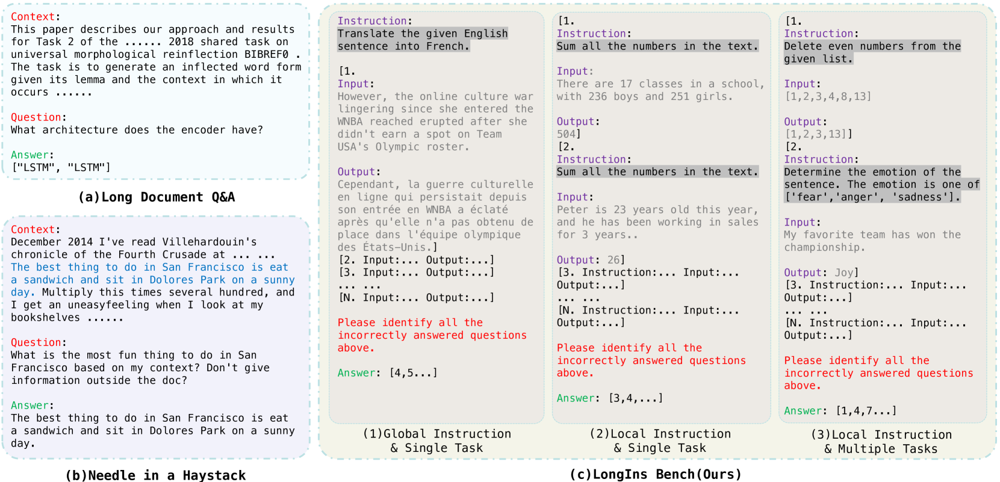

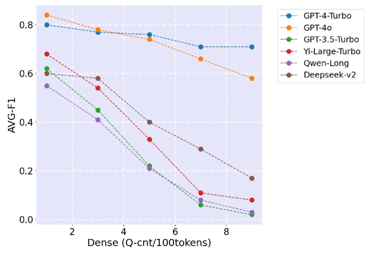

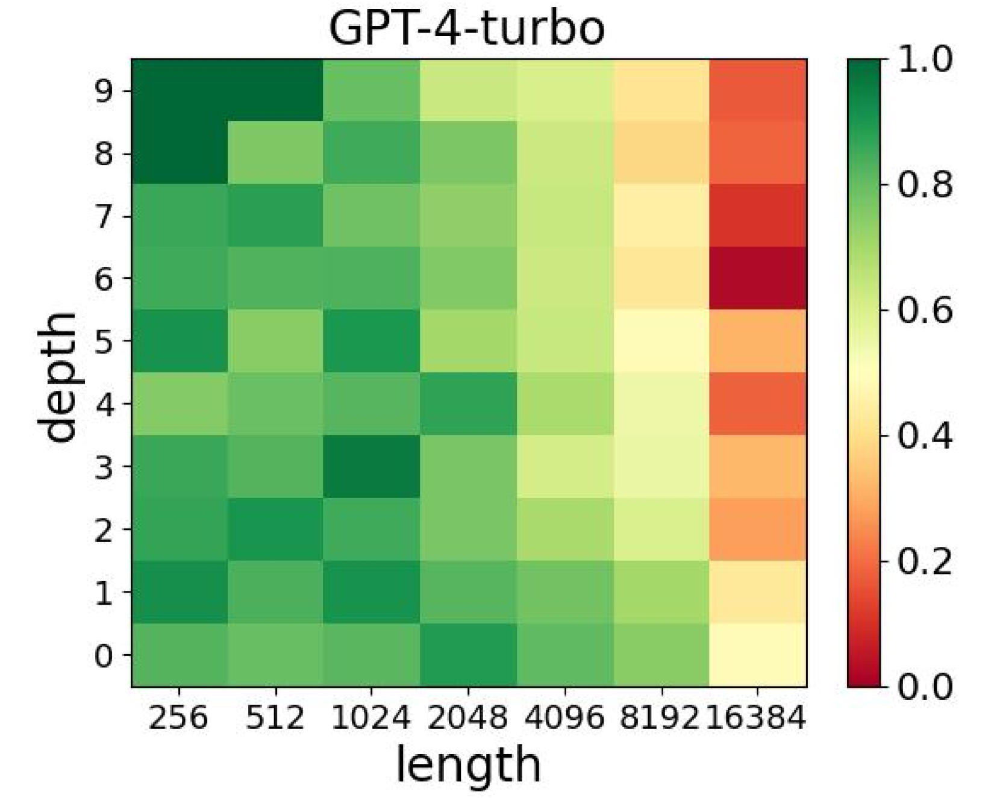

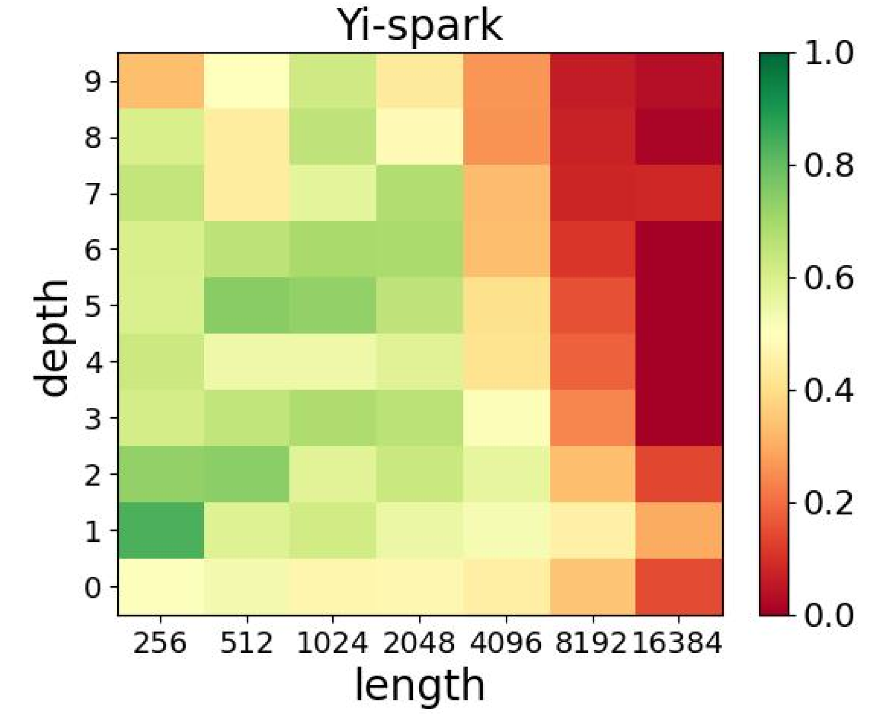

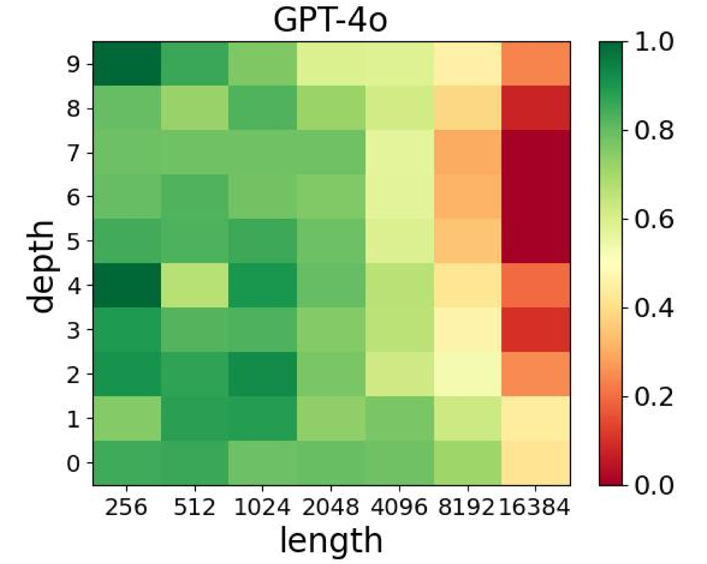

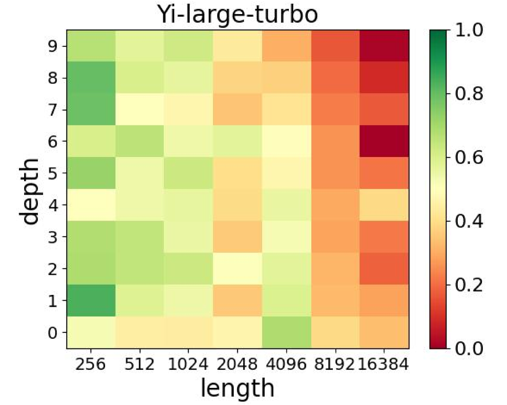

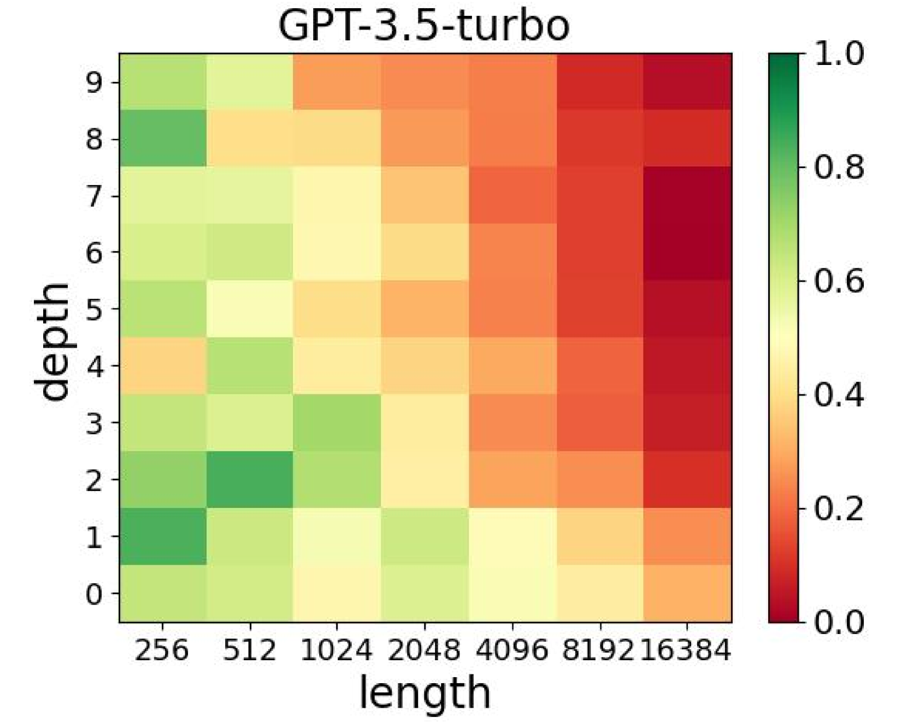

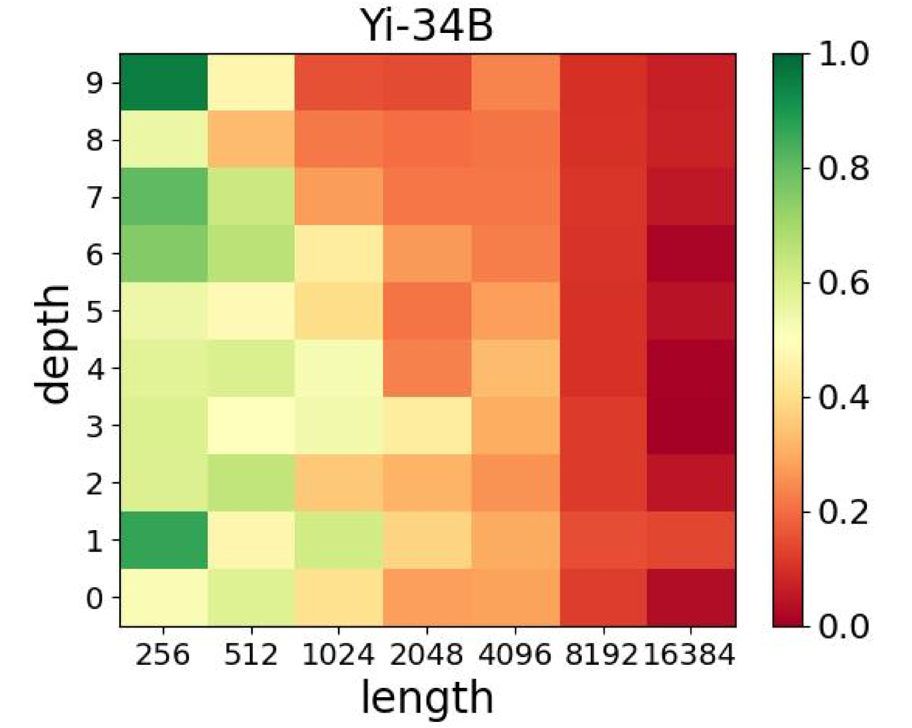

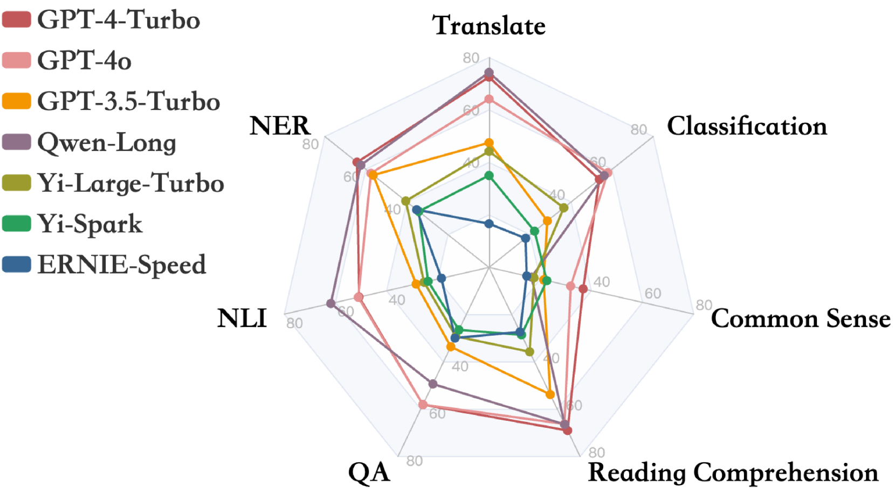

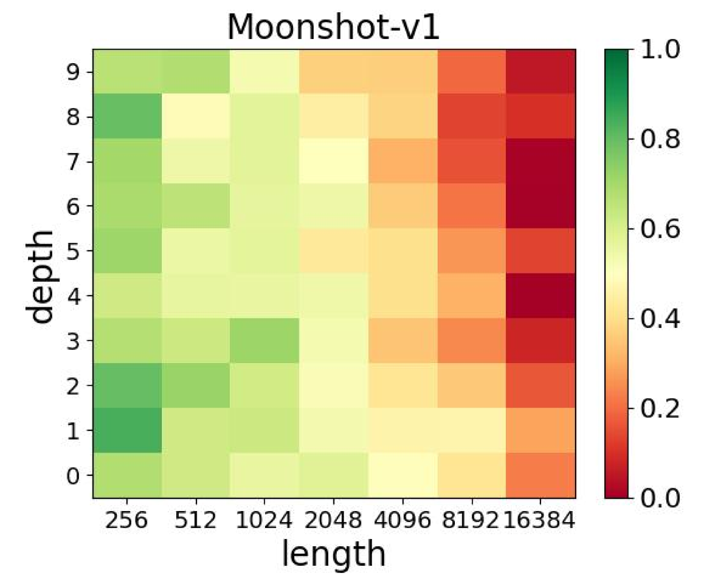

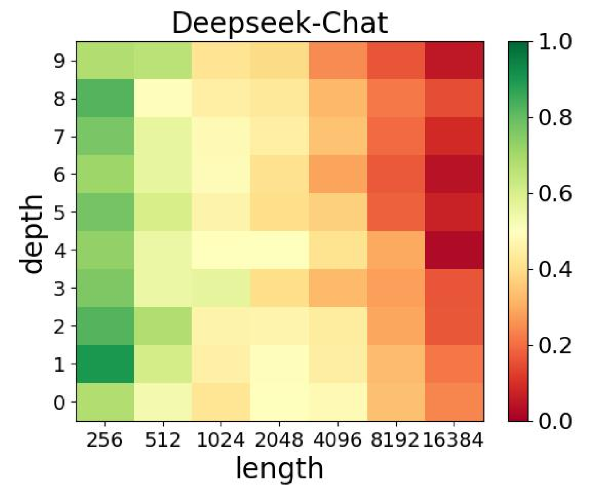

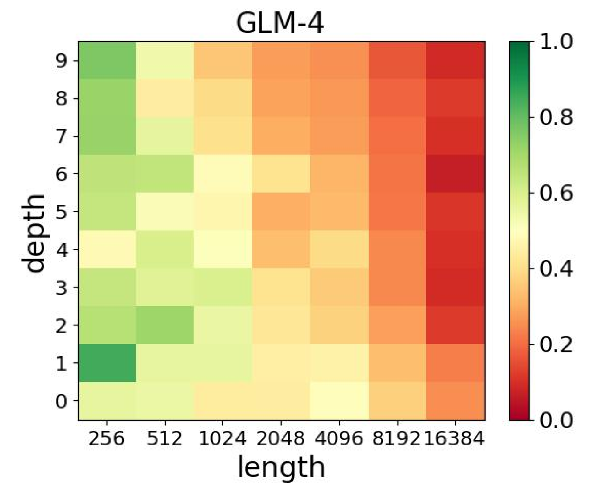

[Arxiv](https://arxiv.org/abs/2406.17588)