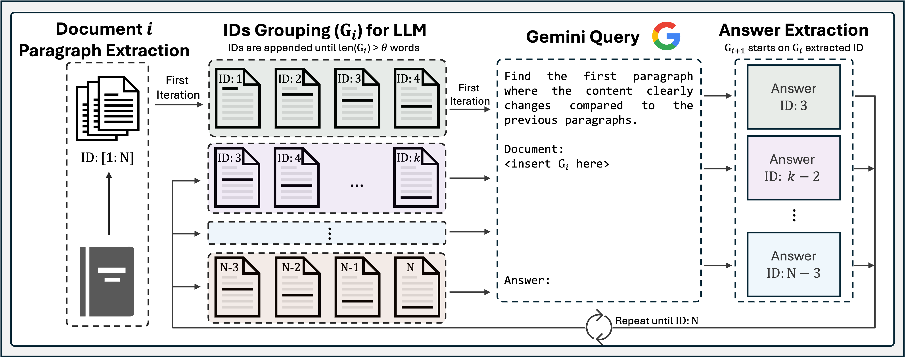
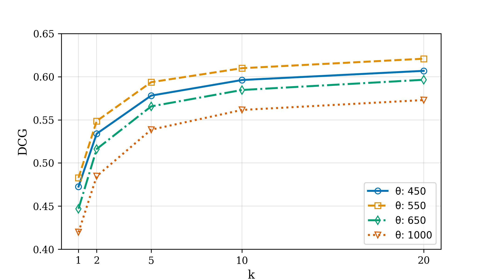
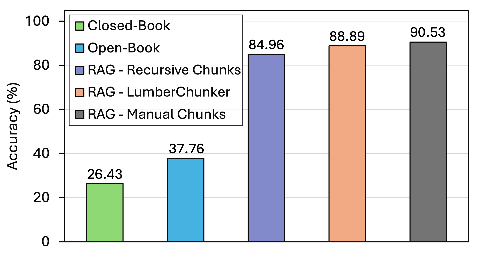
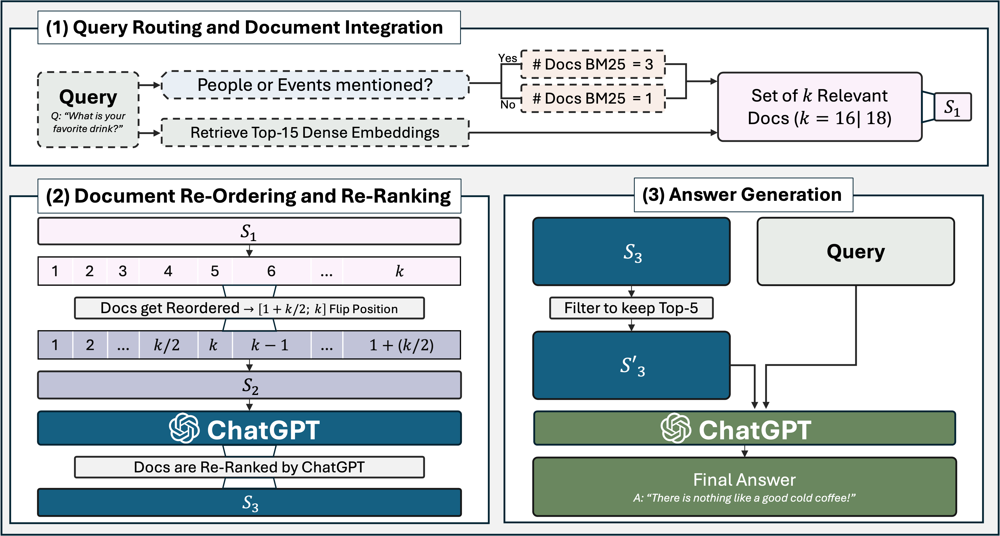

# LumberChunker：长篇叙事文档的巧妙分割术

发布时间：2024年06月25日

`RAG

理由：这篇论文主要介绍了一种名为LumberChunker的新方法，该方法利用大型语言模型（LLM）动态分割文档，以提升检索效果。这种方法特别适用于RAG（Retrieval-Augmented Generation）流程，旨在通过优化文档分割来增强信息检索的效率和准确性。论文中提到的GutenQA基准测试和与其他技术的比较，进一步证明了其在RAG框架中的应用价值和性能优势。因此，这篇论文应归类于RAG。` `信息检索`

> LumberChunker: Long-Form Narrative Document Segmentation

# 摘要

> 现代NLP任务正日益依赖密集检索技术，以获取最新且相关的上下文信息。我们基于一个前提：检索效果可通过大小可变的段落得到提升，这些段落能更好地捕捉内容的语义独立性。为此，我们开发了LumberChunker，一种利用大型语言模型（LLM）动态分割文档的新方法，它能迭代地提示LLM识别内容在连续段落中开始变化的点。为了验证这一方法，我们创建了GutenQA基准，包含3000对“大海捞针”式的问题-答案对，源自Project Gutenberg上的100本公共领域叙事书籍。实验结果显示，LumberChunker在检索性能（DCG@20）上超越了最先进的基准7.37%，并且当整合进RAG流程时，它比其他分块技术和竞争基准（如Gemini 1.5M Pro）更为高效。我们的代码和数据已公开在https://github.com/joaodsmarques/LumberChunker。

> Modern NLP tasks increasingly rely on dense retrieval methods to access up-to-date and relevant contextual information. We are motivated by the premise that retrieval benefits from segments that can vary in size such that a content's semantic independence is better captured. We propose LumberChunker, a method leveraging an LLM to dynamically segment documents, which iteratively prompts the LLM to identify the point within a group of sequential passages where the content begins to shift. To evaluate our method, we introduce GutenQA, a benchmark with 3000 "needle in a haystack" type of question-answer pairs derived from 100 public domain narrative books available on Project Gutenberg. Our experiments show that LumberChunker not only outperforms the most competitive baseline by 7.37% in retrieval performance (DCG@20) but also that, when integrated into a RAG pipeline, LumberChunker proves to be more effective than other chunking methods and competitive baselines, such as the Gemini 1.5M Pro. Our Code and Data are available at https://github.com/joaodsmarques/LumberChunker

[Arxiv](https://arxiv.org/abs/2406.17526)