# MAGIC：元能力引导的交互式链式蒸馏，旨在实现视觉与语言导航的高效与有效性

发布时间：2024年06月25日

`Agent

这篇论文主要讨论了具身人工智能（E-AI）中的视觉与语言导航（VLN）任务，并提出了一种名为MAGIC的元能力引导交互式链式蒸馏方法，用于创建轻量级模型。这种方法特别关注于通过知识蒸馏来优化代理（Agent）的性能，使其能够在保持较小模型大小的同时，实现高效的导航任务。因此，这篇论文更符合Agent分类，因为它专注于开发和优化用于特定任务的智能代理模型。` `机器人技术` `人工智能`

> MAGIC: Meta-Ability Guided Interactive Chain-of-Distillation for Effective-and-Efficient Vision-and-Language Navigation

# 摘要

> 尽管具身人工智能（E-AI）中的大型模型近期取得了显著进展，但其庞大的参数和计算需求阻碍了它们与机器人技术的融合。针对E-AI的核心任务——视觉与语言导航（VLN），本文提出了一种名为MAGIC的元能力引导交互式链式蒸馏方法，展示了通过知识蒸馏获取轻量级模型的巨大潜力。该方法通过MAKD框架解耦并精炼VLN代理的元能力，并利用MKRW和MKTD模块动态调整元能力和样本级别的权重。此外，提出的ICoD学习策略打破了传统单向蒸馏的局限，实现了师生间的多步互动进化。在R2R测试未见排行榜上，我们的最小模型MAGIC-S以仅5%的教师模型大小（11M）超越了所有先前方法。而最大模型MAGIC-L在SPL和SR上分别提升了5.84%和3.18%。此外，我们还从生活环境中收集并标注了新数据集，MAGIC-S在此展现了卓越的性能和实时效率。相关代码已在GitHub上公开。

> Despite the remarkable developments of recent large models in Embodied Artificial Intelligence (E-AI), their integration into robotics is hampered by their excessive parameter sizes and computational demands. Towards the Vision-and-Language Navigation (VLN) task, a core task in E-AI, this paper reveals the great potential of using knowledge distillation for obtaining lightweight student models by proposing a Meta-Ability Guided Interactive Chain-of-distillation (MAGIC) method. Specifically, a Meta-Ability Knowledge Distillation (MAKD) framework is proposed for decoupling and refining the necessary meta-abilities of VLN agents. A Meta-Knowledge Randomization Weighting (MKRW) and a Meta-Knowledge Transferable Determination (MKTD) module are incorporated to dynamically adjust aggregation weights at the meta-ability and sample levels, respectively. Move beyond the traditional one-step unidirectional distillation, an Interactive Chain-of-Distillation (ICoD) learning strategy is proposed to allow students to give feedback to teachers, forming a new multi-step teacher-student co-evolution pipeline. Remarkably, on the R2R test unseen public leaderboard, our smallest model, MAGIC-S, with only 5% (11M) of the teacher's size, outperforms all previous methods under the same training data. Additionally, our largest model, MAGIC-L, surpasses the previous state-of-the-art by 5.84% in SPL and 3.18% in SR. Furthermore, a new dataset was collected and annotated from our living environments, where MAGIC-S demonstrated superior performance and real-time efficiency. Our code is publicly available on https://github.com/CrystalSixone/VLN-MAGIC.

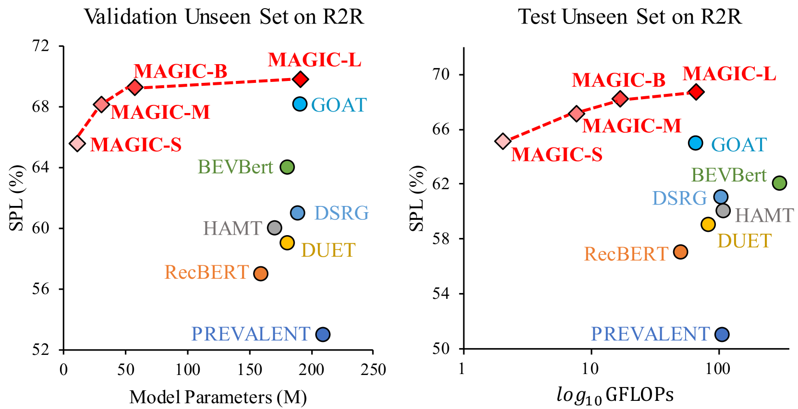

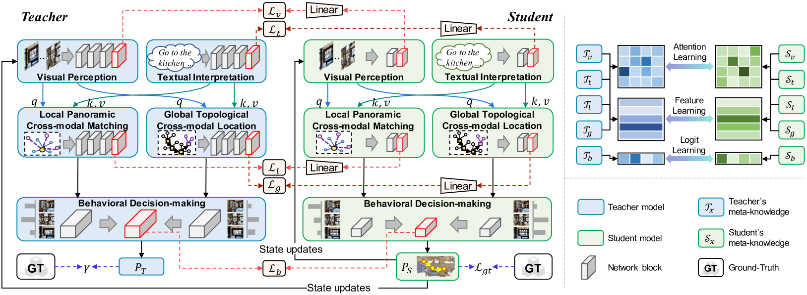

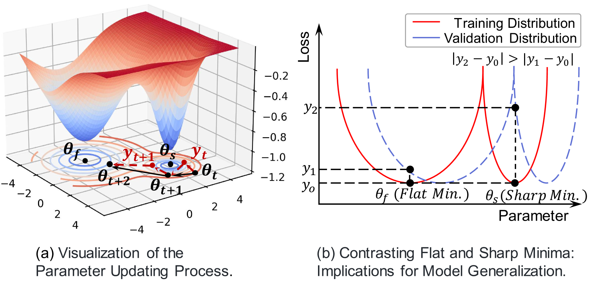

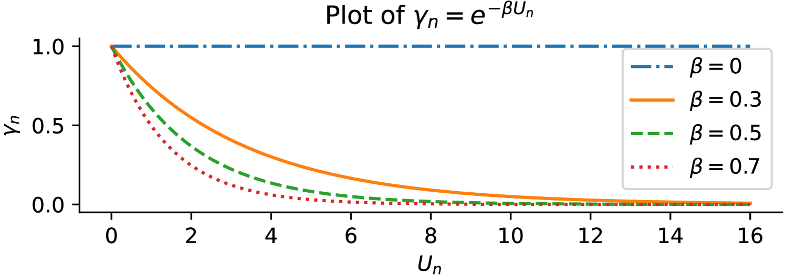

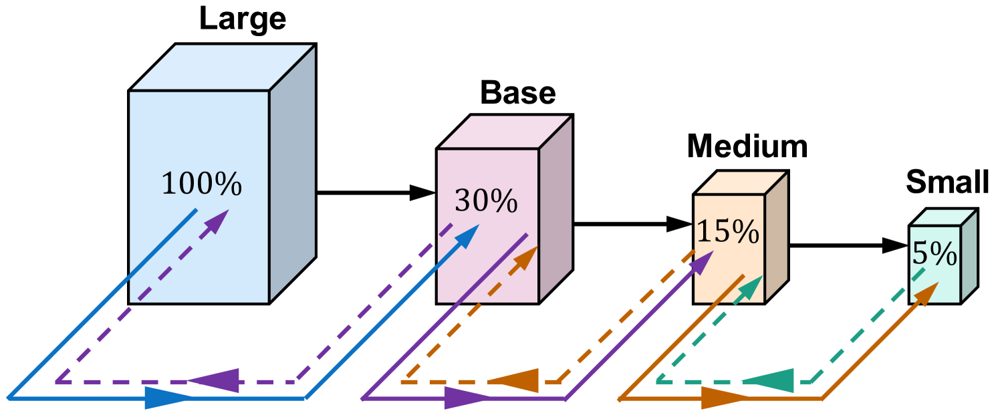

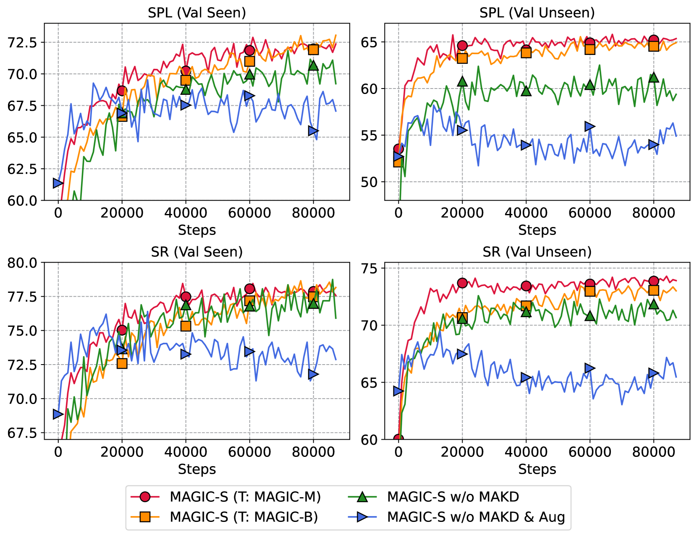

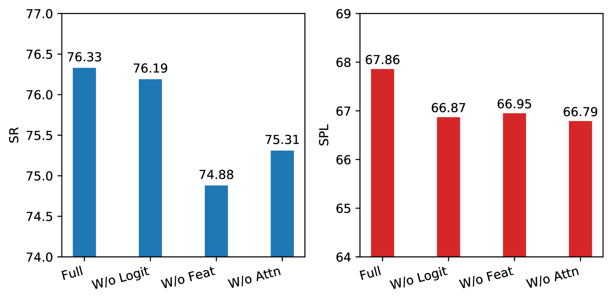

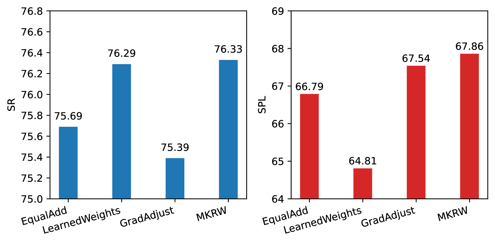

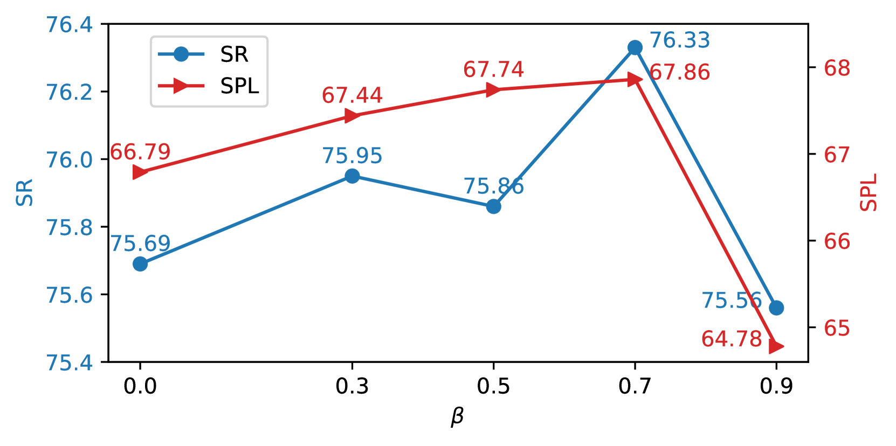

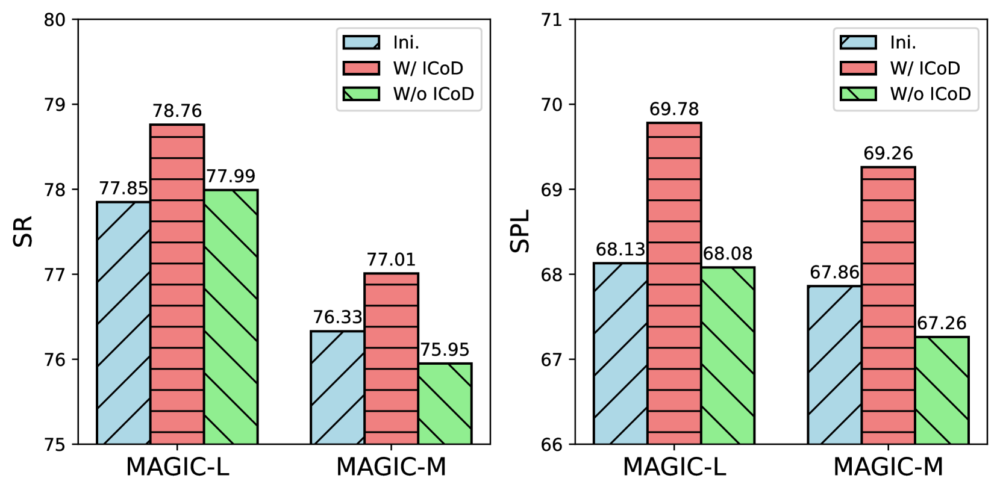

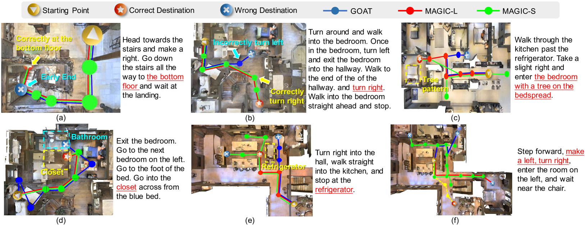

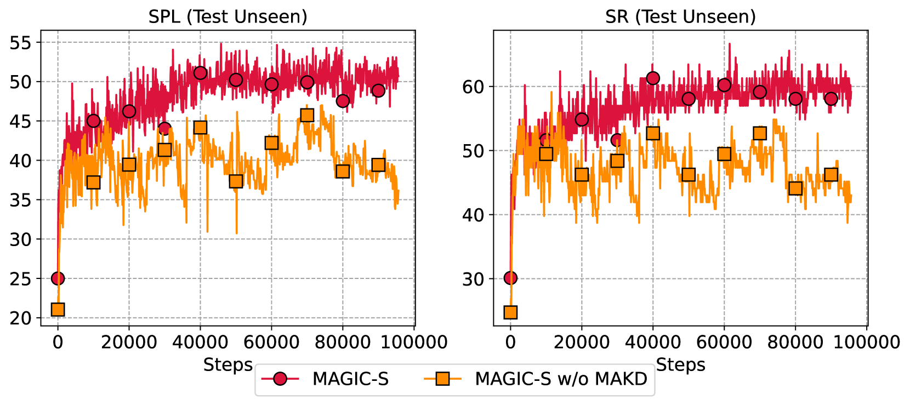

[Arxiv](https://arxiv.org/abs/2406.17960)