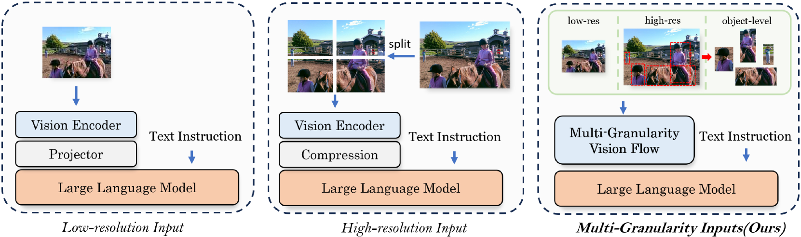

# MG-LLaVA：探索多粒度视觉指令调优之路

发布时间：2024年06月25日

`RAG

理由：该论文介绍了一种新型的多模态大型语言模型（MLLMs），名为MG-LLaVA，它通过引入多粒度视觉流和高分辨率视觉编码器来提升视觉处理能力。这种模型通过融合不同粒度的视觉信息，包括低、高分辨率及对象中心特征，来增强视觉理解和处理能力。此外，模型还集成了对象级特征，这些特征由离线检测器识别的边界框衍生而来，以进一步增强对象识别能力。这种模型的设计和实现涉及到对多模态数据的处理和融合，这与RAG（Retrieval-Augmented Generation）模型的概念相似，即通过整合外部信息来增强模型的生成能力。因此，将该论文分类为RAG是合适的。` `计算机视觉` `人工智能`

> MG-LLaVA: Towards Multi-Granularity Visual Instruction Tuning

# 摘要

> 多模态大型语言模型（MLLMs）在视觉理解任务中取得了重大进展，但多数模型受限于处理低分辨率图像，这在需要精细视觉信息的任务中显得力不从心。我们的研究中，推出了MG-LLaVA，这一创新模型通过引入多粒度视觉流（涵盖低、高分辨率及对象中心特征），显著提升了视觉处理能力。我们额外集成了高分辨率视觉编码器，捕捉细微细节，并通过Conv-Gate融合网络与基础视觉特征融合。此外，我们还引入了由离线检测器识别的边界框所衍生的对象级特征，以增强对象识别能力。MG-LLaVA仅通过公开多模态数据的指令调整训练，展现出卓越的感知能力。我们采用从3.8B至34B的多种语言编码器进行实例化，全面评估其性能。多基准的广泛测试显示，MG-LLaVA在性能上超越了同等参数规模的现有MLLMs，证明了其卓越效能。相关代码将在https://github.com/PhoenixZ810/MG-LLaVA公开。

> Multi-modal large language models (MLLMs) have made significant strides in various visual understanding tasks. However, the majority of these models are constrained to process low-resolution images, which limits their effectiveness in perception tasks that necessitate detailed visual information. In our study, we present MG-LLaVA, an innovative MLLM that enhances the model's visual processing capabilities by incorporating a multi-granularity vision flow, which includes low-resolution, high-resolution, and object-centric features. We propose the integration of an additional high-resolution visual encoder to capture fine-grained details, which are then fused with base visual features through a Conv-Gate fusion network. To further refine the model's object recognition abilities, we incorporate object-level features derived from bounding boxes identified by offline detectors. Being trained solely on publicly available multimodal data through instruction tuning, MG-LLaVA demonstrates exceptional perception skills. We instantiate MG-LLaVA with a wide variety of language encoders, ranging from 3.8B to 34B, to evaluate the model's performance comprehensively. Extensive evaluations across multiple benchmarks demonstrate that MG-LLaVA outperforms existing MLLMs of comparable parameter sizes, showcasing its remarkable efficacy. The code will be available at https://github.com/PhoenixZ810/MG-LLaVA.

[Arxiv](https://arxiv.org/abs/2406.17770)