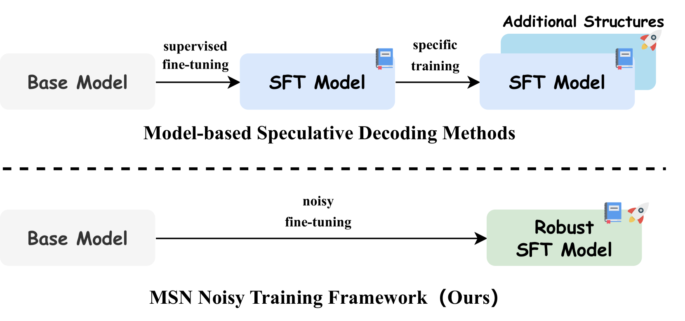

# 噪声训练：开启语言模型并行推理之门

发布时间：2024年06月25日

`LLM理论

理由：这篇论文介绍了一种新的训练框架（Make Some Noise, MSN）和解码策略（基于树的检索增强型 Jacobi, TR-Jacobi），旨在提升大型语言模型的并行解码能力和推理速度。这些方法涉及模型的内部机制和优化，属于理论层面的研究，因此归类为LLM理论。论文中并未提及具体的应用场景或Agent的行为，也没有涉及检索增强生成（RAG）的相关内容，因此不适合归类为LLM应用、Agent或RAG。` `机器学习`

> Make Some Noise: Unlocking Language Model Parallel Inference Capability through Noisy Training

# 摘要

> 现有的推测解码方法往往依赖于额外的模型结构和训练过程，以辅助模型生成草稿令牌，这不仅增加了迁移加速方法到新模型的成本，也对设备内存提出了更高要求。为此，我们提出了Make Some Noise (MSN) 训练框架，作为大型语言模型监督微调阶段的新选择。MSN 训练方法通过在输入中引入噪声，让模型学习去噪，从而在不牺牲原始任务能力的前提下，大幅提升模型的并行解码能力。此外，我们还开发了基于树的检索增强型 Jacobi (TR-Jacobi) 解码策略，进一步加快了 MSN 模型的推理速度。实验结果显示，MSN 在通用和代码领域均能将推理速度提升 2.3-2.7 倍，且不影响模型性能。在 Spec-Bench 上，MSN 模型实现了与具有额外模型结构的 SOTA 模型相当的加速效果。

> Existing speculative decoding methods typically require additional model structure and training processes to assist the model for draft token generation. This makes the migration of acceleration methods to the new model more costly and more demanding on device memory. To address this problem, we propose the Make Some Noise (MSN) training framework as a replacement for the supervised fine-tuning stage of the large language model. The training method simply introduces some noise at the input for the model to learn the denoising task. It significantly enhances the parallel decoding capability of the model without affecting the original task capability. In addition, we propose a tree-based retrieval-augmented Jacobi (TR-Jacobi) decoding strategy to further improve the inference speed of MSN models. Experiments in both the general and code domains have shown that MSN can improve inference speed by 2.3-2.7x times without compromising model performance. The MSN model also achieves comparable acceleration ratios to the SOTA model with additional model structure on Spec-Bench.

[Arxiv](https://arxiv.org/abs/2406.17404)