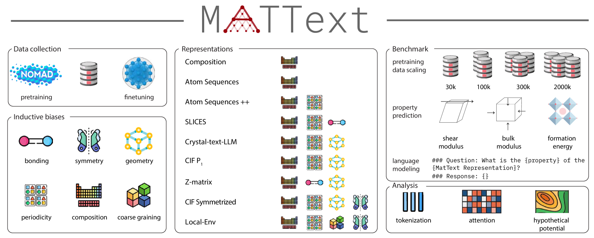
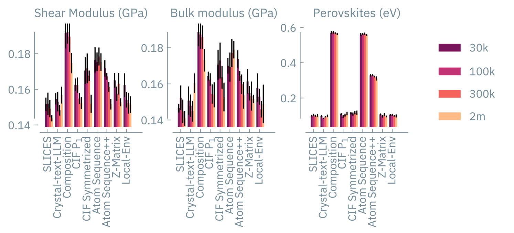
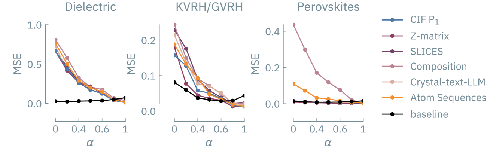
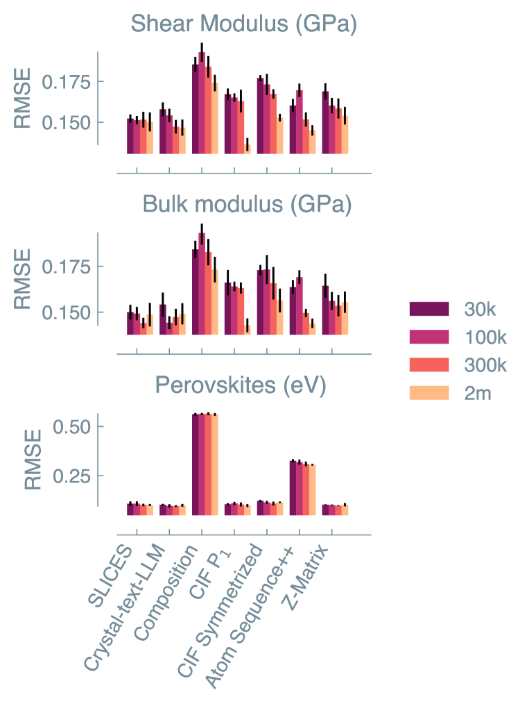
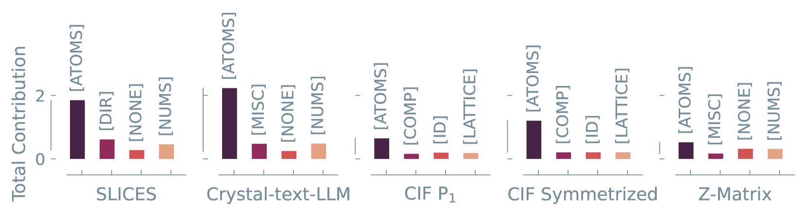
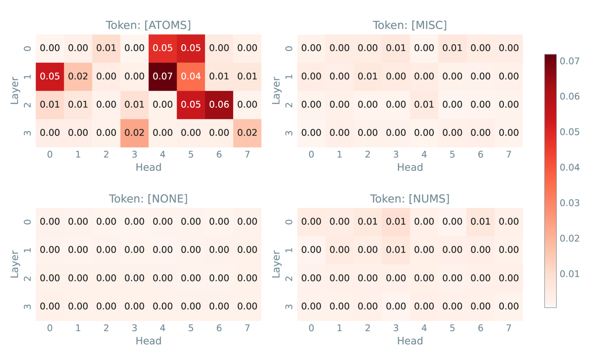
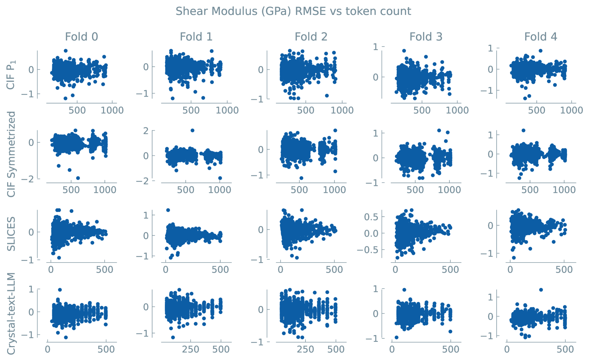
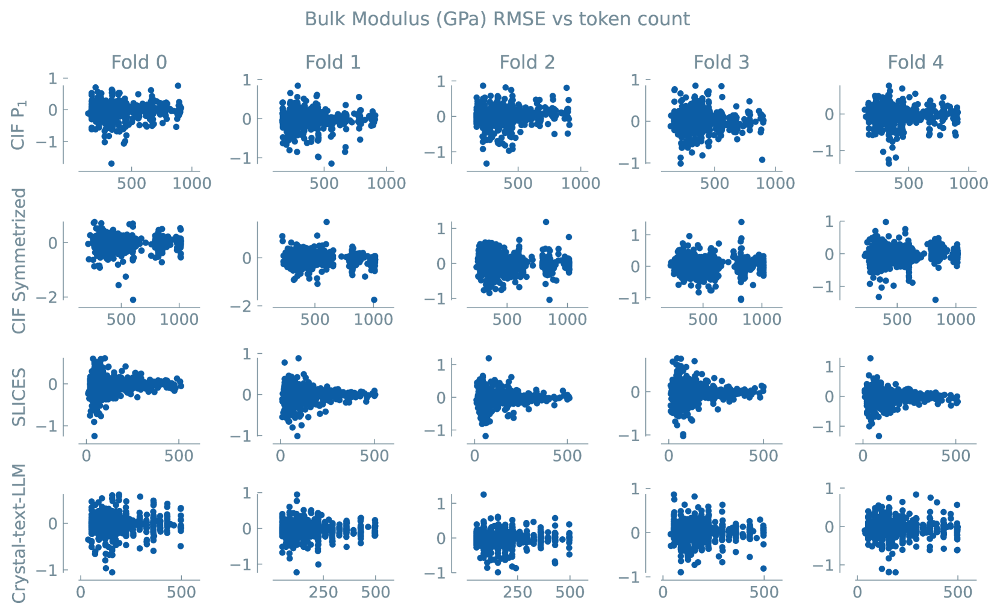

# MatText：探讨语言模型在材料建模领域，是否仅凭文本和规模已足够。

发布时间：2024年06月25日

`LLM应用

这篇论文主要探讨了大型语言模型（LLMs）在材料科学中的应用，特别是如何通过文本表示来推动新材料的发现。论文介绍了MatText，一个专为评估语言模型在材料建模中性能而设计的基准工具和数据集。这表明论文关注的是LLMs在特定领域的实际应用，即材料科学，而不是LLMs的理论研究或Agent的设计与应用。因此，最合适的分类是LLM应用。` `材料科学` `语言模型`

> MatText: Do Language Models Need More than Text & Scale for Materials Modeling?

# 摘要

> 将材料以文本形式有效表示，有望借助大型语言模型（LLMs）的巨大进步，推动新材料的发现。虽然LLMs在多个领域已取得显著成就，但在材料科学中的应用仍显不足。关键难题在于，我们尚未充分理解如何最佳地利用文本表示进行材料建模。此外，缺乏一个全面的基准来严格评估这些文本表示在捕捉材料系统复杂性方面的能力和局限性，使得问题更加复杂。为此，我们推出了MatText，一套专为系统评估语言模型在材料建模中性能而设计的基准工具和数据集。MatText涵盖了九种独特的基于文本的材料系统表示，其中包含几种创新表示，每种都融入了捕捉相关信息并整合先验物理知识的独特归纳偏差。MatText还提供了关键的训练和基准测试工具，包括每种表示的标准化数据集分割、评估几何敏感性的探针，以及将晶体结构转换为文本的工具。通过MatText，我们深入分析了语言模型在材料建模中的能力。研究发现，当前的语言模型在捕捉所有表示中对材料建模至关重要的几何信息方面存在困难，而更倾向于利用局部信息，这在我们的某些创新表示中尤为明显。这一分析凸显了MatText揭示基于文本的材料设计方法不足的能力。

> Effectively representing materials as text has the potential to leverage the vast advancements of large language models (LLMs) for discovering new materials. While LLMs have shown remarkable success in various domains, their application to materials science remains underexplored. A fundamental challenge is the lack of understanding of how to best utilize text-based representations for materials modeling. This challenge is further compounded by the absence of a comprehensive benchmark to rigorously evaluate the capabilities and limitations of these text representations in capturing the complexity of material systems. To address this gap, we propose MatText, a suite of benchmarking tools and datasets designed to systematically evaluate the performance of language models in modeling materials. MatText encompasses nine distinct text-based representations for material systems, including several novel representations. Each representation incorporates unique inductive biases that capture relevant information and integrate prior physical knowledge about materials. Additionally, MatText provides essential tools for training and benchmarking the performance of language models in the context of materials science. These tools include standardized dataset splits for each representation, probes for evaluating sensitivity to geometric factors, and tools for seamlessly converting crystal structures into text. Using MatText, we conduct an extensive analysis of the capabilities of language models in modeling materials. Our findings reveal that current language models consistently struggle to capture the geometric information crucial for materials modeling across all representations. Instead, these models tend to leverage local information, which is emphasized in some of our novel representations. Our analysis underscores MatText's ability to reveal shortcomings of text-based methods for materials design.

[Arxiv](https://arxiv.org/abs/2406.17295)