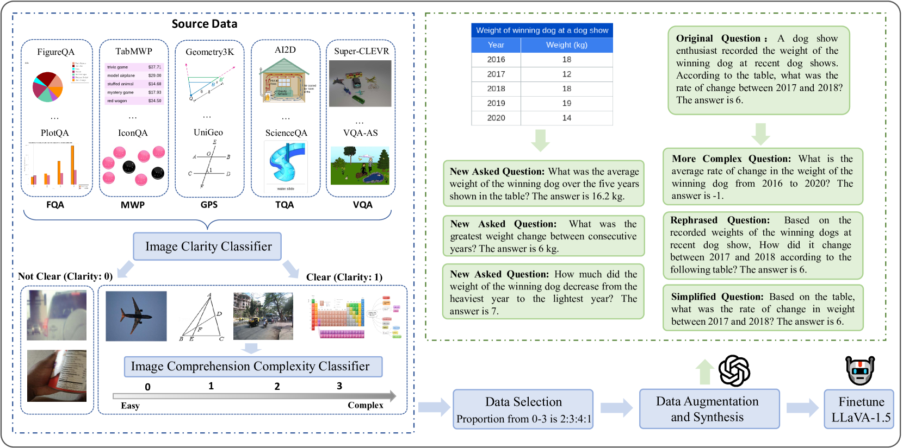
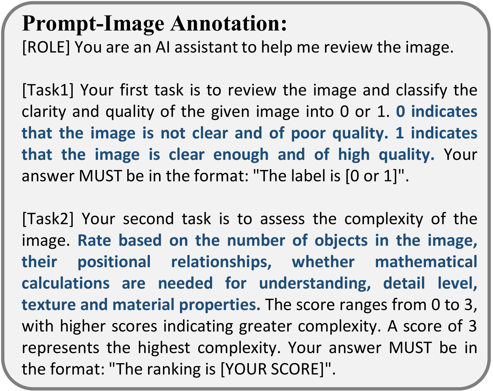

# Math-LLaVA：助力多模态大型语言模型提升数学推理能力

发布时间：2024年06月25日

`LLM应用

这篇论文主要介绍了Math-LLaVA模型的开发和其在多模态数学推理能力上的提升，这是通过创建和利用一个大规模的多模态数学问题数据集MathV360K来实现的。论文的重点在于应用大型语言模型（LLMs）于多模态环境下的数学问题解决，并通过数据集的扩展和模型的微调来提升性能。因此，这篇论文属于LLM应用类别。` `人工智能`

> Math-LLaVA: Bootstrapping Mathematical Reasoning for Multimodal Large Language Models

# 摘要

> 大型语言模型（LLMs）在文本数学问题解决上展现了卓越的推理能力。然而，现有开源图像指令微调数据集因每图问题-答案对有限，未能充分挖掘视觉信息以提升多模态LLMs（MLLMs）的数学推理能力。为此，我们通过整合24个数据集中的40,000张高质量图像及其问题-答案对，并创造320,000个新对，推出了MathV360K数据集，极大地拓宽和深化了多模态数学问题的领域。基于此，我们开发了Math-LLaVA，一个基于LLaVA-1.5的模型，通过MathV360K进行微调，显著提升了其多模态数学推理能力，性能提升了19个点，与GPT-4V在MathVista的minitest分割上表现相当。Math-LLaVA还展示了更强的泛化能力，在MMMU基准上取得了显著进步，凸显了数据集多样性和合成在推动MLLMs数学推理能力发展中的关键作用。相关代码和数据已公开：\url{https://github.com/HZQ950419/Math-LLaVA}。

> Large language models (LLMs) have demonstrated impressive reasoning capabilities, particularly in textual mathematical problem-solving. However, existing open-source image instruction fine-tuning datasets, containing limited question-answer pairs per image, do not fully exploit visual information to enhance the multimodal mathematical reasoning capabilities of Multimodal LLMs (MLLMs). To bridge this gap, we address the lack of high-quality, diverse multimodal mathematical datasets by collecting 40K high-quality images with question-answer pairs from 24 existing datasets and synthesizing 320K new pairs, creating the MathV360K dataset, which enhances both the breadth and depth of multimodal mathematical questions. We introduce Math-LLaVA, a LLaVA-1.5-based model fine-tuned with MathV360K. This novel approach significantly improves the multimodal mathematical reasoning capabilities of LLaVA-1.5, achieving a 19-point increase and comparable performance to GPT-4V on MathVista's minitest split. Furthermore, Math-LLaVA demonstrates enhanced generalizability, showing substantial improvements on the MMMU benchmark. Our research highlights the importance of dataset diversity and synthesis in advancing MLLMs' mathematical reasoning abilities. The code and data are available at: \url{https://github.com/HZQ950419/Math-LLaVA}.

[Arxiv](https://arxiv.org/abs/2406.17294)