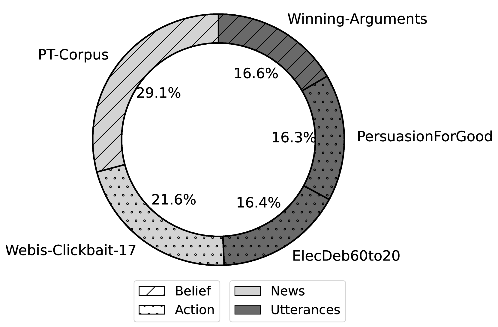
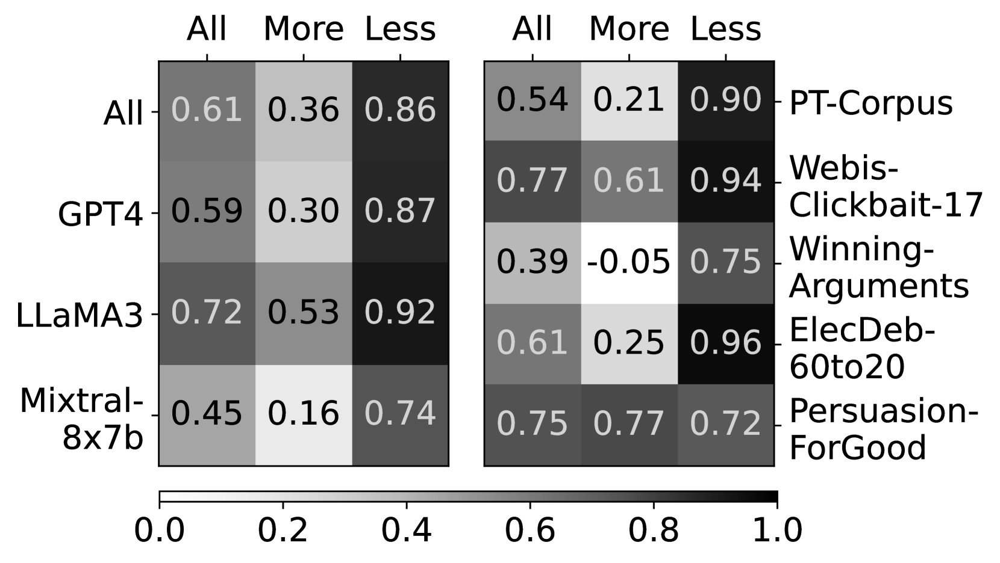

# 评估与基准化大型语言模型在生成说服性语言方面的能力

发布时间：2024年06月25日

`LLM应用

这篇论文探讨了大型语言模型（LLMs）生成说服性文本的能力，并创建了一个名为Persuasive-Pairs的新数据集来评估和比较LLMs在不同指令下生成说服性文本的能力。研究内容涉及跨多个领域的说服性文本生成，以及如何通过系统提示调整文本的说服力。这与LLM的应用相关，特别是在评估和改进模型在特定任务（如生成说服性文本）上的表现。因此，这篇论文应归类于LLM应用。` `信息传播`

> Measuring and Benchmarking Large Language Models' Capabilities to Generate Persuasive Language

# 摘要

> 我们每天都会接触到各种试图影响我们的信息，包括预告、辩论、政治新闻和宣传，它们都巧妙地运用了说服性语言。随着大型语言模型（LLMs）的兴起，我们探讨了这些模型生成说服性文本的能力。与以往专注于特定领域或说服类型的研究不同，我们的研究横跨多个领域，旨在评估和比较LLMs在不同指令下生成说服性文本的能力，无论是增强还是减弱文本的说服力。为此，我们创建了名为Persuasive-Pairs的新数据集，包含由LLM重写的文本对，旨在调整说服性语言的强度。我们对该数据集进行了多重标注，并展示了它如何用于训练回归模型，以预测文本对之间的说服性语言得分。这一模型不仅有助于对不同LLMs进行跨领域的评分和基准测试，还促进了它们之间的比较。最后，我们探讨了系统提示对说服性语言的影响，发现LLaMA3中的不同“角色”设置能显著改变文本的说服力，即使仅限于改写任务。这些发现凸显了深入研究LLM生成文本中说服性语言的必要性。

> We are exposed to much information trying to influence us, such as teaser messages, debates, politically framed news, and propaganda - all of which use persuasive language. With the recent interest in Large Language Models (LLMs), we study the ability of LLMs to produce persuasive text. As opposed to prior work which focuses on particular domains or types of persuasion, we conduct a general study across various domains to measure and benchmark to what degree LLMs produce persuasive text - both when explicitly instructed to rewrite text to be more or less persuasive and when only instructed to paraphrase. To this end, we construct a new dataset, Persuasive-Pairs, of pairs each consisting of a short text and of a text rewritten by an LLM to amplify or diminish persuasive language. We multi-annotate the pairs on a relative scale for persuasive language. This data is not only a valuable resource in itself, but we also show that it can be used to train a regression model to predict a score of persuasive language between text pairs. This model can score and benchmark new LLMs across domains, thereby facilitating the comparison of different LLMs. Finally, we discuss effects observed for different system prompts. Notably, we find that different 'personas' in the system prompt of LLaMA3 change the persuasive language in the text substantially, even when only instructed to paraphrase. These findings underscore the importance of investigating persuasive language in LLM generated text.

[Arxiv](https://arxiv.org/abs/2406.17753)