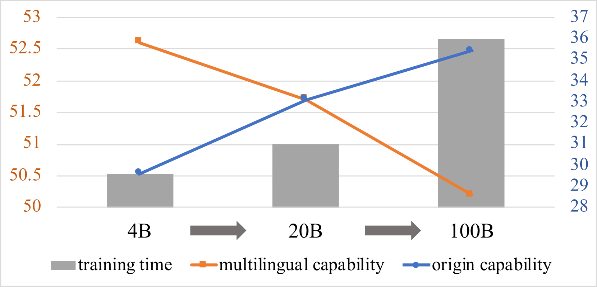
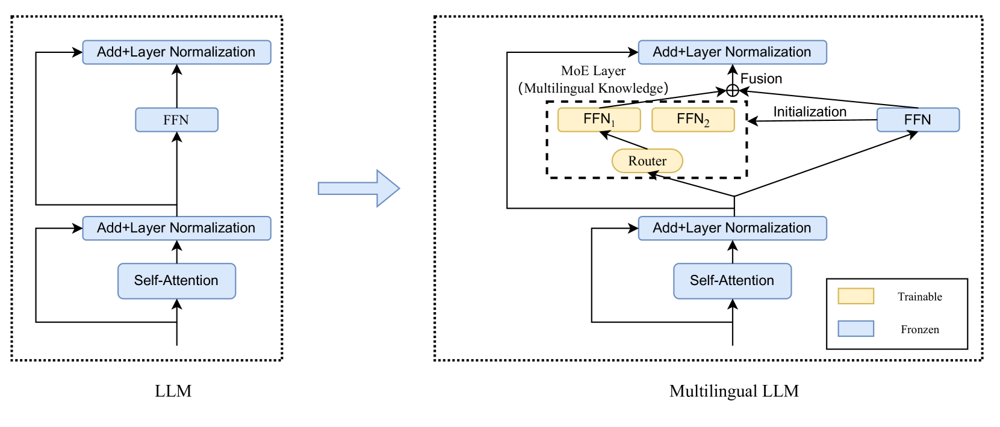

# MoE-CT：一种创新策略，助力大型语言模型训练，有效抵御灾难性遗忘。

发布时间：2024年06月25日

`LLM应用` `语言技术` `多语言建模`

> MoE-CT: A Novel Approach For Large Language Models Training With Resistance To Catastrophic Forgetting

# 摘要

> 大型语言模型（LLM）主要服务于高资源语言，导致低资源语言性能不足。传统持续训练（CT）方法在多语言扩展时往往削弱原始语言能力。为此，我们创新性地提出了MoE-CT架构，将基础模型学习与多语言扩展分离。该设计冻结了LLM原始参数，确保高资源语言性能不受影响，同时通过专为多样语言数据集训练的MoE模块提升低资源语言能力。实验证明，我们的方法在多语言基准测试中显著超越传统CT方法，且不损害原始语言性能。MoE-CT框架还展现出更强的抗遗忘特性和迁移学习优势。通过保护基础模型完整性并策略性扩展参数，我们的方法不仅推进了多语言建模，也为低资源语言在LLM中的应用开辟了新路径，为语言技术未来研究指明了方向。

> The advent of large language models (LLMs) has predominantly catered to high-resource languages, leaving a disparity in performance for low-resource languages. Conventional Continual Training (CT) approaches to bridge this gap often undermine a model's original linguistic proficiency when expanding to multilingual contexts. Addressing this issue, we introduce a novel MoE-CT architecture, a paradigm that innovatively separates the base model's learning from the multilingual expansion process. Our design freezes the original LLM parameters, thus safeguarding its performance in high-resource languages, while an appended MoE module, trained on diverse language datasets, augments low-resource language proficiency. Our approach significantly outperforms conventional CT methods, as evidenced by our experiments, which show marked improvements in multilingual benchmarks without sacrificing the model's original language performance. Moreover, our MoE-CT framework demonstrates enhanced resistance to forgetting and superior transfer learning capabilities. By preserving the base model's integrity and focusing on strategic parameter expansion, our methodology advances multilingual language modeling and represents a significant step forward for low-resource language inclusion in LLMs, indicating a fruitful direction for future research in language technologies.

[Arxiv](https://arxiv.org/abs/2407.00875)