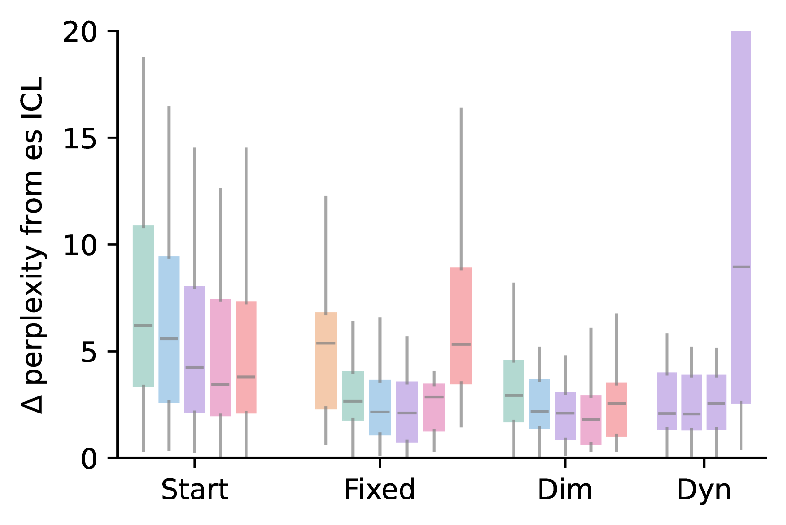

# 动态激活组合：驾驭大型语言模型的多重属性

发布时间：2024年06月25日

`LLM理论

理由：这篇论文主要探讨了语言模型（LLM）中的激活导向方法，并提出了一种基于信息论的动态激活组合方法，以优化模型的生成过程。这些内容更多地涉及语言模型的理论和内部机制的改进，而不是具体的应用场景或Agent的行为，也不是关于检索增强生成（RAG）的具体研究。因此，将其归类为LLM理论是合适的。` `模型优化`

> Multi-property Steering of Large Language Models with Dynamic Activation Composition

# 摘要

> 激活导向方法通过在模型中间层进行加性干预，有效提升了语言模型的生成质量。但目前这些技术的评估多局限于单一属性调节和人工环境。本研究深入探讨了多种激活导向策略，并指出最优参数需根据属性特性调整，以确保生成过程的稳定性。为此，我们提出了一种基于信息论的动态激活组合方法，旨在动态调整生成过程中多个属性的导向强度。实验结果显示，该方法在保持高度调节效果的同时，显著减少了调节对生成流畅性的负面影响。

> Activation steering methods were shown to be effective in conditioning language model generation by additively intervening over models' intermediate representations. However, the evaluation of these techniques has so far been limited to single conditioning properties and synthetic settings. In this work, we conduct a comprehensive evaluation of various activation steering strategies, highlighting the property-dependent nature of optimal parameters to ensure a robust effect throughout generation. To address this issue, we propose Dynamic Activation Composition, an information-theoretic approach to modulate the steering intensity of one or more properties throughout generation. Our experiments on multi-property steering show that our method successfully maintains high conditioning while minimizing the impact of conditioning on generation fluency.

[Arxiv](https://arxiv.org/abs/2406.17563)