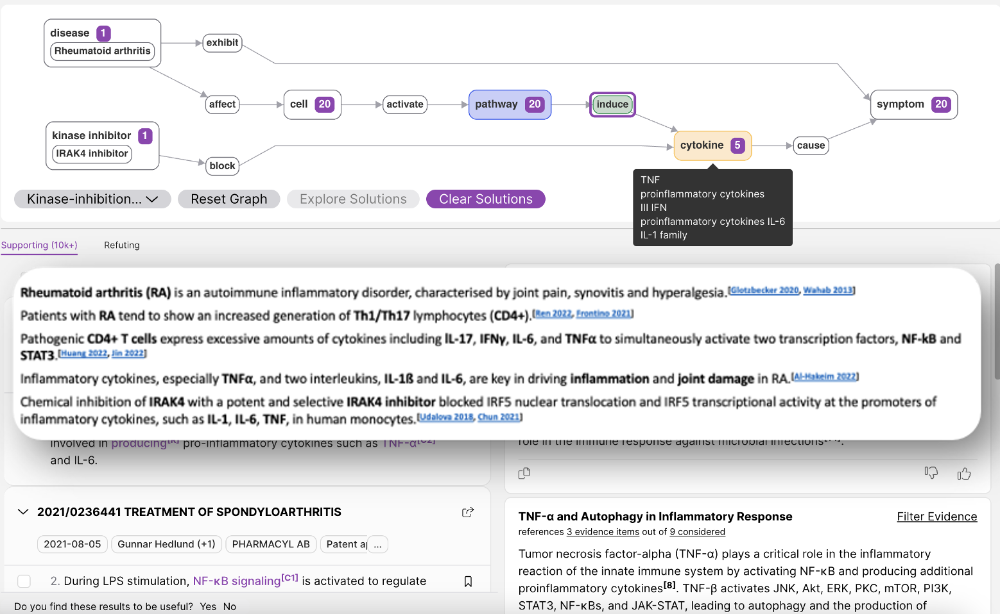
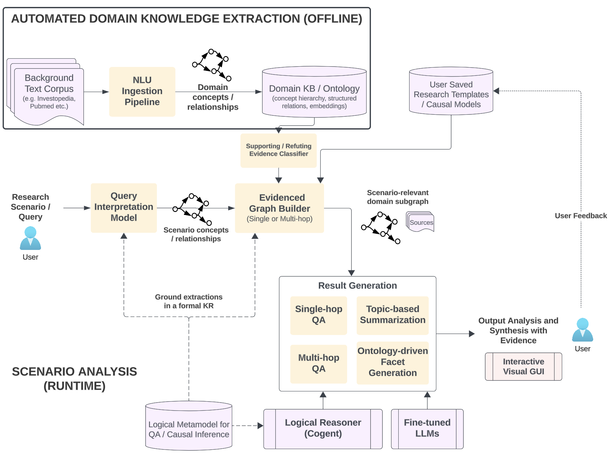

# 在非结构化数据上进行多步骤的知识检索与推理

发布时间：2024年06月25日

`Agent

这篇论文主要介绍了Elemental Cognition（EC）推出的神经符号AI平台，以及基于此平台的协作研究助手Cora。Cora专为高风险领域中的复杂研究与发现任务设计，能够进行逻辑推理、规划及交互式约束求解。这与Agent分类中的智能体概念相符，因为Cora作为一个智能体，能够执行复杂的任务并作出决策。虽然文中提到了LLMs和RAG，但它们是作为Cora平台的一部分被提及，而不是论文的主要研究内容。因此，这篇论文更适合归类为Agent。`

> Multi-step Knowledge Retrieval and Inference over Unstructured Data

# 摘要

> 大型语言模型（LLMs）与生成式AI的兴起，极大地革新了多领域的自然语言应用。但在医疗、法律及金融等高风险领域，决策任务对精确性、全面性和逻辑一致性的要求极高，传统LLM或检索增强生成（RAG）方法往往难以胜任。Elemental Cognition（EC）推出的神经符号AI平台，正是为了应对这些挑战。该平台融合了精细调整的LLMs用于知识提取，并与强大的符号推理引擎相结合，实现逻辑推理、规划及交互式约束求解。我们介绍了基于此平台的协作研究助手Cora，专为高风险领域中的复杂研究与发现任务设计。本文深入探讨了这些领域中的多步骤推理难题，指出了现有LLM方法的不足，并展示了Cora如何通过其神经符号方法有效应对这些挑战。文章还概述了系统架构、关键的知识提取与形式推理算法，并提供了初步评估结果，显示Cora在性能上超越了知名的LLM和RAG基准。

> The advent of Large Language Models (LLMs) and Generative AI has revolutionized natural language applications across various domains. However, high-stakes decision-making tasks in fields such as medical, legal and finance require a level of precision, comprehensiveness, and logical consistency that pure LLM or Retrieval-Augmented-Generation (RAG) approaches often fail to deliver. At Elemental Cognition (EC), we have developed a neuro-symbolic AI platform to tackle these problems. The platform integrates fine-tuned LLMs for knowledge extraction and alignment with a robust symbolic reasoning engine for logical inference, planning and interactive constraint solving. We describe Cora, a Collaborative Research Assistant built on this platform, that is designed to perform complex research and discovery tasks in high-stakes domains. This paper discusses the multi-step inference challenges inherent in such domains, critiques the limitations of existing LLM-based methods, and demonstrates how Cora's neuro-symbolic approach effectively addresses these issues. We provide an overview of the system architecture, key algorithms for knowledge extraction and formal reasoning, and present preliminary evaluation results that highlight Cora's superior performance compared to well-known LLM and RAG baselines.

[Arxiv](https://arxiv.org/abs/2406.17987)