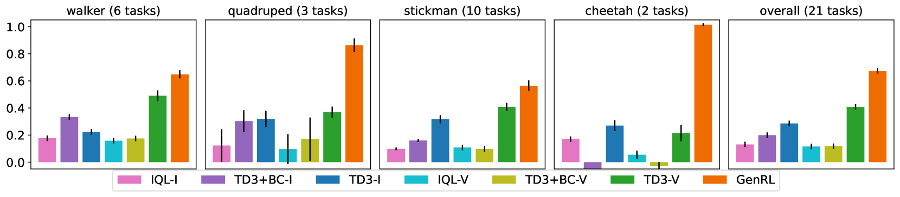
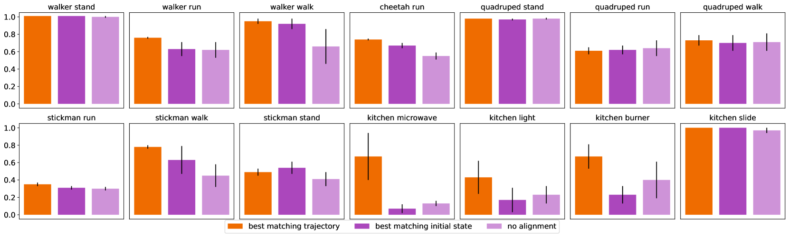
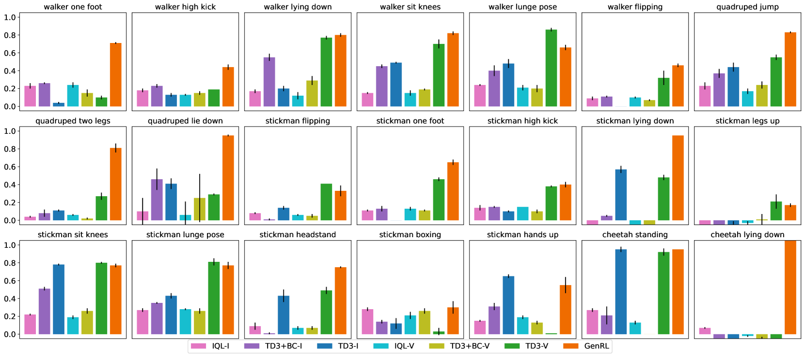

# 通用具身代理的多模态基础世界模型

发布时间：2024年06月25日

`Agent

这篇论文主要探讨了如何培养能够跨领域解决多样任务的通用实体代理，并提出了一种名为GenRL的代理学习框架。该框架利用多模态基础世界模型，能够无缝对接基础视觉-语言模型（VLMs）与强化学习（RL）生成世界模型的潜在空间，无需语言标注。这种方法允许通过视觉或语言提示定义任务，并将其嵌入实体环境的动态中，进而在模拟环境中学习相应行为。因此，这篇论文更符合Agent分类，因为它专注于开发和研究智能代理系统，特别是那些能够处理多模态数据并在不同领域中泛化能力的代理。` `多模态数据`

> Multimodal foundation world models for generalist embodied agents

# 摘要

> 培养能跨领域解决多样任务的通用实体代理，一直是研究的难题。强化学习（RL）因需为每项任务精心设计奖励机制而难以扩展。相较之下，语言能更自然地定义任务。现有的视觉-语言基础模型（VLMs）通常需微调或适应，以弥合领域间的巨大鸿沟。然而，多模态数据的稀缺成为构建实体应用基础模型的障碍。本研究提出了一种多模态基础世界模型，它能无缝对接基础VLMs与RL生成世界模型的潜在空间，无需语言标注。这一名为GenRL的代理学习框架，允许通过视觉或语言提示定义任务，并将其嵌入实体环境的动态中，进而在模拟环境中学习相应行为。经大规模多任务测试，GenRL在多个运动与操作领域展现了卓越的泛化能力。此外，引入的无数据RL策略为基于基础模型的通用实体代理RL奠定了基础。

> Learning generalist embodied agents, able to solve multitudes of tasks in different domains is a long-standing problem. Reinforcement learning (RL) is hard to scale up as it requires a complex reward design for each task. In contrast, language can specify tasks in a more natural way. Current foundation vision-language models (VLMs) generally require fine-tuning or other adaptations to be functional, due to the significant domain gap. However, the lack of multimodal data in such domains represents an obstacle toward developing foundation models for embodied applications. In this work, we overcome these problems by presenting multimodal foundation world models, able to connect and align the representation of foundation VLMs with the latent space of generative world models for RL, without any language annotations. The resulting agent learning framework, GenRL, allows one to specify tasks through vision and/or language prompts, ground them in the embodied domain's dynamics, and learns the corresponding behaviors in imagination. As assessed through large-scale multi-task benchmarking, GenRL exhibits strong multi-task generalization performance in several locomotion and manipulation domains. Furthermore, by introducing a data-free RL strategy, it lays the groundwork for foundation model-based RL for generalist embodied agents.

[Arxiv](https://arxiv.org/abs/2406.18043)