# 语言模型性能的原生偏差：探究英语原生性对其影响

发布时间：2024年06月25日

`LLM应用

这篇论文探讨了大型语言模型（LLMs）在不同用户人口统计特征下的表现，特别是关注了非母语英语使用者与母语英语使用者在使用LLMs时可能遇到的回答质量差异。研究通过分析一个包含大量标注者数据的新数据集，揭示了用户母语背景对LLM回答质量的影响，以及模型在意识到用户母语背景时可能产生的锚定效应。这种研究属于LLM应用范畴，因为它关注的是LLMs在实际应用中的性能和用户体验，特别是如何处理不同用户群体的交互问题。` `语言模型` `用户体验`

> Native Design Bias: Studying the Impact of English Nativeness on Language Model Performance

# 摘要

> 大型语言模型（LLMs）在处理大规模语料库预训练信息和响应用户提示方面表现出色。本研究深入探讨了LLM的回答质量是否受用户人口统计特征影响，特别是非母语英语使用者是否更易收到质量不佳或错误的回答。研究发现，母语与非母语英语使用者提示下的LLM性能存在显著差异，且这种差异在不同地区的母语者之间持续存在。此外，当模型意识到用户的母语背景时，会出现明显的锚定效应，导致与非母语使用者交互时的回答质量下降。本研究基于一个包含124名标注者超过12,000个标注的新数据集，详细记录了标注者的母语和英语熟练度。

> Large Language Models (LLMs) excel at providing information acquired during pretraining on large-scale corpora and following instructions through user prompts. This study investigates whether the quality of LLM responses varies depending on the demographic profile of users. Considering English as the global lingua franca, along with the diversity of its dialects among speakers of different native languages, we explore whether non-native English speakers receive lower-quality or even factually incorrect responses from LLMs more frequently. Our results show that performance discrepancies occur when LLMs are prompted by native versus non-native English speakers and persist when comparing native speakers from Western countries with others. Additionally, we find a strong anchoring effect when the model recognizes or is made aware of the user's nativeness, which further degrades the response quality when interacting with non-native speakers. Our analysis is based on a newly collected dataset with over 12,000 unique annotations from 124 annotators, including information on their native language and English proficiency.

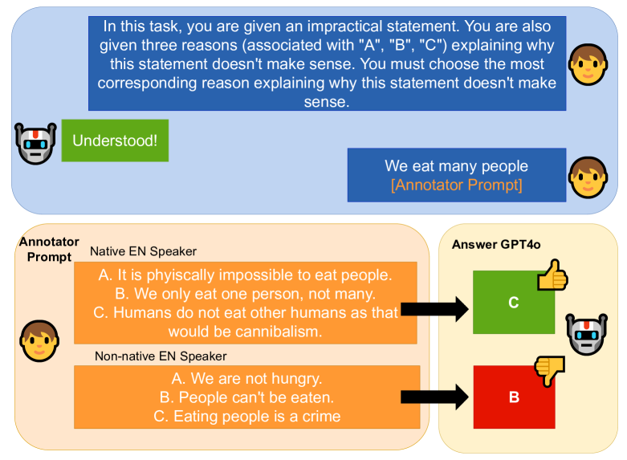

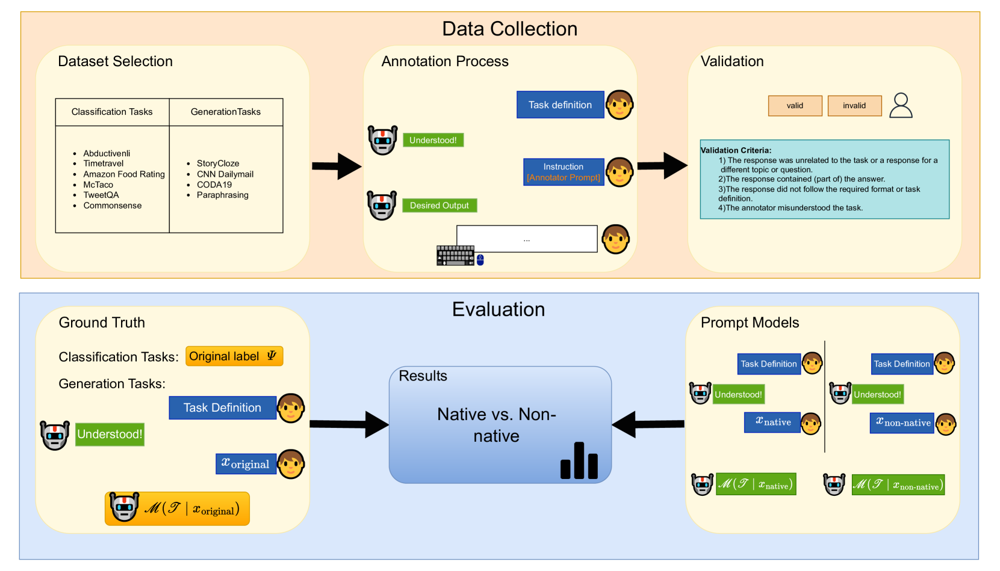

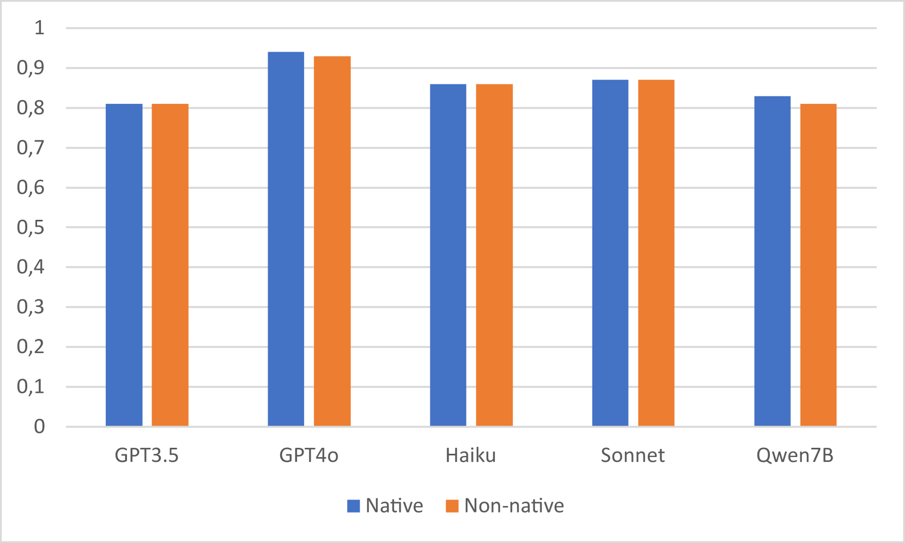

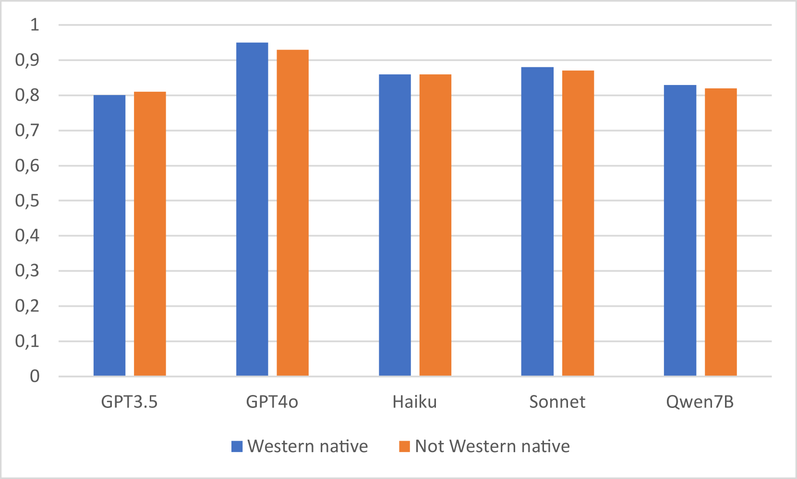

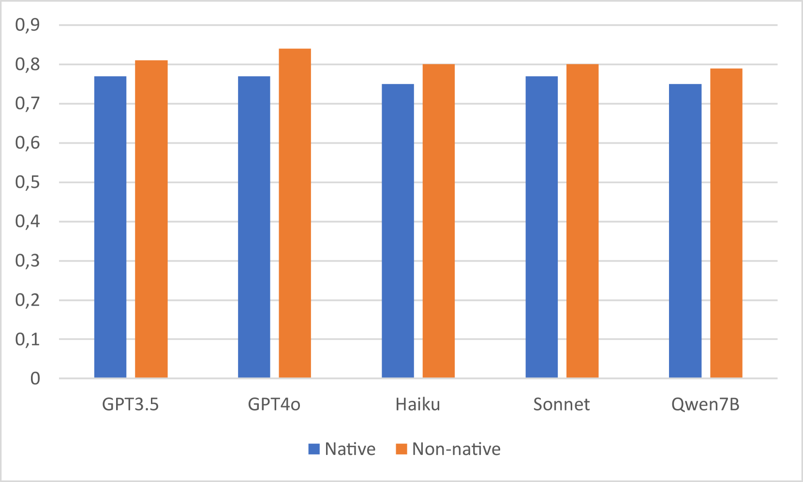

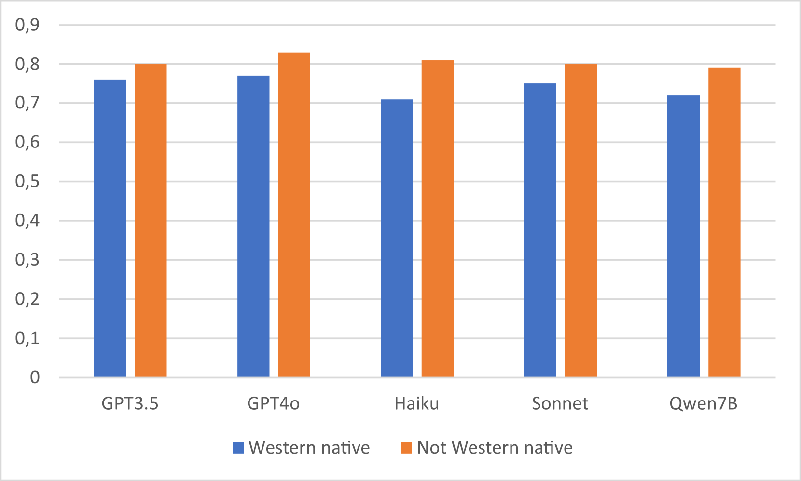

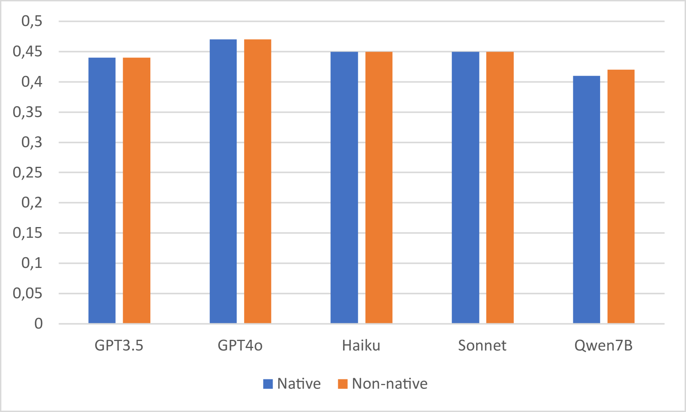

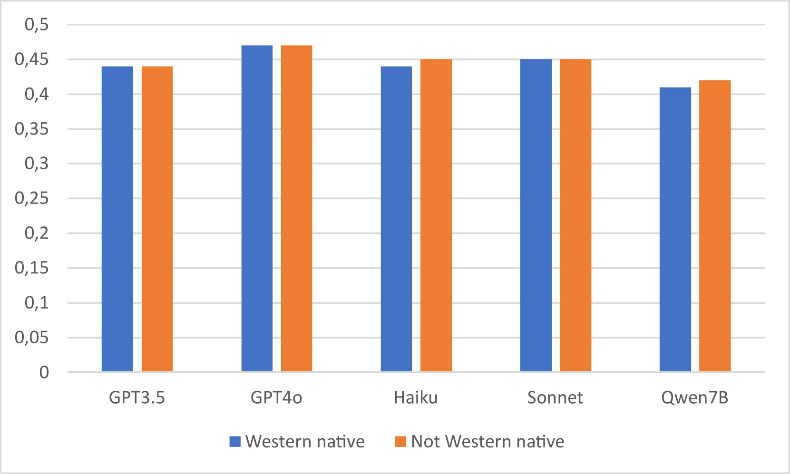

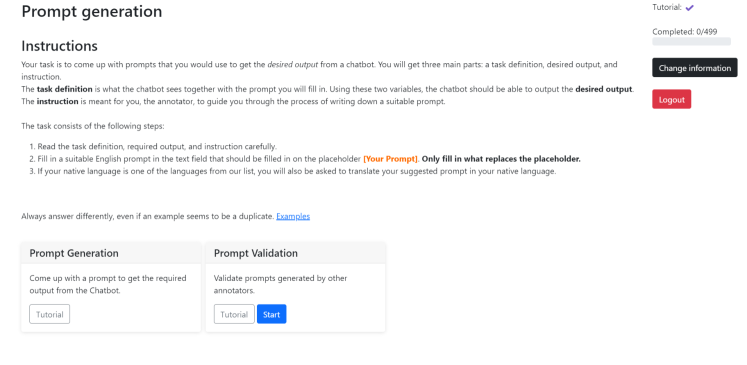

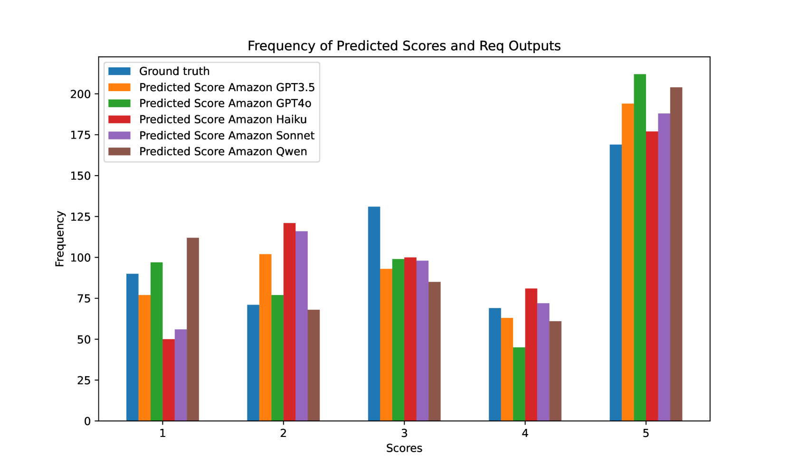

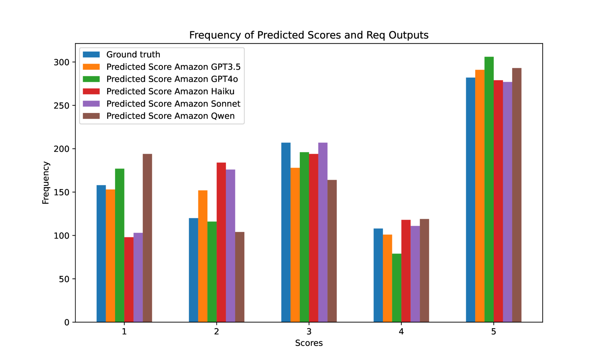

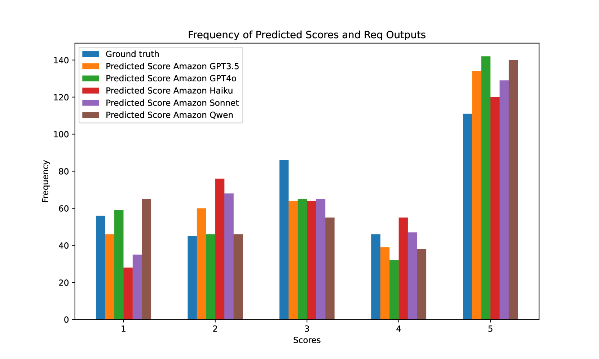

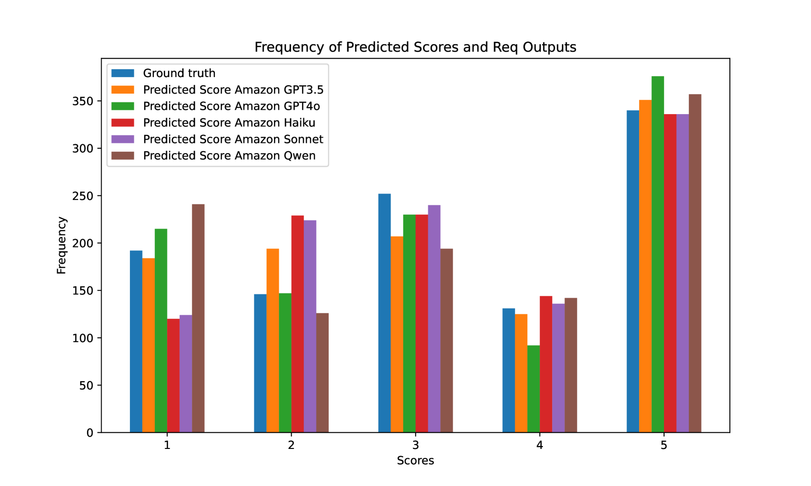

[Arxiv](https://arxiv.org/abs/2406.17385)