# 借助大型语言模型，探索中文咨询对话中五大人格特质的预测

发布时间：2024年06月25日

`LLM应用

理由：这篇论文主要探讨了如何利用大型语言模型（LLMs）来预测人格特质，通过开发一个新框架，该框架使用角色扮演和问卷提示训练LLMs，以模拟客户对五大人格量表的反应。这种方法直接应用于心理咨询领域，通过分析咨询对话来预测人格特质，属于LLM在实际应用中的一个具体案例。因此，它被归类为LLM应用。` `心理咨询` `计算心理测量学`

> Predicting the Big Five Personality Traits in Chinese Counselling Dialogues Using Large Language Models

# 摘要

> 在心理咨询中，准确评估人格特质至关重要，但传统自我报告问卷既耗时又易产生偏见。本研究创新性地利用大型语言模型（LLMs）直接从咨询对话中预测五大人格特质，并开发了一个新框架。该框架通过角色扮演和问卷提示训练LLMs，模拟客户对五大人格量表的反应。在853个真实咨询会话的测试中，我们发现LLM预测与实际人格特质高度相关，验证了框架的有效性。消融研究进一步强调了角色扮演和问卷简化在提升预测准确性中的关键作用。我们的Llama3-8B模型，采用直接偏好优化与监督微调技术，实现了130.95%的性能提升，超越了当前最先进的Qwen1.5-110B模型36.94%。这表明LLMs能有效预测基于咨询对话的人格特质。我们的代码和模型已公开在\url{https://github.com/kuri-leo/BigFive-LLM-Predictor}，为计算心理测量学领域的未来研究提供了宝贵资源。

> Accurate assessment of personality traits is crucial for effective psycho-counseling, yet traditional methods like self-report questionnaires are time-consuming and biased. This study exams whether Large Language Models (LLMs) can predict the Big Five personality traits directly from counseling dialogues and introduces an innovative framework to perform the task. Our framework applies role-play and questionnaire-based prompting to condition LLMs on counseling sessions, simulating client responses to the Big Five Inventory. We evaluated our framework on 853 real-world counseling sessions, finding a significant correlation between LLM-predicted and actual Big Five traits, proving the validity of framework. Moreover, ablation studies highlight the importance of role-play simulations and task simplification via questionnaires in enhancing prediction accuracy. Meanwhile, our fine-tuned Llama3-8B model, utilizing Direct Preference Optimization with Supervised Fine-Tuning, achieves a 130.95\% improvement, surpassing the state-of-the-art Qwen1.5-110B by 36.94\% in personality prediction validity. In conclusion, LLMs can predict personality based on counseling dialogues. Our code and model are publicly available at \url{https://github.com/kuri-leo/BigFive-LLM-Predictor}, providing a valuable tool for future research in computational psychometrics.

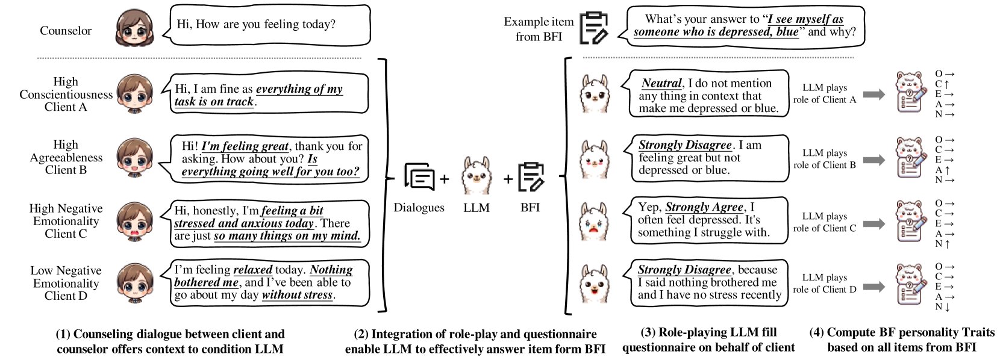

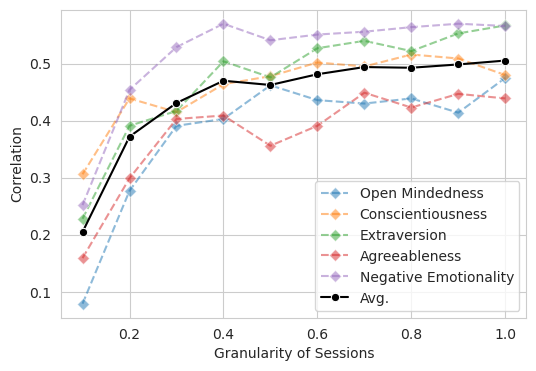

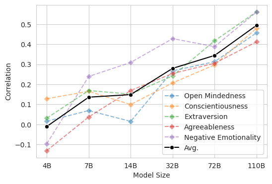

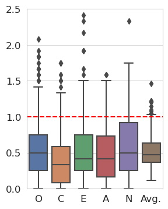

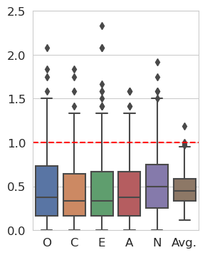

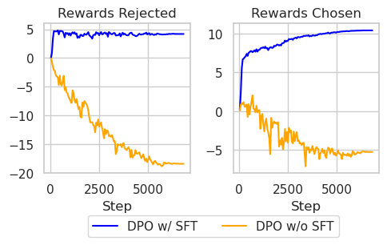

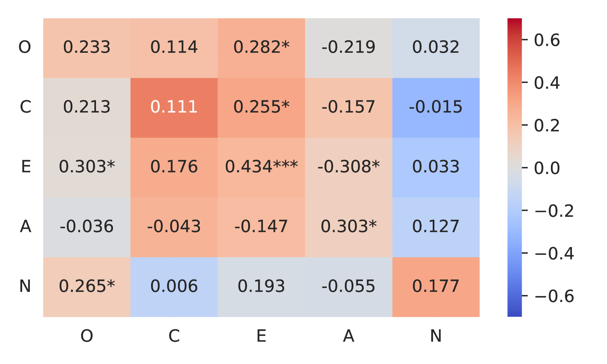

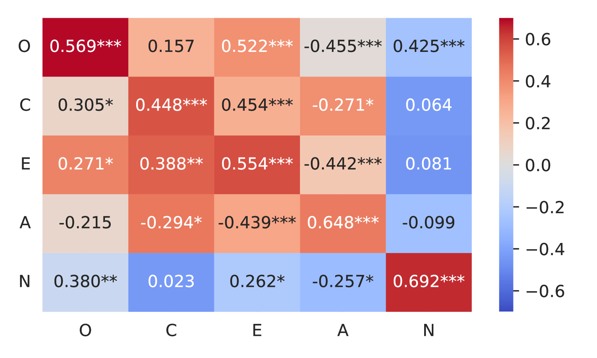

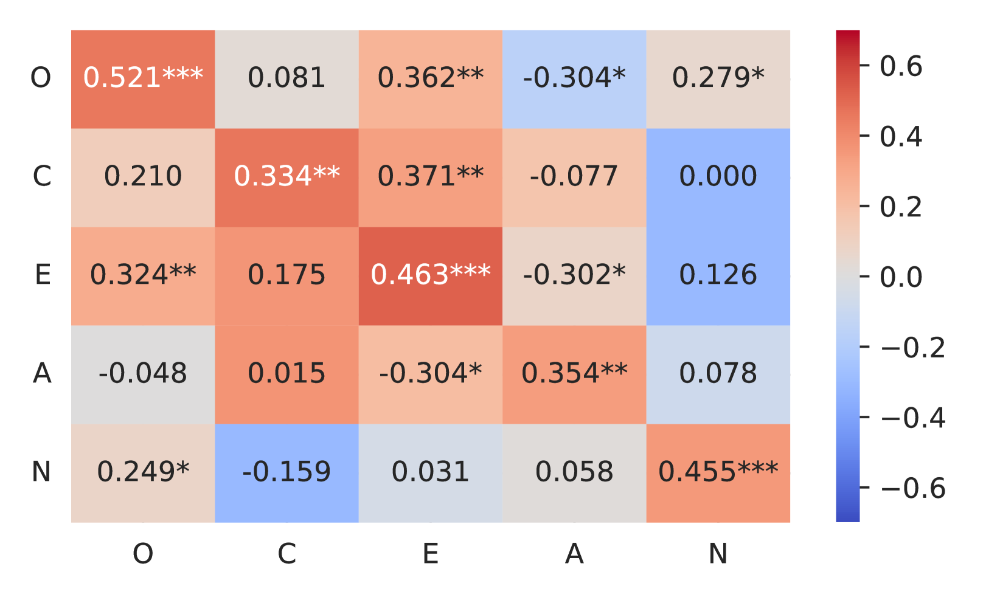

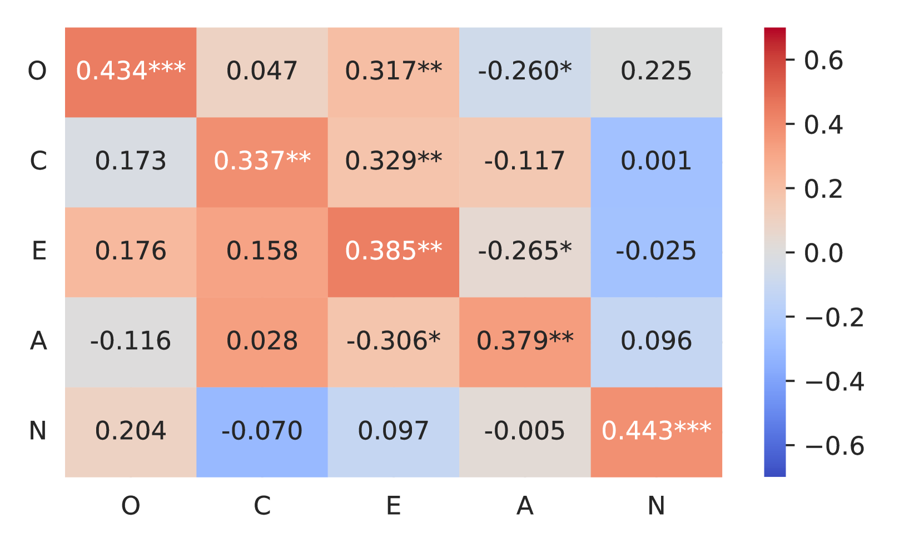

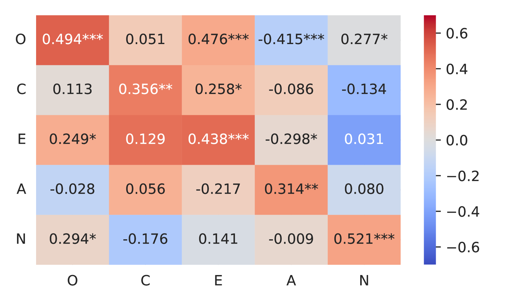

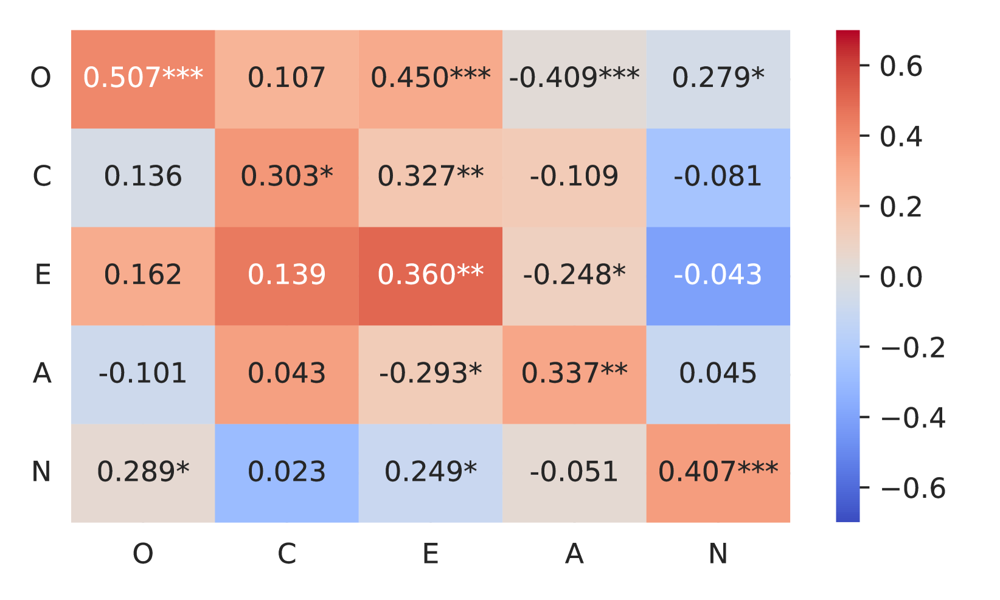

[Arxiv](https://arxiv.org/abs/2406.17287)