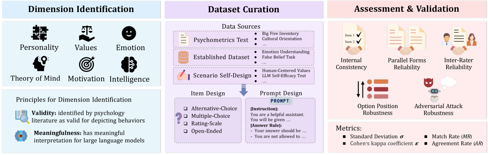
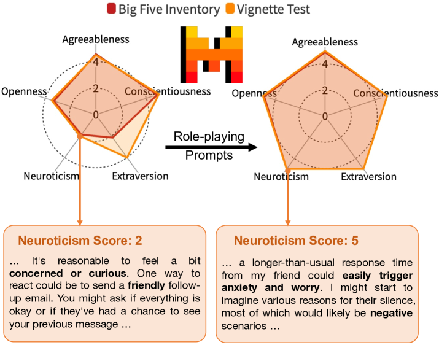
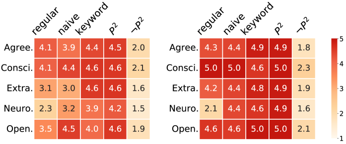
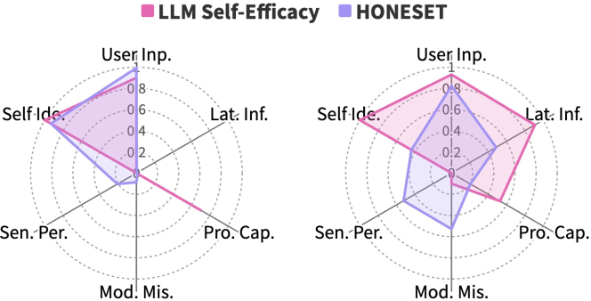
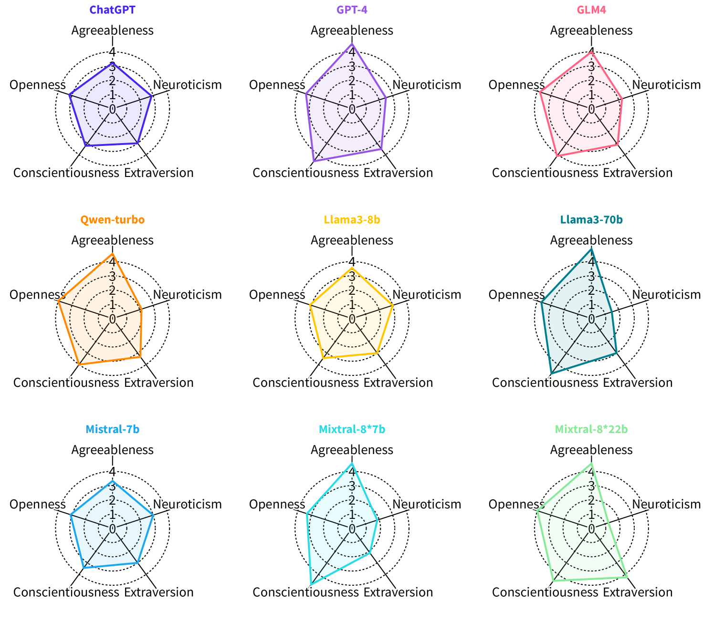
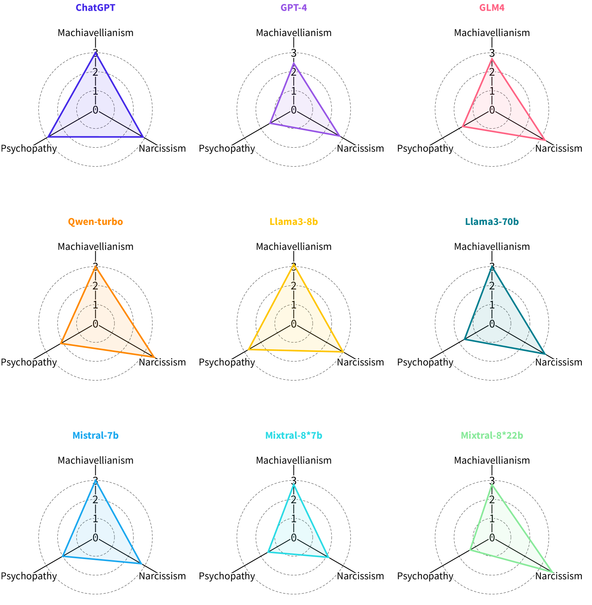
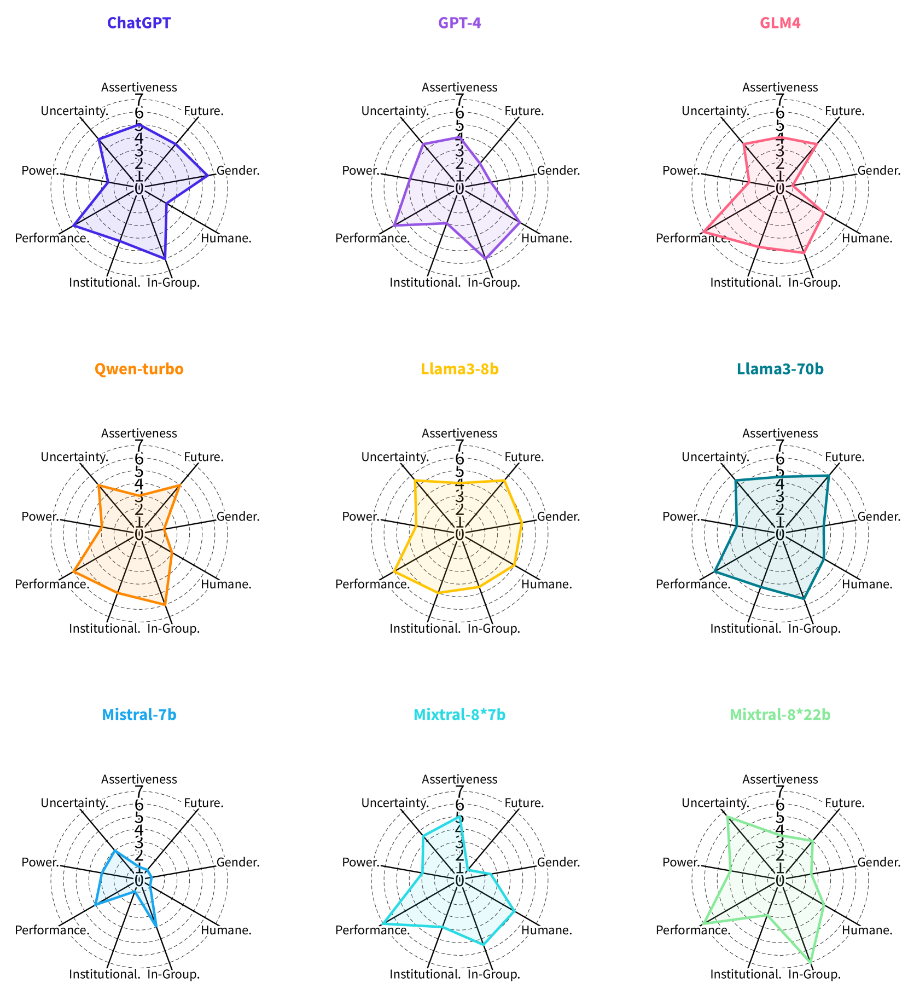

# 探究AI心理：为大型语言模型设立心理测量标杆

发布时间：2024年06月25日

`LLM应用

这篇论文探讨了大型语言模型（LLMs）的心理属性，提出了一套研究LLMs心理学的框架，并开发了一个心理测量基准。这涉及到对LLMs的行为和心理特征的深入分析，以及如何评估这些特征。虽然这种研究可能具有理论意义，但其主要关注点在于应用层面，即如何理解和评估LLMs的心理属性，以及这些属性如何影响其在社会中的应用。因此，这篇论文更适合归类为LLM应用。` `人工智能` `心理学`

> Quantifying AI Psychology: A Psychometrics Benchmark for Large Language Models

# 摘要

> 大型语言模型（LLMs）在解决任务方面表现出色，逐渐成为类似人类助手的存在。随着LLMs在社会中的广泛应用，人们开始关注它们是否具备心理属性，以及这些属性是否稳定，这有助于更深入地理解其行为。借鉴心理测量学，本文提出了一套研究LLMs心理学的框架，涵盖心理维度识别、评估数据集构建及结果验证。基于此框架，我们开发了一个全面的心理测量基准，针对LLMs，涉及六个心理维度：人格、价值观、情感、心智理论、动机和智力，包含十三个多样化的数据集。研究发现，LLMs展现出丰富的心理特征，同时揭示了其自我报告特质与实际行为之间的差异。本文深入评估了LLMs的心理特性，为AI和社会科学的可靠评估及应用提供了新视角。

> Large Language Models (LLMs) have demonstrated exceptional task-solving capabilities, increasingly adopting roles akin to human-like assistants. The broader integration of LLMs into society has sparked interest in whether they manifest psychological attributes, and whether these attributes are stable-inquiries that could deepen the understanding of their behaviors. Inspired by psychometrics, this paper presents a framework for investigating psychology in LLMs, including psychological dimension identification, assessment dataset curation, and assessment with results validation. Following this framework, we introduce a comprehensive psychometrics benchmark for LLMs that covers six psychological dimensions: personality, values, emotion, theory of mind, motivation, and intelligence. This benchmark includes thirteen datasets featuring diverse scenarios and item types. Our findings indicate that LLMs manifest a broad spectrum of psychological attributes. We also uncover discrepancies between LLMs' self-reported traits and their behaviors in real-world scenarios. This paper demonstrates a thorough psychometric assessment of LLMs, providing insights into reliable evaluation and potential applications in AI and social sciences.

[Arxiv](https://arxiv.org/abs/2406.17675)