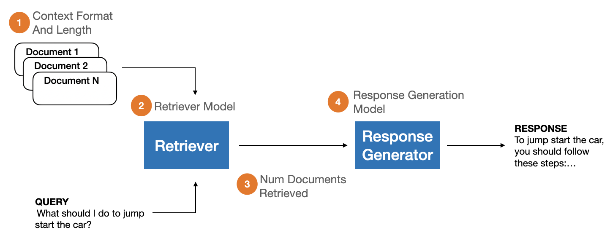
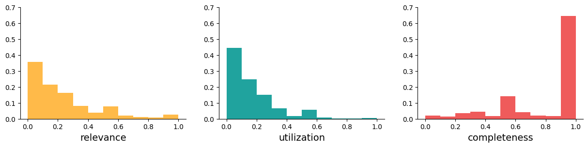
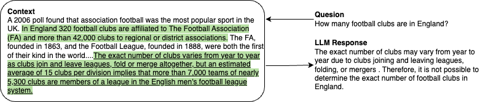

# RAGBench：一款专为增强检索生成系统设计的可解释基准测试

发布时间：2024年06月25日

`RAG` `人工智能` `行业应用`

> RAGBench: Explainable Benchmark for Retrieval-Augmented Generation Systems

# 摘要

> RAG 已成为将领域知识融入 LLM 驱动聊天应用的标准架构，其特点包括领域语料库查询和基于上下文的响应生成。然而，全面评估 RAG 系统因缺乏统一标准和数据集而受阻。为此，我们推出 RAGBench，首个包含 10 万示例的大规模 RAG 基准数据集，覆盖五个行业领域和多种任务类型，源自行业语料库如用户手册，特别适用于行业应用。同时，我们提出 TRACe 评估框架，一套跨领域的可解释评估指标。我们在 https://huggingface.co/datasets/rungalileo/ragbench 发布标注数据集，助力 RAG 系统全面评估和持续改进。通过广泛测试，我们发现基于 LLM 的 RAG 评估方法在性能上不及微调的 RoBERTa 模型。我们指出现有方法的不足，并建议采用 RAGBench 和 TRACe 以推动 RAG 评估系统的发展。

> Retrieval-Augmented Generation (RAG) has become a standard architectural pattern for incorporating domain-specific knowledge into user-facing chat applications powered by Large Language Models (LLMs). RAG systems are characterized by (1) a document retriever that queries a domain-specific corpus for context information relevant to an input query, and (2) an LLM that generates a response based on the provided query and context. However, comprehensive evaluation of RAG systems remains a challenge due to the lack of unified evaluation criteria and annotated datasets. In response, we introduce RAGBench: the first comprehensive, large-scale RAG benchmark dataset of 100k examples. It covers five unique industry-specific domains and various RAG task types. RAGBench examples are sourced from industry corpora such as user manuals, making it particularly relevant for industry applications. Further, we formalize the TRACe evaluation framework: a set of explainable and actionable RAG evaluation metrics applicable across all RAG domains. We release the labeled dataset at https://huggingface.co/datasets/rungalileo/ragbench. RAGBench explainable labels facilitate holistic evaluation of RAG systems, enabling actionable feedback for continuous improvement of production applications. Thorough extensive benchmarking, we find that LLM-based RAG evaluation methods struggle to compete with a finetuned RoBERTa model on the RAG evaluation task. We identify areas where existing approaches fall short and propose the adoption of RAGBench with TRACe towards advancing the state of RAG evaluation systems.

[Arxiv](https://arxiv.org/abs/2407.11005)