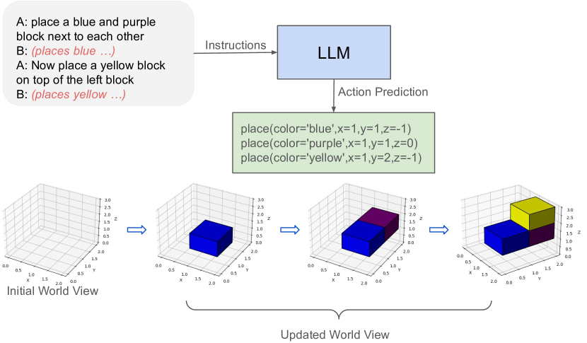
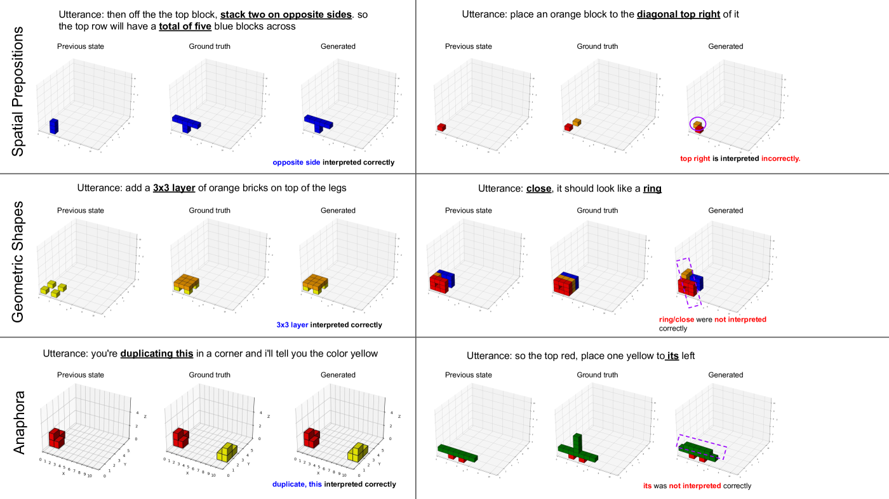
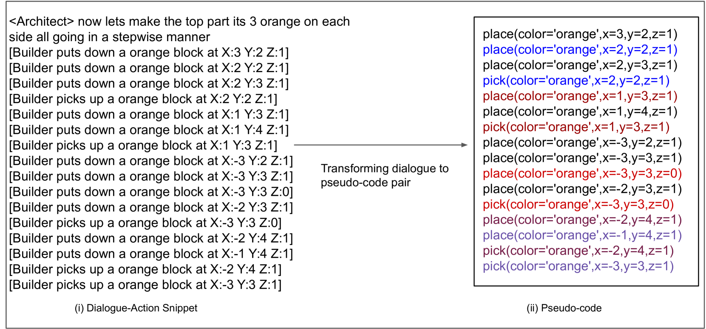
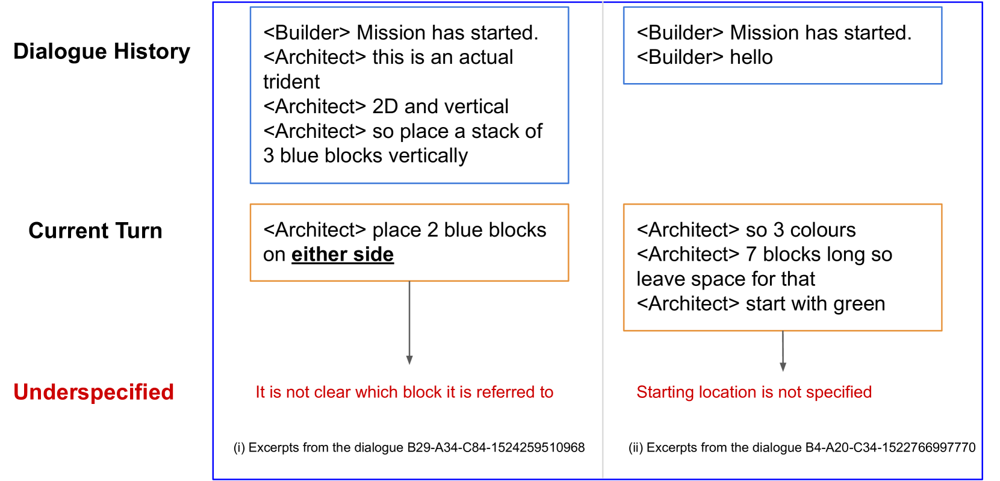

# 《我的世界》情境动作生成中的检索增强代码生成：一项案例研究

发布时间：2024年06月25日

`Agent

这篇论文的研究内容主要集中在使用大型语言模型（LLMs）来预测和指导Minecraft游戏中的建造者（B）的动作序列，以协助建筑师（A）完成特定的建筑任务。这种方法涉及到了智能代理（Agent）的行为预测和控制，因此属于Agent分类。虽然它使用了LLMs，但其核心在于应用这些模型来增强代理的行为预测能力，而不是探讨LLMs的理论或应用，因此不适合归类于LLM应用或LLM理论。同时，它也不涉及RAG（检索增强生成）的相关技术，因此不归类于RAG。` `建筑设计`

> Retrieval-Augmented Code Generation for Situated Action Generation: A Case Study on Minecraft

# 摘要

> 在Minecraft的协作建筑挑战中，建筑师（A）指导建造者（B）用3D方块搭建特定结构。本研究利用大型语言模型（LLMs）预测建造者的动作序列，通过少量样本提示技术，显著提升了性能，超越了传统方法。我们还深入分析了性能上的差距，为未来的研究指明了方向。

> In the Minecraft Collaborative Building Task, two players collaborate: an Architect (A) provides instructions to a Builder (B) to assemble a specified structure using 3D blocks. In this work, we investigate the use of large language models (LLMs) to predict the sequence of actions taken by the Builder. Leveraging LLMs' in-context learning abilities, we use few-shot prompting techniques, that significantly improve performance over baseline methods. Additionally, we present a detailed analysis of the gaps in performance for future work

[Arxiv](https://arxiv.org/abs/2406.17553)