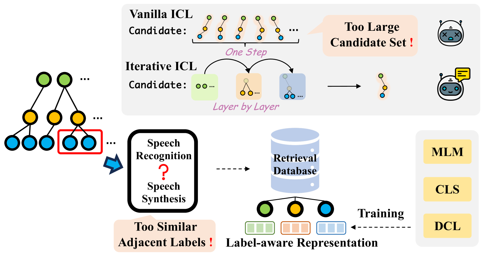
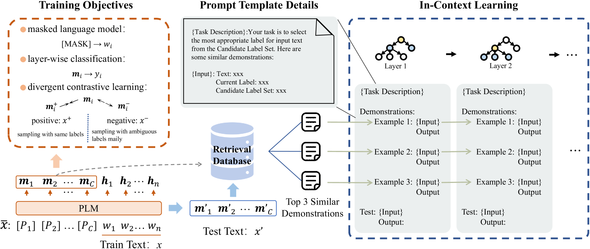
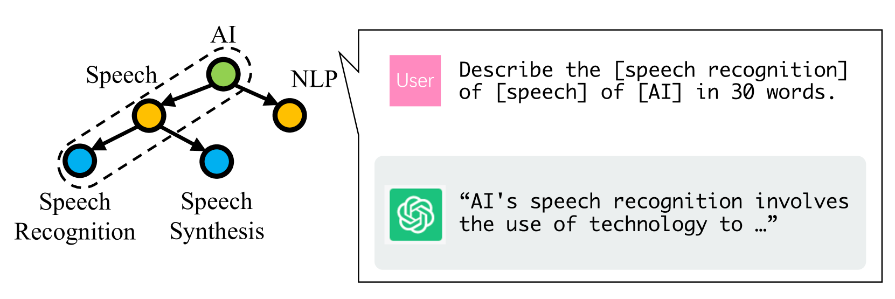
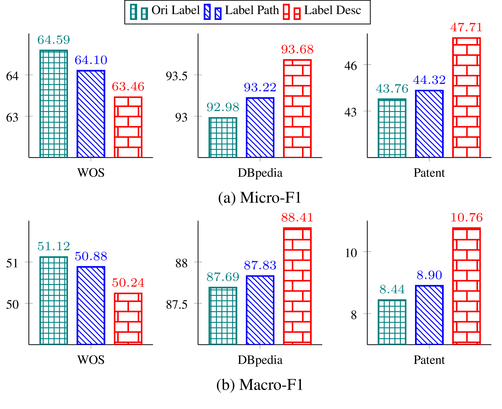
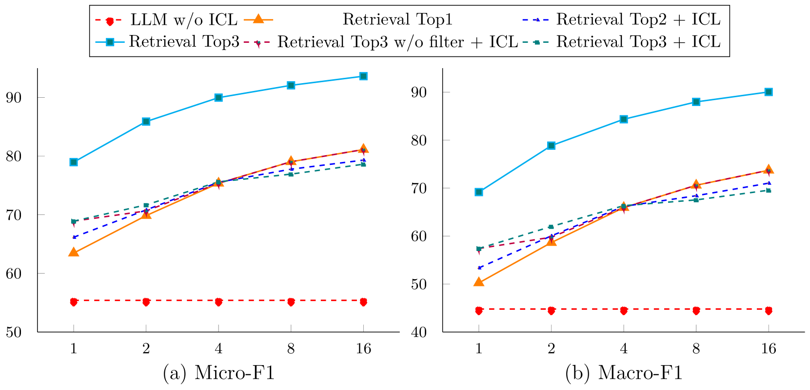
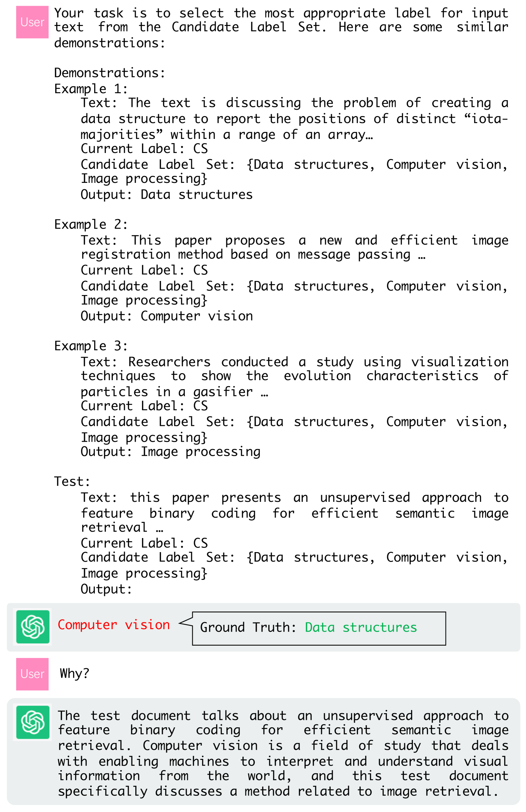
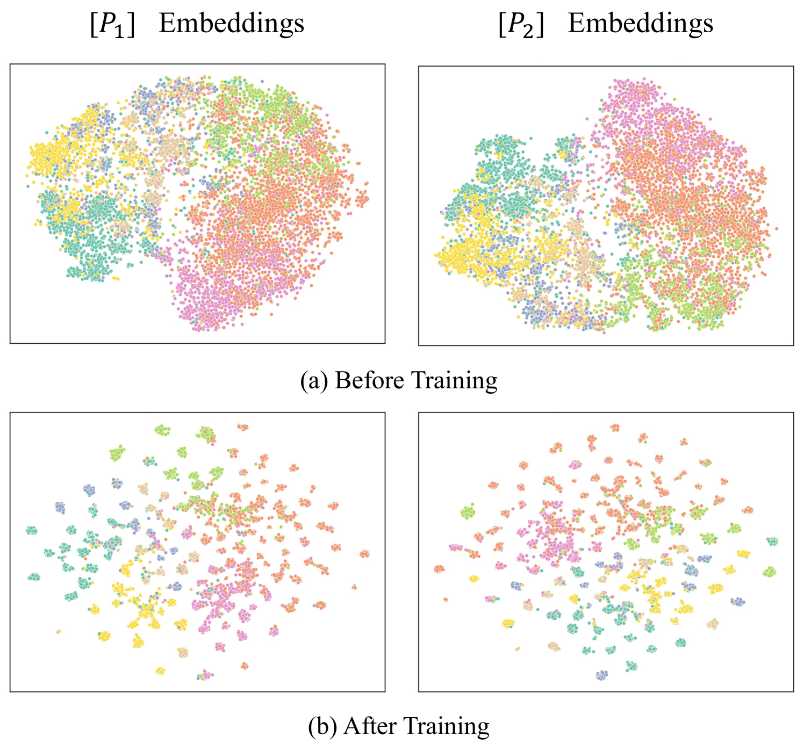

# 利用检索式上下文学习优化少量样本的层次文本分类

发布时间：2024年06月25日

`Agent

这篇论文主要讨论了如何利用大型语言模型（LLMs）的上下文学习（ICL）来优化层次文本分类（HTC）任务，特别是在少样本学习场景下。论文提出了一种新的框架，该框架通过检索数据库和迭代策略来管理多层级标签，并引入了HTC标签感知表示。这些创新点表明，论文的重点在于开发和应用一个智能系统（Agent）来解决特定的任务，即少样本HTC。因此，这篇论文更适合归类为Agent。` `文本分类` `机器学习`

> Retrieval-style In-Context Learning for Few-shot Hierarchical Text Classification

# 摘要

> 层次文本分类（HTC）任务因其广泛的应用而备受重视，而少样本HTC正逐渐成为研究热点。尽管大型语言模型（LLMs）的上下文学习（ICL）在少样本学习领域取得了显著成就，但在HTC领域，由于层次标签集的广泛性和标签的极端模糊性，其效果并不理想。为此，我们首次提出了一个基于ICL的框架，专门用于少样本HTC，并利用LLM进行优化。该框架通过检索数据库精确定位相关演示，并采用迭代策略有效管理多层级标签。特别地，我们为检索数据库引入了HTC标签感知表示，这一创新是通过在预训练语言模型上持续训练，融合掩码语言建模（MLM）、层级分类（CLS）以及一种新颖的分歧对比学习（DCL）目标实现的。实验结果显示，我们的方法在三个基准数据集上表现卓越，成功实现了少样本HTC领域的最新技术水平。

> Hierarchical text classification (HTC) is an important task with broad applications, while few-shot HTC has gained increasing interest recently. While in-context learning (ICL) with large language models (LLMs) has achieved significant success in few-shot learning, it is not as effective for HTC because of the expansive hierarchical label sets and extremely-ambiguous labels. In this work, we introduce the first ICL-based framework with LLM for few-shot HTC. We exploit a retrieval database to identify relevant demonstrations, and an iterative policy to manage multi-layer hierarchical labels. Particularly, we equip the retrieval database with HTC label-aware representations for the input texts, which is achieved by continual training on a pretrained language model with masked language modeling (MLM), layer-wise classification (CLS, specifically for HTC), and a novel divergent contrastive learning (DCL, mainly for adjacent semantically-similar labels) objective. Experimental results on three benchmark datasets demonstrate superior performance of our method, and we can achieve state-of-the-art results in few-shot HTC.

[Arxiv](https://arxiv.org/abs/2406.17534)