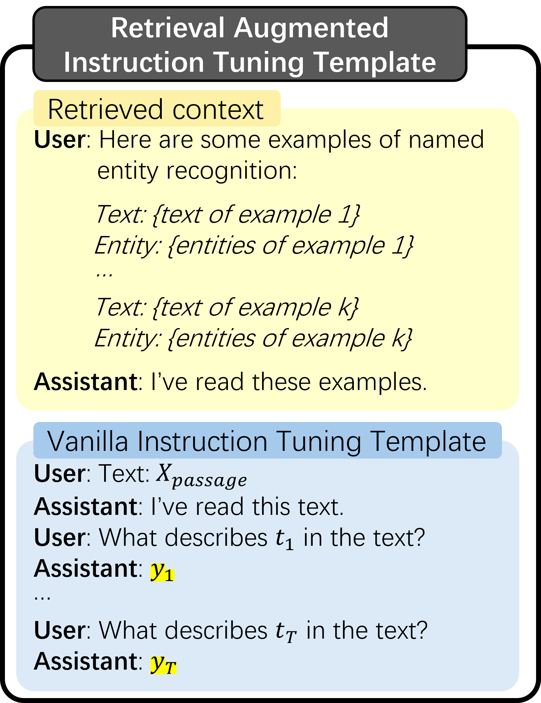
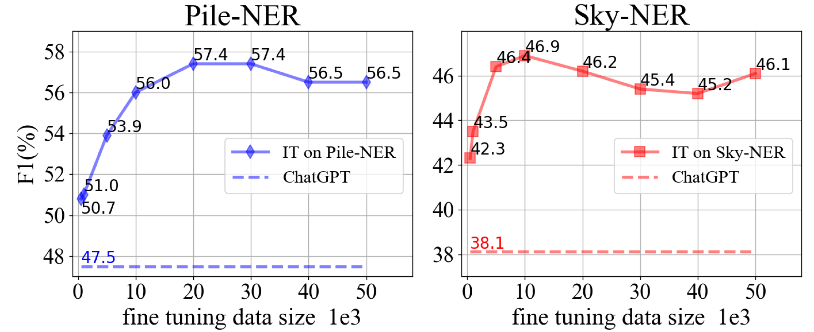
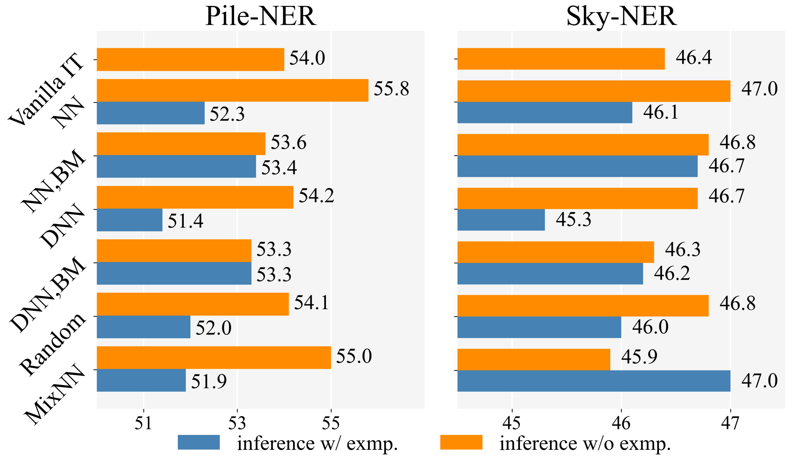
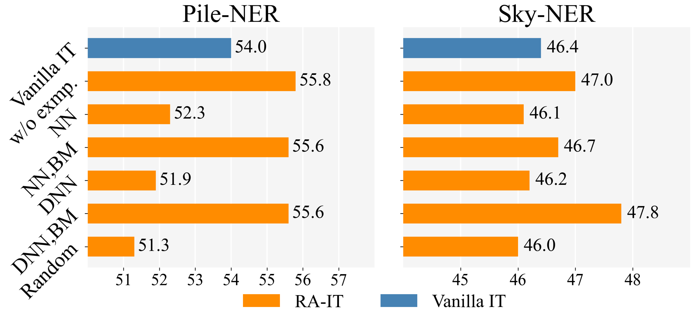
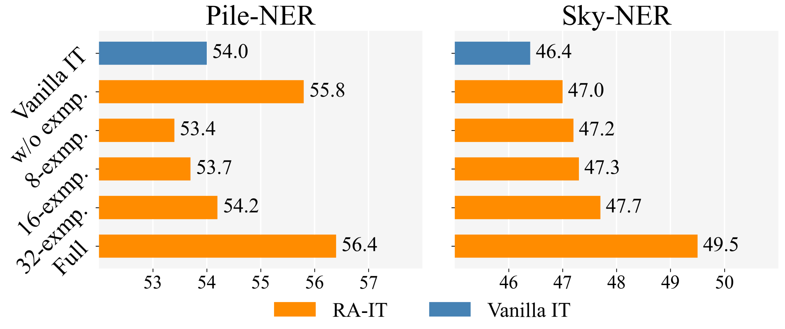
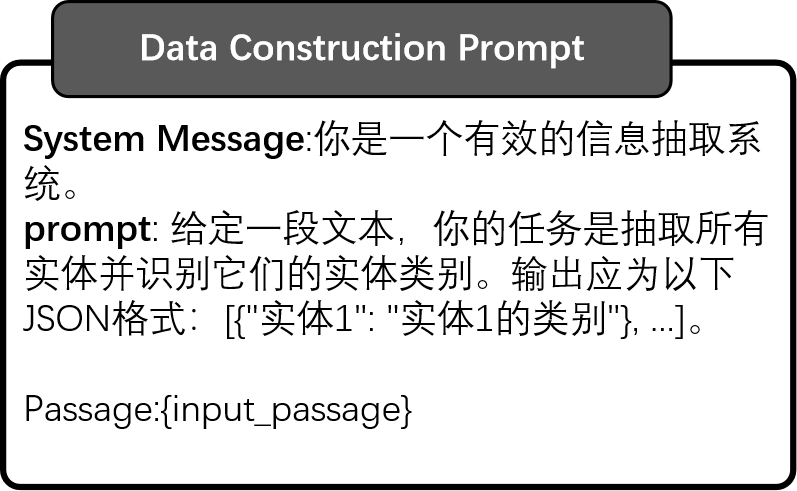

# 大型语言模型下的开放命名实体识别：基于检索增强的指令调优策略

发布时间：2024年06月25日

`RAG

理由：这篇论文主要探讨了检索增强指令调优（RA-IT）在开放命名实体识别（NER）任务中的应用，特别是在结合信息提取（IE）和大型语言模型（LLMs）时的优化方法。这种方法涉及从训练数据集中提取语义相似的示例作为上下文，并将其用于指令调优。这与RAG（检索增强生成）的概念相似，即通过检索相关信息来增强模型的性能。因此，这篇论文更适合归类于RAG，因为它专注于通过检索增强来优化LLM的应用。` `信息提取` `命名实体识别`

> Retrieval Augmented Instruction Tuning for Open NER with Large Language Models

# 摘要

> 大型语言模型（LLMs）的强大能力在信息提取（IE）领域展现出色，无论是通过检索增强提示还是指令调优（IT）。但如何最佳地结合信息与LLMs进行IE，这一问题仍待解答。本文深入探讨了针对IE的检索增强指令调优（RA-IT），特别聚焦于开放命名实体识别（NER）任务。我们为每个训练样本从训练数据集中提取语义相似的示例作为上下文，并将其前置于原始指令的输入。为了全面评估RA-IT，我们创建了一个中文IT数据集，并在英语和中文环境下对其进行了测试。实验结果证实了RA-IT在不同数据规模及双语环境下的有效性。此外，我们还深入分析了RA-IT框架中不同检索策略的影响。相关代码和数据已公开分享于：https://github.com/Emma1066/Retrieval-Augmented-IT-OpenNER

> The strong capability of large language models (LLMs) has been applied to information extraction (IE) through either retrieval augmented prompting or instruction tuning (IT). However, the best way to incorporate information with LLMs for IE remains an open question. In this paper, we explore Retrieval Augmented Instruction Tuning (RA-IT) for IE, focusing on the task of open named entity recognition (NER). Specifically, for each training sample, we retrieve semantically similar examples from the training dataset as the context and prepend them to the input of the original instruction. To evaluate our RA-IT approach more thoroughly, we construct a Chinese IT dataset for open NER and evaluate RA-IT in both English and Chinese scenarios. Experimental results verify the effectiveness of RA-IT across various data sizes and in both English and Chinese scenarios. We also conduct thorough studies to explore the impacts of various retrieval strategies in the proposed RA-IT framework. Code and data are available at: https://github.com/Emma1066/Retrieval-Augmented-IT-OpenNER

[Arxiv](https://arxiv.org/abs/2406.17305)